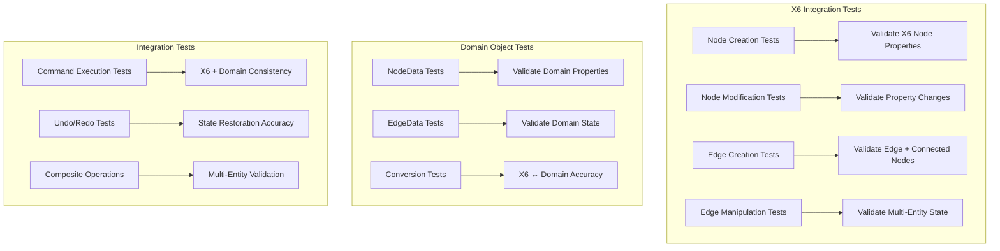

# Comprehensive Testing Plan for Edge Method Consolidation

## Overview

This testing plan ensures complete validation of X6 native properties and domain objects during the edge method consolidation refactor. Tests validate actual X6 objects and domain objects rather than mocked interfaces, with minimal use of mocks only when absolutely necessary.

## Testing Strategy

### Core Principles

1. **X6 Object Validation**: Test against actual X6 Node/Edge objects and their native properties
2. **Domain Object Validation**: Test against actual domain objects (NodeData, EdgeData, etc.)
3. **State Verification**: Verify exact property values on all affected cells
4. **Minimal Mocking**: Use real X6 Graph instances, mock only external dependencies (HTTP, etc.)
5. **Multi-Entity Testing**: For edge operations, validate both edge and connected nodes
6. **Undo/Redo Validation**: Ensure graph state matches expected state exactly

## Test Structure



## Detailed Test Cases

### 1. Node Creation and Modification Tests

#### 1.1 Node Creation Tests

```typescript
describe('Node Creation - X6 Integration', () => {
  let graph: Graph;

  beforeEach(() => {
    graph = new Graph({ container: document.createElement('div') });
  });

  describe('Actor Node Creation', () => {
    it('should create actor node with correct X6 properties', () => {
      // Test creates actual actor node
      const nodeData = NodeData.createDefault('actor', new Point(100, 100));
      const x6Node = adapter.addNode(new DiagramNode(nodeData));

      // Validate X6 native properties
      expect(x6Node.getPosition()).toEqual({ x: 100, y: 100 });
      expect(x6Node.getSize()).toEqual({ width: 120, height: 80 });
      expect(x6Node.getAttrByPath('text/text')).toBe('External Entity');
      expect(x6Node.shape).toBe('actor');
      expect(x6Node.getPorts()).toHaveLength(4); // top, right, bottom, left

      // Validate port properties
      const ports = x6Node.getPorts();
      expect(ports[0]).toMatchObject({
        id: 'top',
        position: { name: 'top' },
        attrs: { circle: { magnet: true } },
      });
    });
  });

  describe('Process Node Creation', () => {
    it('should create process node with correct X6 properties', () => {
      const nodeData = NodeData.createDefault('process', new Point(200, 150));
      const x6Node = adapter.addNode(new DiagramNode(nodeData));

      expect(x6Node.getPosition()).toEqual({ x: 200, y: 150 });
      expect(x6Node.getSize()).toEqual({ width: 140, height: 100 });
      expect(x6Node.getAttrByPath('text/text')).toBe('Process');
      expect(x6Node.shape).toBe('process');
      expect(x6Node.getAttrByPath('body/rx')).toBe(10); // Rounded corners
    });
  });

  describe('Store Node Creation', () => {
    it('should create store node with correct X6 properties', () => {
      const nodeData = NodeData.createDefault('store', new Point(300, 200));
      const x6Node = adapter.addNode(new DiagramNode(nodeData));

      expect(x6Node.getPosition()).toEqual({ x: 300, y: 200 });
      expect(x6Node.getSize()).toEqual({ width: 160, height: 60 });
      expect(x6Node.getAttrByPath('text/text')).toBe('Data Store');
      expect(x6Node.shape).toBe('store');
      expect(x6Node.getAttrByPath('body/strokeWidth')).toBe(2);
    });
  });

  describe('Security Boundary Creation', () => {
    it('should create security boundary with correct X6 properties', () => {
      const nodeData = NodeData.createDefault('security-boundary', new Point(50, 50));
      const x6Node = adapter.addNode(new DiagramNode(nodeData));

      expect(x6Node.getPosition()).toEqual({ x: 50, y: 50 });
      expect(x6Node.getSize()).toEqual({ width: 400, height: 300 });
      expect(x6Node.getAttrByPath('text/text')).toBe('Security Boundary');
      expect(x6Node.shape).toBe('security-boundary');
      expect(x6Node.getAttrByPath('body/strokeDasharray')).toBe('5,5');
    });
  });
});
```

#### 1.2 Node Modification Tests

```typescript
describe('Node Modification - X6 Integration', () => {
  let graph: Graph;
  let actorNode: Node;

  beforeEach(() => {
    graph = new Graph({ container: document.createElement('div') });
    const nodeData = NodeData.createDefault('actor', new Point(100, 100));
    actorNode = adapter.addNode(new DiagramNode(nodeData));
  });

  describe('Position Modification', () => {
    it('should update X6 node position correctly', () => {
      const newPosition = new Point(200, 250);

      adapter.moveNode(actorNode.id, newPosition);

      expect(actorNode.getPosition()).toEqual({ x: 200, y: 250 });
      expect(actorNode.getBBox()).toMatchObject({
        x: 200,
        y: 250,
        width: 120,
        height: 80,
      });
    });
  });

  describe('Size Modification', () => {
    it('should update X6 node size correctly', () => {
      actorNode.setSize(150, 100);

      expect(actorNode.getSize()).toEqual({ width: 150, height: 100 });
      expect(actorNode.getBBox()).toMatchObject({
        x: 100,
        y: 100,
        width: 150,
        height: 100,
      });
    });
  });

  describe('Label Modification', () => {
    it('should update X6 node label correctly', () => {
      actorNode.setLabel('Updated Actor');

      expect(actorNode.getLabel()).toBe('Updated Actor');
      expect(actorNode.getAttrByPath('text/text')).toBe('Updated Actor');
    });
  });

  describe('Embedding Operations', () => {
    it('should embed child node and update X6 properties', () => {
      const childData = NodeData.createDefault('process', new Point(120, 120));
      const childNode = adapter.addNode(new DiagramNode(childData));

      actorNode.addChild(childNode);

      expect(actorNode.getChildren()).toContain(childNode);
      expect(childNode.getParent()).toBe(actorNode);
      expect(childNode.getZIndex()).toBeGreaterThan(actorNode.getZIndex());
    });

    it('should unembedded child node and restore X6 properties', () => {
      const childData = NodeData.createDefault('process', new Point(120, 120));
      const childNode = adapter.addNode(new DiagramNode(childData));
      actorNode.addChild(childNode);

      actorNode.removeChild(childNode);

      expect(actorNode.getChildren()).not.toContain(childNode);
      expect(childNode.getParent()).toBeNull();
    });
  });
});
```

### 2. Edge Creation and Manipulation Tests

#### 2.1 Edge Creation Tests

```typescript
describe('Edge Creation - X6 Integration', () => {
  let graph: Graph;
  let sourceNode: Node;
  let targetNode: Node;

  beforeEach(() => {
    graph = new Graph({ container: document.createElement('div') });
    const sourceData = NodeData.createDefault('actor', new Point(100, 100));
    const targetData = NodeData.createDefault('process', new Point(300, 100));
    sourceNode = adapter.addNode(new DiagramNode(sourceData));
    targetNode = adapter.addNode(new DiagramNode(targetData));
  });

  describe('Basic Edge Creation', () => {
    it('should create edge with correct X6 properties and update connected nodes', () => {
      const edgeData = EdgeData.create({
        id: 'edge-1',
        sourceNodeId: sourceNode.id,
        targetNodeId: targetNode.id,
        label: 'Data Flow',
      });

      const x6Edge = adapter.addEdge(new DiagramEdge(edgeData));

      // Validate edge properties
      expect(x6Edge.getSource()).toEqual({ cell: sourceNode.id, port: 'right' });
      expect(x6Edge.getTarget()).toEqual({ cell: targetNode.id, port: 'left' });
      expect(x6Edge.getLabels()[0].attrs.text.text).toBe('Data Flow');
      expect(x6Edge.shape).toBe('edge');

      // Validate edge visual properties
      expect(x6Edge.getAttrByPath('line/stroke')).toBe('#000000');
      expect(x6Edge.getAttrByPath('line/strokeWidth')).toBe(3);
      expect(x6Edge.getAttrByPath('line/targetMarker')).toMatchObject({
        name: 'classic',
        size: 8,
      });

      // Validate connected nodes port visibility
      const sourceRightPort = sourceNode.getPortProp('right', 'attrs/circle/opacity');
      const targetLeftPort = targetNode.getPortProp('left', 'attrs/circle/opacity');
      expect(sourceRightPort).toBe(1); // Visible
      expect(targetLeftPort).toBe(1); // Visible

      // Validate other ports remain hidden
      const sourceTopPort = sourceNode.getPortProp('top', 'attrs/circle/opacity');
      expect(sourceTopPort).toBe(0); // Hidden
    });
  });

  describe('Edge with Specific Ports', () => {
    it('should create edge with specified ports and update correct port visibility', () => {
      const edgeData = EdgeData.createWithPorts(
        'edge-2',
        sourceNode.id,
        targetNode.id,
        'top',
        'bottom',
        'Custom Flow',
      );

      const x6Edge = adapter.addEdge(new DiagramEdge(edgeData));

      expect(x6Edge.getSource()).toEqual({ cell: sourceNode.id, port: 'top' });
      expect(x6Edge.getTarget()).toEqual({ cell: targetNode.id, port: 'bottom' });

      // Validate specific port visibility
      expect(sourceNode.getPortProp('top', 'attrs/circle/opacity')).toBe(1);
      expect(targetNode.getPortProp('bottom', 'attrs/circle/opacity')).toBe(1);
      expect(sourceNode.getPortProp('right', 'attrs/circle/opacity')).toBe(0);
      expect(targetNode.getPortProp('left', 'attrs/circle/opacity')).toBe(0);
    });
  });

  describe('Self-Loop Edge', () => {
    it('should create self-loop edge with correct properties', () => {
      const edgeData = EdgeData.createWithPorts(
        'self-loop',
        sourceNode.id,
        sourceNode.id,
        'top',
        'right',
        'Self Loop',
      );

      const x6Edge = adapter.addEdge(new DiagramEdge(edgeData));

      expect(x6Edge.getSource()).toEqual({ cell: sourceNode.id, port: 'top' });
      expect(x6Edge.getTarget()).toEqual({ cell: sourceNode.id, port: 'right' });

      // Validate both ports on same node are visible
      expect(sourceNode.getPortProp('top', 'attrs/circle/opacity')).toBe(1);
      expect(sourceNode.getPortProp('right', 'attrs/circle/opacity')).toBe(1);
    });
  });
});
```

#### 2.2 Edge Manipulation Tests

```typescript
describe('Edge Manipulation - X6 Integration', () => {
  let graph: Graph;
  let sourceNode: Node;
  let targetNode: Node;
  let edge: Edge;

  beforeEach(() => {
    graph = new Graph({ container: document.createElement('div') });
    const sourceData = NodeData.createDefault('actor', new Point(100, 100));
    const targetData = NodeData.createDefault('process', new Point(300, 100));
    sourceNode = adapter.addNode(new DiagramNode(sourceData));
    targetNode = adapter.addNode(new DiagramNode(targetData));

    const edgeData = EdgeData.create({
      id: 'edge-1',
      sourceNodeId: sourceNode.id,
      targetNodeId: targetNode.id,
      label: 'Original Flow',
    });
    edge = adapter.addEdge(new DiagramEdge(edgeData));
  });

  describe('Label Modification', () => {
    it('should update edge label and maintain other properties', () => {
      edge.setLabel('Updated Flow');

      expect(edge.getLabel()).toBe('Updated Flow');
      expect(edge.getLabels()[0].attrs.text.text).toBe('Updated Flow');
      expect(edge.getSource()).toEqual({ cell: sourceNode.id, port: 'right' });
      expect(edge.getTarget()).toEqual({ cell: targetNode.id, port: 'left' });
    });
  });

  describe('Vertex Manipulation', () => {
    it('should add vertices and update edge path', () => {
      const vertices = [
        { x: 200, y: 50 },
        { x: 250, y: 150 },
      ];
      edge.setVertices(vertices);

      expect(edge.getVertices()).toEqual(vertices);
      expect(edge.getVertices()).toHaveLength(2);

      // Validate path calculation
      const pathLength = edge.getVertices().reduce((total, vertex, index) => {
        if (index === 0) return 0;
        const prev = edge.getVertices()[index - 1];
        return total + Math.sqrt(Math.pow(vertex.x - prev.x, 2) + Math.pow(vertex.y - prev.y, 2));
      }, 0);
      expect(pathLength).toBeGreaterThan(0);
    });
  });

  describe('Connection Change', () => {
    it('should update edge connection and port visibility', () => {
      const newTargetData = NodeData.createDefault('store', new Point(400, 200));
      const newTargetNode = adapter.addNode(new DiagramNode(newTargetData));

      edge.setTarget({ cell: newTargetNode.id, port: 'left' });

      // Validate edge connection
      expect(edge.getTarget()).toEqual({ cell: newTargetNode.id, port: 'left' });

      // Validate old target port is hidden
      expect(targetNode.getPortProp('left', 'attrs/circle/opacity')).toBe(0);

      // Validate new target port is visible
      expect(newTargetNode.getPortProp('left', 'attrs/circle/opacity')).toBe(1);

      // Validate source port remains visible
      expect(sourceNode.getPortProp('right', 'attrs/circle/opacity')).toBe(1);
    });
  });

  describe('Edge Removal', () => {
    it('should remove edge and hide connected ports', () => {
      adapter.removeEdge(edge.id);

      // Validate edge is removed
      expect(graph.getCellById(edge.id)).toBeNull();

      // Validate ports are hidden
      expect(sourceNode.getPortProp('right', 'attrs/circle/opacity')).toBe(0);
      expect(targetNode.getPortProp('left', 'attrs/circle/opacity')).toBe(0);
    });
  });
});
```

### 3. Domain Object Tests

#### 3.1 NodeData Tests

```typescript
describe('NodeData - Domain Object Validation', () => {
  describe('Creation and Properties', () => {
    it('should create NodeData with correct properties', () => {
      const nodeData = new NodeData(
        'node-1',
        'actor',
        'Test Actor',
        new Point(100, 150),
        120,
        80,
        [],
      );

      expect(nodeData.id).toBe('node-1');
      expect(nodeData.type).toBe('actor');
      expect(nodeData.label).toBe('Test Actor');
      expect(nodeData.position).toEqual(new Point(100, 150));
      expect(nodeData.width).toBe(120);
      expect(nodeData.height).toBe(80);
      expect(nodeData.getBounds()).toEqual({
        topLeft: new Point(100, 150),
        bottomRight: new Point(220, 230),
      });
    });
  });

  describe('Immutable Updates', () => {
    let originalData: NodeData;

    beforeEach(() => {
      originalData = NodeData.createDefault('process', new Point(200, 200));
    });

    it('should create new instance with updated position', () => {
      const newPosition = new Point(300, 350);
      const updatedData = originalData.withPosition(newPosition);

      expect(updatedData).not.toBe(originalData);
      expect(updatedData.position).toEqual(newPosition);
      expect(updatedData.id).toBe(originalData.id);
      expect(updatedData.type).toBe(originalData.type);
      expect(originalData.position).toEqual(new Point(200, 200)); // Unchanged
    });

    it('should create new instance with updated dimensions', () => {
      const updatedData = originalData.withDimensions(200, 150);

      expect(updatedData.width).toBe(200);
      expect(updatedData.height).toBe(150);
      expect(originalData.width).toBe(140); // Unchanged
      expect(originalData.height).toBe(100); // Unchanged
    });
  });
});
```

#### 3.2 EdgeData Tests

```typescript
describe('EdgeData - Domain Object Validation', () => {
  describe('Creation and Properties', () => {
    it('should create EdgeData with correct X6-compatible structure', () => {
      const edgeData = new EdgeData(
        'edge-1',
        'edge',
        { cell: 'source-1', port: 'right' },
        { cell: 'target-1', port: 'left' },
        { text: { text: 'Test Flow' } },
        [],
        [{ x: 200, y: 100 }],
        2,
        true,
        [{ key: 'category', value: 'critical' }],
      );

      expect(edgeData.id).toBe('edge-1');
      expect(edgeData.sourceNodeId).toBe('source-1');
      expect(edgeData.targetNodeId).toBe('target-1');
      expect(edgeData.sourcePortId).toBe('right');
      expect(edgeData.targetPortId).toBe('left');
      expect(edgeData.label).toBe('Test Flow');
      expect(edgeData.vertices).toEqual([{ x: 200, y: 100 }]);
      expect(edgeData.zIndex).toBe(2);
      expect(edgeData.visible).toBe(true);
    });
  });

  describe('X6 Conversion', () => {
    it('should convert to X6 snapshot with correct structure', () => {
      const edgeData = EdgeData.create({
        id: 'edge-1',
        sourceNodeId: 'source-1',
        targetNodeId: 'target-1',
        label: 'Data Flow',
      });

      const x6Snapshot = edgeData.toX6Snapshot();

      expect(x6Snapshot).toMatchObject({
        id: 'edge-1',
        shape: 'edge',
        source: { cell: 'source-1', port: 'right' },
        target: { cell: 'target-1', port: 'left' },
        attrs: { text: { text: 'Data Flow' } },
        labels: [],
        vertices: [],
        zIndex: 1,
        visible: true,
        metadata: [],
      });
    });
  });
});
```

### 4. Integration Tests

#### 4.1 Command Execution Tests

```typescript
describe('Command Execution - Integration Tests', () => {
  let commandBus: ICommandBus;
  let adapter: X6GraphAdapter;
  let graph: Graph;

  beforeEach(() => {
    // Setup real instances, not mocks
    graph = new Graph({ container: document.createElement('div') });
    adapter = new X6GraphAdapter(/* real dependencies */);
    commandBus = new CommandBus(/* real handlers */);
  });

  describe('Node Commands', () => {
    it('should execute AddNodeCommand and validate X6 + Domain consistency', async () => {
      const nodeData = NodeData.createDefault('actor', new Point(100, 100));
      const command = DiagramCommandFactory.addNode(
        'diagram-1',
        'user-1',
        'node-1',
        nodeData.toX6Snapshot(),
      );

      const result = await commandBus.execute(command).toPromise();

      // Validate command result
      expect(result.success).toBe(true);
      expect(result.events).toHaveLength(1);
      expect(result.events[0].type).toBe('NodeAdded');

      // Validate X6 graph state
      const x6Node = graph.getCellById('node-1') as Node;
      expect(x6Node).toBeDefined();
      expect(x6Node.getPosition()).toEqual({ x: 100, y: 100 });
      expect(x6Node.getAttrByPath('text/text')).toBe('External Entity');

      // Validate domain state
      const domainNode = result.diagramSnapshot.nodes.get('node-1');
      expect(domainNode).toBeDefined();
      expect(domainNode.data.position).toEqual(new Point(100, 100));
      expect(domainNode.data.label).toBe('External Entity');
    });
  });

  describe('Edge Commands', () => {
    it('should execute AddEdgeCommand and validate multi-entity state', async () => {
      // Setup nodes first
      const sourceData = NodeData.createDefault('actor', new Point(100, 100));
      const targetData = NodeData.createDefault('process', new Point(300, 100));

      await commandBus
        .execute(
          DiagramCommandFactory.addNode(
            'diagram-1',
            'user-1',
            'source-1',
            sourceData.toX6Snapshot(),
          ),
        )
        .toPromise();

      await commandBus
        .execute(
          DiagramCommandFactory.addNode(
            'diagram-1',
            'user-1',
            'target-1',
            targetData.toX6Snapshot(),
          ),
        )
        .toPromise();

      // Execute edge command
      const edgeData = EdgeData.create({
        id: 'edge-1',
        sourceNodeId: 'source-1',
        targetNodeId: 'target-1',
        label: 'Data Flow',
      });

      const command = DiagramCommandFactory.addEdge(
        'diagram-1',
        'user-1',
        'edge-1',
        'source-1',
        'target-1',
        edgeData.toX6Snapshot(),
      );

      const result = await commandBus.execute(command).toPromise();

      // Validate edge creation
      const x6Edge = graph.getCellById('edge-1') as Edge;
      expect(x6Edge).toBeDefined();
      expect(x6Edge.getSource()).toEqual({ cell: 'source-1', port: 'right' });
      expect(x6Edge.getTarget()).toEqual({ cell: 'target-1', port: 'left' });

      // Validate connected nodes port visibility
      const sourceNode = graph.getCellById('source-1') as Node;
      const targetNode = graph.getCellById('target-1') as Node;
      expect(sourceNode.getPortProp('right', 'attrs/circle/opacity')).toBe(1);
      expect(targetNode.getPortProp('left', 'attrs/circle/opacity')).toBe(1);

      // Validate domain state consistency
      const domainEdge = result.diagramSnapshot.edges.get('edge-1');
      expect(domainEdge).toBeDefined();
      expect(domainEdge.sourceNodeId).toBe('source-1');
      expect(domainEdge.targetNodeId).toBe('target-1');
    });
  });
});
```

#### 4.2 Undo/Redo Tests

```typescript
describe('Undo/Redo Operations - State Restoration', () => {
  let historyService: HistoryService;
  let commandBus: ICommandBus;
  let adapter: X6GraphAdapter;
  let graph: Graph;

  beforeEach(() => {
    graph = new Graph({ container: document.createElement('div') });
    adapter = new X6GraphAdapter(/* real dependencies */);
    historyService = new HistoryService(/* real dependencies */);
    commandBus = new CommandBus(/* real handlers */);
  });

  describe('Node Operations Undo/Redo', () => {
    it('should restore exact X6 and domain state after undo/redo', async () => {
      // Initial state
      const initialNodeCount = graph.getNodes().length;
      const initialSnapshot = await getCurrentDiagramSnapshot();

      // Execute add node command
      const nodeData = NodeData.createDefault('process', new Point(200, 150));
      const addCommand = DiagramCommandFactory.addNode(
        'diagram-1', 'user-1', 'node-1', nodeData.toX6Snapshot()
      );

      await commandBus.execute(addCommand).toPromise();

      // Validate node was added
      expect(graph.getNodes()).toHaveLength(initialNodeCount + 1);
      const addedNode = graph.getCellById('node-1') as Node;
      expect(addedNode.getPosition()).toEqual({ x: 200, y: 150 });
      expect(addedNode.getAttrByPath('text/text')).toBe('Process');

      // Execute undo
      await historyService.undo().toPromise();

      // Validate exact restoration to initial state
      expect(graph.getNodes()).toHaveLength(initialNodeCount);
      expect(graph.getCellById('node-1')).toBeNull();

      const undoSnapshot = await getCurrentDiagramSnapshot();
      expect(undoSnapshot.nodes.size).toBe(initialSnapshot.nodes.size);
      expect(undoSnapshot.edges.size).toBe(initialSnapshot.edges.size);

      // Execute redo
      await historyService.redo().toPromise();

      // Validate exact restoration to post-add state
      expect(graph.getNodes()).toHaveLength(initialNodeCount + 1);
      const redoneNode = graph.getCellById('node-1') as Node;
      expect(redoneNode.getPosition()).toEqual({ x: 200, y: 150 });
      expect(redoneNode.getAttrByPath('text/text')).toBe('Process');
      expect(redoneNode.getSize()).toEqual({ width: 140, height: 100 });
    });
  });

  describe('Edge Operations Undo/Redo', () => {
    it('should restore exact edge and port state after undo/redo', async () => {
      // Setup nodes
      const sourceData = NodeData.createDefault('actor', new Point(100, 100));
      const targetData = NodeData.createDefault('store', new Point(300, 100));

      await commandBus.execute(DiagramCommandFactory.addNode(
        'diagram-1', 'user-1', 'source-1', sourceData.toX6Snapshot()
      )).toPromise();

      await commandBus.execute(DiagramCommandFactory.addNode(
        'diagram-1', 'user-1', 'target-1', targetData.toX6Snapshot()
      )).toPromise();

      const sourceNode = graph.getCellById('source-1') as Node;
      const targetNode = graph.getCellById('target-1') as Node;

      // Capture initial port state
      const initialSourcePortOpacity = sourceNode.getPortProp('right', 'attrs/circle/opacity');
      const initialTargetPortOpacity = targetNode.getPortProp('left', 'attrs/circle/opacity');
      expect(initialSourcePortOpacity).toBe(0); // Hidden
      expect(initialTargetPortOpacity).toBe(0); // Hidden

      // Add edge
      const edgeData = EdgeData.create({
        id: 'edge-1',
        sourceNodeId: 'source-1',
        targetNodeId: 'target-1',
        label: 'Data Flow'
      });

      await commandBus.execute(DiagramCommandFactory.addEdge(
        'diagram-1', 'user-1', 'edge-1', 'source-1', 'target-1', edgeData.toX6Snapshot()
      )).toPromise();

      // Validate edge and port state after add
      const addedEdge = graph.getCellById('edge-1') as Edge;
      expect(addedEdge).toBeDefined();
      expect(sourceNode.getPortProp('right', 'attrs/circle/opacity')).toBe(1); // Visible
      expect(targetNode.getPortProp('left', 'attrs/circle/opacity')).toBe(1); // Visible

      // Execute undo
      await historyService.undo().toPromise();

      // Validate exact restoration - edge removed, ports hidden
      expect(graph.getCellById('edge-1')).toBeNull();
      expect(sourceNode.getPortProp('right', 'attrs/circle/opacity')).toBe(0); // Hidden
      expect(targetNode.getPortProp('left', 'attrs/circle/opacity')).toBe(0); // Hidden

      // Execute redo
      await historyService.redo().toPromise();

      // Validate exact restoration - edge restored, ports visible
      const redoneEdge = graph.getCellById('edge-1') as Edge;
      expect(redoneEdge).toBeDefined();
      expect(redoneEdge.getSource()).toEqual({ cell: 'source-1', port:
```
