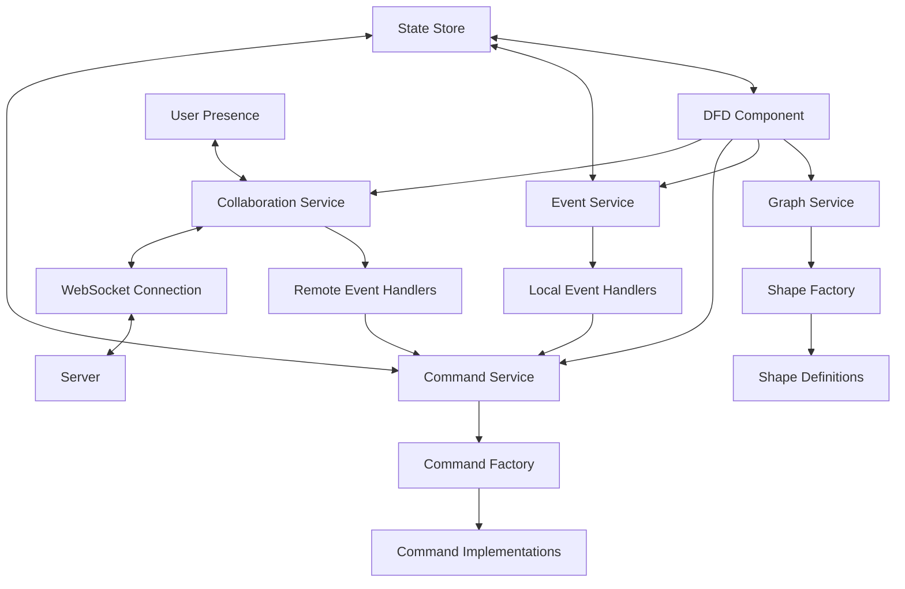

# DFD Component Refactoring Plan

This document outlines the plan for refactoring the DFD component to simplify event management and shape management while enhancing it for collaborative editing.

## Requirements

- Multiple users will be editing the diagram simultaneously
- Some users will be viewing only, others will be editing
- Automation will be able to generate and collaborate on diagrams
- Shapes and styles will be fixed, with styles managed in CSS
- Need to monitor user-made changes (not automatic style changes)
- Need to serialize changes and send them to the server
- Need to consume a stream of changes from the server and apply them locally

## Implementation Plan

### Phase 1: Shape and Command Simplification

1. **Simplify Shape Definitions**

   - Use X6's Shape.define method for shape definitions
   - Move styling to CSS and keep only structural properties in shape definitions
   - Centralize shape configuration

2. **Enhance Commands with Serialization**

   - Extend commands to support serialization to JSON
   - Add origin tracking to commands (local vs. remote)
   - Implement command replay functionality

3. **Implement Selective Change Tracking**
   - Add property to events to distinguish user-initiated vs. system-initiated changes
   - Filter events for synchronization
   - Implement selective deep comparison for user-modifiable properties

### Phase 2: Collaboration Infrastructure

1. **Implement Collaboration Service**

   - Create service for handling WebSocket connections
   - Implement message serialization/deserialization
   - Add authentication and authorization

2. **Add Remote Event Handling**

   - Extend event system to handle events from the server
   - Implement event reconciliation logic
   - Add conflict resolution strategies

3. **Implement User Presence Tracking**
   - Track connected users
   - Show user cursors/selections
   - Implement user activity indicators

### Phase 3: Optimization

1. **Implement Delta Updates**

   - Only send changes rather than entire graph state
   - Optimize serialization format

2. **Add Operation Batching**

   - Group multiple operations into a single network request
   - Implement debouncing for frequent updates

3. **Enhance Conflict Resolution**
   - Implement more sophisticated conflict resolution strategies
   - Add user notification for conflicts
   - Provide manual conflict resolution UI when needed

## Architecture



## Technical Details

### Enhanced Command Interface

```typescript
export interface Command<T = unknown> {
  readonly id: string;
  readonly name: string;
  readonly origin: 'local' | 'remote';

  execute(graph: Graph): Promise<CommandResult<T>>;
  undo(graph: Graph): Promise<CommandResult>;
  canExecute(graph: Graph): boolean;
  canUndo(graph: Graph): boolean;

  // New methods for collaboration
  serialize(): string;
  static deserialize(json: string): Command;
}
```

### Simplified Shape Definition

```typescript
export const ActorShape = Shape.Rect.define({
  constructorName: 'actor',
  markup: [
    { tagName: 'rect', selector: 'body' },
    { tagName: 'text', selector: 'label' },
  ],
  attrs: {
    body: {
      refWidth: '100%',
      refHeight: '100%',
      class: 'actor-shape', // CSS class for styling
    },
    label: {
      refX: '50%',
      refY: '50%',
      textAnchor: 'middle',
      textVerticalAnchor: 'middle',
      class: 'actor-label', // CSS class for styling
    },
  },
  ports: {
    /* port configuration */
  },
});
```

### Selective Change Tracking

```typescript
export function hasUserChanges(originalNode, currentNode) {
  // Only compare properties that users can modify
  const userProps = {
    position: originalNode.position,
    size: originalNode.size,
    label: originalNode.label,
    connections: originalNode.connections,
    // Other user-modifiable properties
  };

  const currentUserProps = {
    position: currentNode.position,
    size: currentNode.size,
    label: currentNode.label,
    connections: currentNode.connections,
    // Other user-modifiable properties
  };

  return !deepCompare(userProps, currentUserProps);
}
```

### Collaboration Event Service

```typescript
export class DfdCollaborationEventService {
  // Track connected users
  private connectedUsers = new Map<
    string,
    { id: string; name: string; role: 'viewer' | 'editor' }
  >();

  // Process remote events
  processRemoteEvent(event: RemoteEvent): void {
    // Check if this is a user event
    if (event.type === 'userJoined') {
      this.connectedUsers.set(event.userId, {
        id: event.userId,
        name: event.userName,
        role: event.userRole,
      });
      this.eventBus.publish({
        type: DfdEventType.UserJoined,
        user: this.connectedUsers.get(event.userId),
        timestamp: Date.now(),
      });
      return;
    }

    // Convert remote event to local command and execute
    const command = this.convertRemoteEventToCommand(event);
    if (command) {
      command.origin = 'remote';
      this.commandService.executeCommand(command).subscribe();
    }
  }
}
```

## Progress Tracking

### Phase 1: Shape and Command Simplification

- [x] Simplify ActorShape definition
- [x] Simplify ProcessShape definition
- [x] Simplify StoreShape definition
- [x] Simplify SecurityBoundaryShape definition
- [x] Simplify TextboxShape definition
- [x] Enhance Command interface with serialization
- [x] Implement command serialization for AddNodeCommand
- [x] Implement command serialization for DeleteNodeCommand
- [x] Implement command serialization for MoveNodeCommand
- [ ] Implement command serialization for edge commands
- [x] Implement selective change tracking

### Phase 2: Collaboration Infrastructure

- [ ] Create DfdCollaborationService
- [ ] Implement WebSocket connection handling
- [ ] Implement message serialization/deserialization
- [ ] Extend event system for remote events
- [ ] Implement event reconciliation
- [ ] Implement user presence tracking

### Phase 3: Optimization

- [ ] Implement delta updates
- [ ] Add operation batching
- [ ] Enhance conflict resolution
- [ ] Performance testing and optimization
