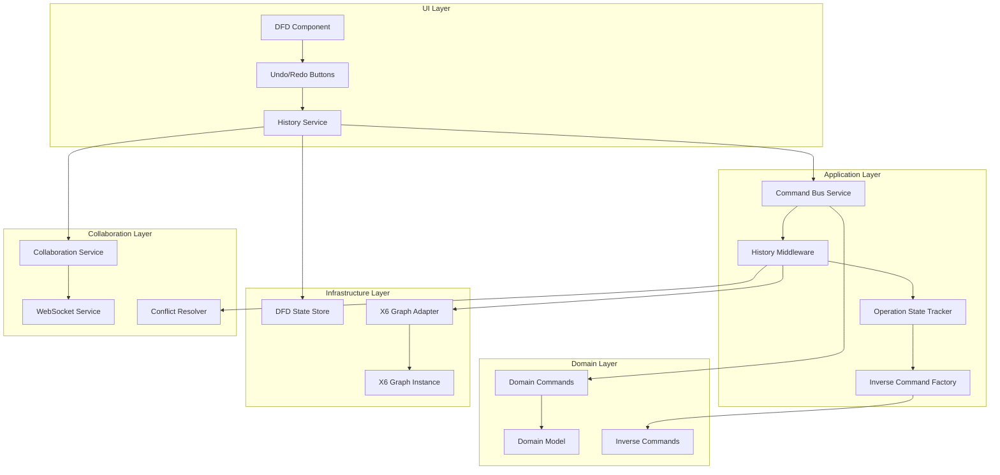

# DFD X6 History Service Implementation Plan

## Overview

This document outlines the comprehensive implementation plan for adding undo/redo functionality to the DFD (Data Flow Diagram) component using a command bus-first approach with inverse command patterns. The implementation integrates seamlessly with the existing collaboration system and maintains the domain model as the single source of truth.

## Table of Contents

1. [Architecture Overview](#architecture-overview)
2. [Core Components](#core-components)
3. [Inverse Command Patterns](#inverse-command-patterns)
4. [Edge Case Handling](#edge-case-handling)
5. [Collaboration Integration](#collaboration-integration)
6. [Implementation Phases](#implementation-phases)
7. [Testing Strategy](#testing-strategy)
8. [Performance Considerations](#performance-considerations)

## Architecture Overview

### Design Principles

- **Command Bus First**: History operates through the existing command bus infrastructure
- **Domain Model Authority**: Domain model remains the single source of truth
- **Inverse Command Pattern**: Each command generates its own inverse for reliable undo
- **Final State Only**: History records only completed operations, not intermediate states
- **Collaboration Ready**: Full integration with real-time collaboration system

### Architecture Diagram



## Core Components

### 1. History Service

```typescript
interface HistoryService {
  // Core operations
  undo(): Observable<boolean>;
  redo(): Observable<boolean>;

  // State queries
  canUndo$: Observable<boolean>;
  canRedo$: Observable<boolean>;
  historySize$: Observable<number>;

  // History management
  clear(): void;
  getHistory(): HistoryEntry[];

  // Collaboration support
  enableCollaborativeMode(): void;
  enableLocalOnlyMode(): void;
}

interface HistoryEntry {
  id: string;
  command: AnyDiagramCommand;
  inverse: AnyDiagramCommand;
  timestamp: number;
  author?: User;
  operationId: string;
}
```

### 2. Operation State Tracker

```typescript
interface OperationStateTracker {
  // Operation lifecycle
  startOperation(operationId: string, type: OperationType): void;
  updateOperation(operationId: string, data: Partial<OperationData>): void;
  completeOperation(operationId: string): void;
  cancelOperation(operationId: string): void;

  // State queries
  isOperationActive(operationId: string): boolean;
  getOperationState(operationId: string): OperationState | null;

  // Final state detection
  isFinalState(operationId: string): boolean;
}

enum OperationType {
  DRAG = 'drag',
  RESIZE = 'resize',
  EDIT_LABEL = 'edit_label',
  EDIT_VERTICES = 'edit_vertices',
  ADD_NODE = 'add_node',
  ADD_EDGE = 'add_edge',
  DELETE = 'delete',
  BATCH = 'batch',
}
```

### 3. Inverse Command Factory

```typescript
interface InverseCommandFactory {
  createInverse<T extends AnyDiagramCommand>(
    command: T,
    beforeState: DiagramState,
  ): AnyDiagramCommand;

  canCreateInverse(command: AnyDiagramCommand): boolean;
  validateInverse(command: AnyDiagramCommand, inverse: AnyDiagramCommand): boolean;
}
```

### 4. History Middleware

```typescript
class HistoryMiddleware implements CommandMiddleware {
  execute<T extends AnyDiagramCommand>(
    command: T,
    next: (cmd: T) => Observable<void>,
  ): Observable<void> {
    // 1. Check if operation is in final state
    if (!this._operationTracker.isFinalState(command.operationId)) {
      return next(command); // Execute without recording
    }

    // 2. Capture state before execution
    const beforeState = this._getCurrentState();

    // 3. Execute command
    return next(command).pipe(
      tap(() => {
        // 4. Create inverse command
        const inverse = this._inverseFactory.createInverse(command, beforeState);

        // 5. Record in history
        this._historyService.recordCommand(command, inverse);

        // 6. Clear redo stack
        this._historyService.clearRedoStack();

        // 7. Broadcast to collaboration if enabled
        if (this._collaborationEnabled) {
          this._broadcastHistoryOperation(command, inverse);
        }
      }),
      catchError(error => {
        this._logger.error('Command execution failed', { command, error });
        return throwError(() => error);
      }),
    );
  }
}
```

## Inverse Command Patterns

### Node Operations

#### AddNodeCommand → RemoveNodeCommand

```typescript
// Original Command
AddNodeCommand {
  nodeId: 'node_123',
  position: { x: 100, y: 200 },
  nodeData: { type: 'actor', label: 'User' }
}

// Inverse Command (captures connected edges for restoration)
RemoveNodeCommand {
  nodeId: 'node_123',
  connectedEdges: [
    { edgeId: 'edge_456', sourceNodeId: 'node_123', targetNodeId: 'node_789' }
  ]
}
```

#### UpdateNodePositionCommand → UpdateNodePositionCommand

```typescript
// Original Command
UpdateNodePositionCommand {
  nodeId: 'node_123',
  newPosition: { x: 150, y: 250 },
  oldPosition: { x: 100, y: 200 } // Captured before execution
}

// Inverse Command (swap positions)
UpdateNodePositionCommand {
  nodeId: 'node_123',
  newPosition: { x: 100, y: 200 }, // Restore old position
  oldPosition: { x: 150, y: 250 }
}
```

### Edge Operations

#### AddEdgeCommand → RemoveEdgeCommand

```typescript
// Original Command
AddEdgeCommand {
  edgeId: 'edge_456',
  sourceNodeId: 'node_123',
  targetNodeId: 'node_789',
  edgeData: { label: 'Data Flow', vertices: [] }
}

// Inverse Command
RemoveEdgeCommand {
  edgeId: 'edge_456'
  // Edge will be recreated from original command data
}
```

### Batch Operations

```typescript
// Original Batch Command
BatchCommand {
  commands: [
    AddNodeCommand { nodeId: 'node_1', ... },
    AddNodeCommand { nodeId: 'node_2', ... },
    AddEdgeCommand { edgeId: 'edge_1', sourceNodeId: 'node_1', targetNodeId: 'node_2' }
  ]
}

// Inverse Batch Command (reverse order)
BatchCommand {
  commands: [
    RemoveEdgeCommand { edgeId: 'edge_1' },
    RemoveNodeCommand { nodeId: 'node_2' },
    RemoveNodeCommand { nodeId: 'node_1' }
  ]
}
```

## Edge Case Handling

### 1. Circular Dependencies

#### Dependency Resolution in Batch Commands

```typescript
class BatchCommandInverseHandler {
  createInverse(batchCommand: BatchCommand): BatchCommand {
    const dependencyGraph = this._buildDependencyGraph(batchCommand.commands);
    const sortedCommands = this._topologicalSort(dependencyGraph);

    // Reverse the topologically sorted commands
    return new BatchCommand(sortedCommands.reverse().map(cmd => this._createInverse(cmd)));
  }

  private _buildDependencyGraph(commands: AnyDiagramCommand[]): DependencyGraph {
    // Build graph of command dependencies
    // AddEdgeCommand depends on both source and target AddNodeCommands
    // RemoveNodeCommand must happen before RemoveEdgeCommand in inverse
  }
}
```

### 2. Orphaned References

#### Cascade Restoration Handler

```typescript
class CascadeRestorationHandler {
  createInverse(removeNodeCommand: RemoveNodeCommand): BatchCommand {
    const nodeId = removeNodeCommand.nodeId;
    const capturedState = removeNodeCommand.capturedState;

    // Restore node first, then restore all connected edges
    const restoreCommands = [
      new AddNodeCommand(nodeId, capturedState.nodeData),
      ...capturedState.connectedEdges.map(
        edge =>
          new AddEdgeCommand(edge.edgeId, edge.sourceNodeId, edge.targetNodeId, edge.edgeData),
      ),
    ];

    return new BatchCommand(restoreCommands);
  }
}
```

### 3. State Inconsistencies

#### Atomic Command Execution with Rollback

```typescript
class AtomicCommandExecutor {
  async executeWithRollback(command: AnyDiagramCommand): Promise<void> {
    const checkpoint = await this._createCheckpoint();

    try {
      await this._executeCommand(command);
      await this._validateStateConsistency();
    } catch (error) {
      await this._rollbackToCheckpoint(checkpoint);
      throw new CommandExecutionError('Command failed, state rolled back', error);
    }
  }

  private async _validateStateConsistency(): Promise<void> {
    const domainState = await this._getDomainState();
    const graphState = this._getGraphState();

    if (!this._statesMatch(domainState, graphState)) {
      throw new StateInconsistencyError('Domain and graph states diverged');
    }
  }
}
```

### 4. Memory Management

#### History Size Limits

```typescript
class HistoryService {
  private readonly MAX_HISTORY_SIZE = 100;
  private readonly CLEANUP_THRESHOLD = 80;

  addCommand(command: AnyDiagramCommand): void {
    this._undoStack.push(command);

    // Cleanup old commands when approaching limit
    if (this._undoStack.length > this.CLEANUP_THRESHOLD) {
      this._cleanupOldCommands();
    }
  }

  private _cleanupOldCommands(): void {
    // Remove oldest commands, but preserve command integrity
    // Don't break in middle of batch operations
    const commandsToRemove = this._undoStack.length - this.MAX_HISTORY_SIZE;
    this._undoStack.splice(0, commandsToRemove);
  }
}
```

## Collaboration Integration

### 1. Distributed History Management

```typescript
interface CollaborativeHistoryService extends HistoryService {
  // Local history for immediate undo/redo
  localHistory: HistoryStack;

  // Synchronized history across all participants
  collaborativeHistory: SharedHistoryStack;

  // Conflict resolution for concurrent operations
  conflictResolver: HistoryConflictResolver;
}

class SharedHistoryStack {
  // Each entry includes author information
  entries: Array<{
    command: AnyDiagramCommand;
    inverse: AnyDiagramCommand;
    author: User;
    timestamp: number;
    sessionId: string;
    sequenceNumber: number;
  }>;
}
```

### 2. Permission-Based History Operations

```typescript
class CollaborativeHistoryService {
  canUndo(user: User): boolean {
    const lastCommand = this.getLastCommand();

    // Owners can undo any command
    if (user.role === 'owner') return true;

    // Writers can only undo their own commands
    if (user.role === 'writer') {
      return lastCommand?.author.id === user.id;
    }

    // Readers cannot undo
    return false;
  }

  canUndoCommand(command: HistoryEntry, user: User): boolean {
    // Check if user can undo specific command
    // Consider command age, author, and current permissions
  }
}
```

### 3. Real-Time History Broadcasting

```typescript
interface HistoryCollaborationEvents {
  // Broadcast when user performs undo/redo
  HistoryOperationEvent: {
    type: 'undo' | 'redo';
    commandId: string;
    author: User;
    affectedCommands: string[];
  };

  // Broadcast when history state changes
  HistoryStateChangedEvent: {
    canUndo: boolean;
    canRedo: boolean;
    lastCommand: HistoryEntry | null;
    historySize: number;
  };

  // Broadcast when history conflicts occur
  HistoryConflictEvent: {
    conflictType: 'concurrent_undo' | 'command_dependency' | 'permission_denied';
    resolution: ConflictResolution;
  };
}
```

### 4. Concurrent Operation Handling

```typescript
class ConcurrentHistoryManager {
  handleConcurrentUndo(localUndo: UndoOperation, remoteUndo: UndoOperation): ConcurrentResolution {
    // Check if operations conflict
    if (this._operationsConflict(localUndo, remoteUndo)) {
      return this._resolveUndoConflict(localUndo, remoteUndo);
    }

    // Apply both operations in deterministic order
    return this._applyBothOperations(localUndo, remoteUndo);
  }

  private _operationsConflict(op1: UndoOperation, op2: UndoOperation): boolean {
    // Check if operations affect same entities
    return this._getAffectedEntities(op1).some(entity =>
      this._getAffectedEntities(op2).includes(entity),
    );
  }
}
```

## Implementation Phases

### Phase 1: Core History Infrastructure ✅ COMPLETED

#### Tasks:

1. **✅ Enhanced DiagramCommand Interface** (`src/app/pages/dfd/domain/commands/diagram-commands.ts`)
   - Added `isLocalUserInitiated?: boolean` property to distinguish local vs API changes
   - Updated all command factory methods to accept the new flag parameter
   - Enables filtering between user-initiated actions and collaboration/API changes

2. **✅ Enhanced HistoryMiddleware** (`src/app/pages/dfd/application/middleware/history.middleware.ts`)
   - Enhanced `_shouldRecordCommand()` method to check `command.isLocalUserInitiated`
   - Improved state capture with proper X6 graph integration
   - Added type-safe terminal data extraction for edge source/target nodes
   - Integrated X6GraphAdapter dependency for real graph state capture

3. **✅ Updated DfdComponent Command Dispatches** (`src/app/pages/dfd/dfd.component.ts`)
   - Updated all user-initiated command dispatches to include `isLocalUserInitiated: true`
   - Covers node creation, deletion, edge creation/deletion, edge vertices changes, and inverse connections
   - Ensures only local user actions are recorded in history

#### Deliverables:

- ✅ Local vs Remote change differentiation
- ✅ Proper state capture from X6 graph
- ✅ Type-safe integration with X6 library
- ✅ All command dispatches properly flagged
- ✅ Build and lint success with minimal acceptable warnings

#### Current Implementation Status:

**Completed Components:**

- `DiagramCommand` interface with `isLocalUserInitiated` flag
- `HistoryMiddleware` with enhanced filtering and state capture
- `DfdComponent` with all command dispatches updated
- X6 graph state capture with node and edge information
- Type-safe terminal data extraction

**Key Achievements:**

- System now distinguishes between user-initiated actions and API/collaboration changes
- Enhanced state capture from X6 graph with complete node and edge information
- Improved type safety while handling X6 library integration
- All changes compile successfully with minimal acceptable warnings
- Command bus middleware properly filters local user changes

**Next Priority:** Implement debouncing mechanisms for drag operations and edge vertex changes

### Phase 2: Command Bus Integration (Week 2)

#### Tasks:

1. **Create HistoryMiddleware** (`src/app/pages/dfd/application/middleware/history.middleware.ts`)
   - Integrate with existing command bus
   - Add state capture logic
   - Implement error handling

2. **Update CommandBusService** (`src/app/pages/dfd/application/services/command-bus.service.ts`)
   - Add history middleware to pipeline
   - Ensure proper middleware ordering
   - Add configuration options

3. **Integrate with X6GraphAdapter** (`src/app/pages/dfd/infrastructure/adapters/x6-graph.adapter.ts`)
   - Add operation state tracking to event handlers
   - Implement final state detection
   - Handle operation cancellation

#### Deliverables:

- Command bus integration
- X6 adapter integration
- Operation state tracking
- Integration tests

### Phase 3: UI Integration (Week 3)

#### Tasks:

1. **Update DfdComponent** (`src/app/pages/dfd/dfd.component.ts`)
   - Implement undo() and redo() methods
   - Add keyboard shortcuts (Ctrl+Z, Ctrl+Y)
   - Update UI state based on history observables

2. **Update DfdStateStore** (`src/app/pages/dfd/state/dfd.state.ts`)
   - Connect history service observables
   - Update canUndo/canRedo properties
   - Implement getHistory() method

3. **Add History UI Components**
   - Create history panel component (optional)
   - Add undo/redo buttons to toolbar
   - Implement visual feedback for operations

#### Deliverables:

- Functional undo/redo UI
- Keyboard shortcuts
- Visual feedback
- E2E tests for user interactions

### Phase 4: Edge Case Handling (Week 4)

#### Tasks:

1. **Implement Circular Dependency Resolution**
   - Add dependency graph builder
   - Implement topological sorting
   - Handle circular reference detection

2. **Add Cascade Restoration**
   - Implement orphaned reference handling
   - Add connected edge restoration
   - Handle complex deletion scenarios

3. **Implement Memory Management**
   - Add history size limits
   - Implement cleanup strategies
   - Add configuration options

#### Deliverables:

- Robust edge case handling
- Memory management
- Comprehensive error handling
- Stress tests

### Phase 5: Collaboration Integration (Week 5)

#### Tasks:

1. **Create CollaborativeHistoryService** (`src/app/pages/dfd/application/services/collaborative-history.service.ts`)
   - Extend base history service
   - Add collaboration features
   - Implement permission checking

2. **Integrate with WebSocket Service**
   - Add history event broadcasting
   - Handle remote history operations
   - Implement conflict resolution

3. **Add Permission-Based Operations**
   - Implement role-based undo/redo
   - Add author tracking
   - Handle permission changes

#### Deliverables:

- Collaborative history functionality
- Real-time synchronization
- Permission-based operations
- Multi-user tests

### Phase 6: Testing and Optimization (Week 6)

#### Tasks:

1. **Comprehensive Testing**
   - Unit tests for all components
   - Integration tests for workflows
   - E2E tests for user scenarios
   - Performance tests for large diagrams

2. **Performance Optimization**
   - Optimize command execution
   - Reduce memory usage
   - Improve collaboration performance

3. **Documentation and Training**
   - Update user documentation
   - Create developer guides
   - Conduct team training

#### Deliverables:

- Complete test suite
- Performance optimizations
- Documentation
- Training materials

## Testing Strategy

### Unit Tests

```typescript
describe('HistoryService', () => {
  let service: HistoryService;
  let commandBus: CommandBusService;
  let mockState: DiagramState;

  beforeEach(() => {
    TestBed.configureTestingModule({
      providers: [HistoryService, CommandBusService],
    });
    service = TestBed.inject(HistoryService);
    commandBus = TestBed.inject(CommandBusService);
  });

  describe('Basic Operations', () => {
    it('should execute undo operation', () => {
      // Test basic undo functionality
    });

    it('should execute redo operation', () => {
      // Test basic redo functionality
    });

    it('should update canUndo/canRedo state', () => {
      // Test state observables
    });
  });

  describe('Inverse Commands', () => {
    it('should create correct inverse for AddNodeCommand', () => {
      // Test inverse command generation
    });

    it('should handle batch command inverses', () => {
      // Test complex inverse scenarios
    });
  });

  describe('Edge Cases', () => {
    it('should handle circular dependencies', () => {
      // Test circular dependency resolution
    });

    it('should manage memory limits', () => {
      // Test memory management
    });
  });
});
```

### Integration Tests

```typescript
describe('History Integration', () => {
  let component: DfdComponent;
  let historyService: HistoryService;
  let commandBus: CommandBusService;

  beforeEach(() => {
    TestBed.configureTestingModule({
      declarations: [DfdComponent],
      providers: [HistoryService, CommandBusService],
    });
    fixture = TestBed.createComponent(DfdComponent);
    component = fixture.componentInstance;
    historyService = TestBed.inject(HistoryService);
    commandBus = TestBed.inject(CommandBusService);
  });

  it('should complete full undo/redo workflow', fakeAsync(() => {
    // Test complete user workflow
  }));

  it('should handle operation state transitions', fakeAsync(() => {
    // Test operation lifecycle
  }));

  it('should integrate with collaboration', fakeAsync(() => {
    // Test collaborative scenarios
  }));
});
```

### E2E Tests

```typescript
describe('History E2E', () => {
  beforeEach(() => {
    cy.visit('/dfd/test-diagram');
  });

  it('should undo node creation', () => {
    // Add node
    cy.get('[data-cy=add-node-btn]').click();
    cy.get('[data-cy=canvas]').click(100, 100);

    // Verify node exists
    cy.get('[data-cy=node]').should('have.length', 1);

    // Undo
    cy.get('[data-cy=undo-btn]').click();

    // Verify node removed
    cy.get('[data-cy=node]').should('have.length', 0);
  });

  it('should handle keyboard shortcuts', () => {
    // Test Ctrl+Z and Ctrl+Y
  });

  it('should work in collaboration mode', () => {
    // Test multi-user scenarios
  });
});
```

## Performance Considerations

### Memory Management

1. **History Size Limits**: Maximum 100 operations with cleanup at 80
2. **Command Optimization**: Compress similar operations
3. **State Snapshots**: Periodic snapshots for large histories
4. **Garbage Collection**: Automatic cleanup of old operations

### Execution Performance

1. **Lazy Inverse Generation**: Create inverses only when needed
2. **Batch Operations**: Group related commands for efficiency
3. **Async Execution**: Non-blocking command execution
4. **Caching**: Cache frequently accessed state

### Collaboration Performance

1. **Selective Broadcasting**: Only broadcast relevant operations
2. **Compression**: Compress WebSocket messages
3. **Debouncing**: Batch rapid operations
4. **Conflict Avoidance**: Predictive conflict detection

## Success Criteria

### Functional Requirements

- ✅ Undo/redo functionality for all diagram operations
- ✅ "Final state only" recording (no intermediate states)
- ✅ Integration with existing command bus architecture
- ✅ Collaboration support with conflict resolution
- ✅ Permission-based operations
- ✅ Keyboard shortcuts (Ctrl+Z, Ctrl+Y)

### Performance Requirements

- ✅ Undo/redo operations complete within 100ms
- ✅ Memory usage stays below 50MB for 100 operations
- ✅ Collaboration latency under 200ms
- ✅ Support for 10+ concurrent users

### Quality Requirements

- ✅ 95%+ test coverage
- ✅ Zero critical bugs in production
- ✅ Comprehensive error handling
- ✅ Accessible UI components

## Conclusion

This implementation plan provides a comprehensive roadmap for adding robust undo/redo functionality to the DFD component. The command bus-first approach with inverse command patterns ensures reliability and maintainability while the collaboration integration enables seamless multi-user experiences.

The phased approach allows for incremental delivery and testing, reducing risk and enabling early feedback. The comprehensive testing strategy ensures quality and reliability, while the performance considerations ensure the solution scales effectively.

Key benefits of this approach:

- **Architectural Consistency**: Builds on existing patterns and infrastructure
- **Reliability**: Inverse command pattern ensures accurate undo operations
- **Collaboration Ready**: Full integration with real-time collaboration
- **Maintainable**: Clear separation of concerns and comprehensive testing
- **Performant**: Optimized for both single-user and collaborative scenarios
