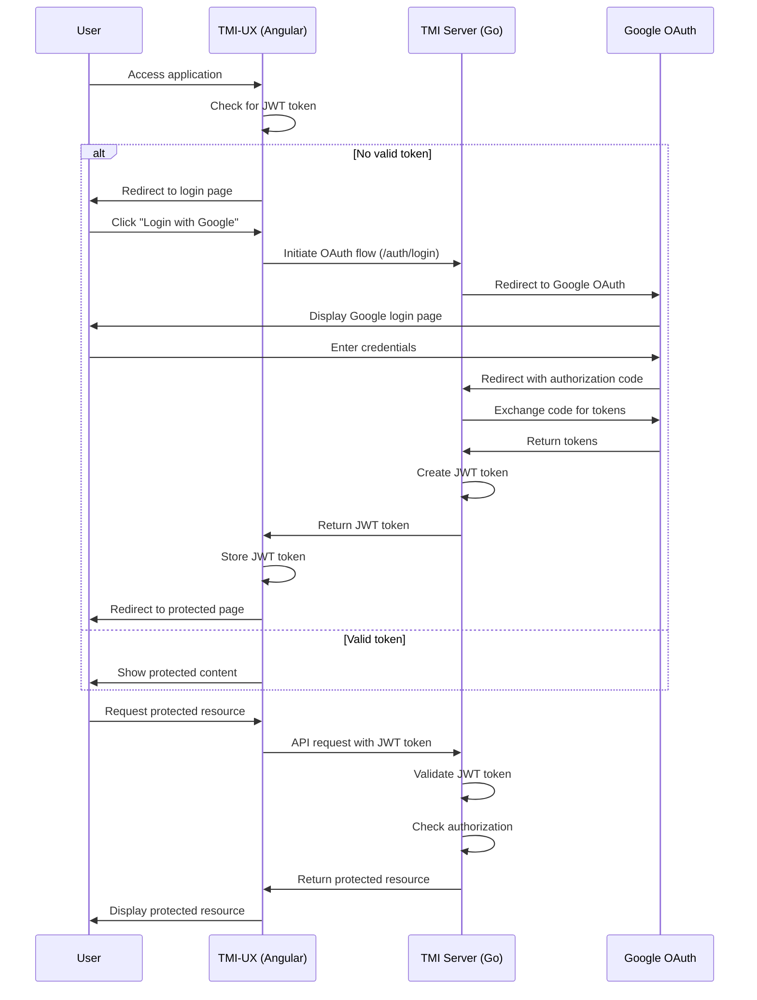
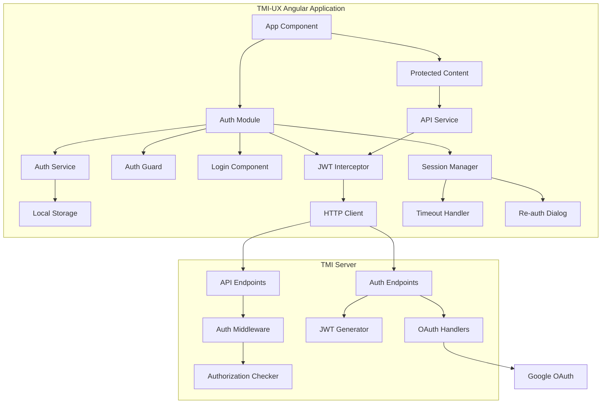
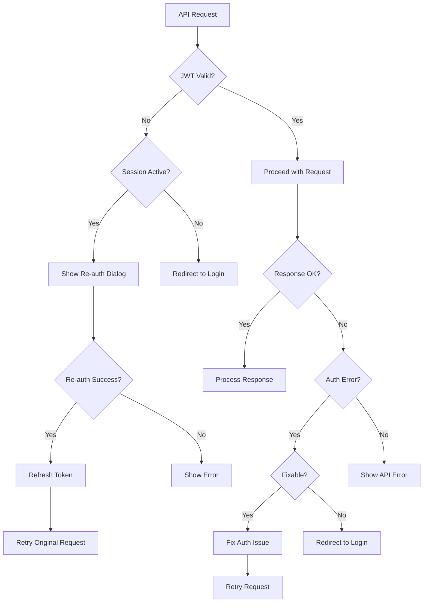

# TMI Server Integration Plan

## Overview

This document outlines the plan for integrating the TMI-UX Angular application with the TMI server running on localhost:8080. The integration will implement the authentication and authorization mechanisms described in the authentication-authorization-plan.md document.

## Scope

The initial integration will focus on:

1. Google OAuth as the initial authentication provider
2. Core authentication flow (login, JWT handling, API authorization)
3. Comprehensive error handling and user experience
4. Session timeout management and smooth re-authentication
5. Updating environment configuration to point to the TMI server

Future phases will implement additional features such as:

- Additional OAuth providers (GitHub, Microsoft)
- Account linking
- Refresh token functionality

## Current State Analysis

### TMI-UX Application (Angular)

- Currently has a mock authentication service
- Auth guard is disabled for development (always returns true)
- API service is configured to use a mock API URL
- No JWT token handling or OAuth implementation

### TMI Server (Go)

- Running on localhost:8080
- Implements OAuth 2.0 with OIDC
- Uses JWT for authentication
- Has a role-based access control model (Owner, Writer, Reader)
- Provides endpoints for authentication and API operations

## Authentication Flow Diagram



## Component Architecture Diagram



## Error Handling Flow Diagram



## Implementation Plan

### Phase 1: Environment Configuration

#### Task 1.1: Update Environment Files

- Update `environment.ts` to point to the TMI server at localhost:8080
- Add OAuth configuration for Google
- Configure JWT token settings

```typescript
// environment.ts
export const environment: Environment = {
  production: false,
  logLevel: 'DEBUG',
  apiUrl: 'http://localhost:8080',
  authTokenExpiryMinutes: 60,
  operatorName: 'TMI Operator (Development)',
  operatorContact: 'contact@example.com',
  oauth: {
    google: {
      clientId: 'YOUR_GOOGLE_CLIENT_ID',
      redirectUri: 'http://localhost:4200/auth/callback',
    },
  },
};
```

#### Task 1.2: Create Authentication Models

```typescript
// src/app/auth/models/auth.models.ts
export interface JwtToken {
  token: string;
  expiresIn: number;
  expiresAt: Date;
}

export interface UserProfile {
  email: string;
  name: string;
  picture?: string;
}

export interface OAuthResponse {
  code: string;
  state: string;
}

export interface AuthError {
  code: string;
  message: string;
  retryable: boolean;
}
```

#### Error Handling & User Experience for Phase 1

- Create a comprehensive error catalog with user-friendly messages
- Implement environment validation to detect misconfiguration early
- Add detailed logging for environment initialization
- Create fallback mechanisms for missing configuration

### Phase 2: Authentication Service Implementation

#### Task 2.1: Enhance Auth Service

```typescript
// src/app/auth/services/auth.service.ts
@Injectable({
  providedIn: 'root',
})
export class AuthService {
  // Private subjects
  private isAuthenticatedSubject = new BehaviorSubject<boolean>(false);
  private userProfileSubject = new BehaviorSubject<UserProfile | null>(null);
  private jwtTokenSubject = new BehaviorSubject<JwtToken | null>(null);
  private authErrorSubject = new BehaviorSubject<AuthError | null>(null);

  // Public observables
  isAuthenticated$ = this.isAuthenticatedSubject.asObservable();
  userProfile$ = this.userProfileSubject.asObservable();
  authError$ = this.authErrorSubject.asObservable();

  constructor(
    private router: Router,
    private logger: LoggerService,
    private http: HttpClient,
  ) {
    this.logger.info('Auth Service initialized');
    this.checkAuthStatus();
  }

  // Initialize Google OAuth
  initGoogleOAuth(): void {
    // Implementation details
  }

  // Login with Google
  loginWithGoogle(): void {
    // Implementation details
  }

  // Handle OAuth callback
  handleOAuthCallback(response: OAuthResponse): Observable<boolean> {
    // Implementation details
  }

  // Exchange authorization code for JWT token
  exchangeCodeForToken(code: string): Observable<JwtToken> {
    // Implementation details
  }

  // Store JWT token
  storeToken(token: JwtToken): void {
    // Implementation details
  }

  // Get current JWT token
  getToken(): JwtToken | null {
    // Implementation details
  }

  // Check if token is expired
  isTokenExpired(): boolean {
    // Implementation details
  }

  // Logout
  logout(): void {
    // Implementation details
  }

  // Handle authentication errors
  handleAuthError(error: any): AuthError {
    // Implementation details
  }
}
```

#### Task 2.2: Create HTTP Interceptor

```typescript
// src/app/auth/interceptors/jwt.interceptor.ts
@Injectable()
export class JwtInterceptor implements HttpInterceptor {
  constructor(
    private authService: AuthService,
    private logger: LoggerService,
  ) {}

  intercept(request: HttpRequest<unknown>, next: HttpHandler): Observable<HttpEvent<unknown>> {
    // Add JWT token to request headers
    // Handle 401 Unauthorized responses
    // Implementation details
  }
}
```

#### Task 2.3: Create Session Manager Service

```typescript
// src/app/auth/services/session-manager.service.ts
@Injectable({
  providedIn: 'root',
})
export class SessionManagerService {
  private sessionTimeoutWarning$ = new Subject<number>();
  private tokenExpiryTimer: any;

  constructor(
    private authService: AuthService,
    private dialog: MatDialog,
    private logger: LoggerService,
  ) {
    this.initSessionMonitoring();
  }

  // Initialize session monitoring
  private initSessionMonitoring(): void {
    // Monitor token expiration
    // Set up timers for warnings
  }

  // Show session expiry warning
  showExpiryWarning(minutesLeft: number): void {
    // Display warning notification
  }

  // Handle session timeout
  handleSessionTimeout(): void {
    // Show re-authentication dialog
  }

  // Extend session
  extendSession(): Observable<boolean> {
    // Request token refresh
  }
}
```

#### Task 2.4: Create Re-authentication Dialog Component

```typescript
// src/app/auth/components/reauth-dialog/reauth-dialog.component.ts
@Component({
  selector: 'app-reauth-dialog',
  templateUrl: './reauth-dialog.component.html',
  styleUrls: ['./reauth-dialog.component.scss'],
})
export class ReauthDialogComponent {
  isLoading = false;
  error: string | null = null;

  constructor(
    private authService: AuthService,
    private dialogRef: MatDialogRef<ReauthDialogComponent>,
    private logger: LoggerService,
  ) {}

  // Re-authenticate with Google
  reauthenticate(): void {
    // Implementation details
  }

  // Close dialog
  cancel(): void {
    this.dialogRef.close(false);
  }
}
```

#### Error Handling & User Experience for Phase 2

- Implement comprehensive error handling for all authentication flows
- Create retry mechanisms with exponential backoff for network failures
- Add detailed logging for authentication events
- Implement graceful degradation for authentication failures
- Create user-friendly error messages for common authentication issues

#### Session Timeout Handling for Phase 2

- Implement JWT expiration tracking in the auth service
- Add a timer that triggers before the actual token expiration
- Create a background token validator that periodically checks token validity
- Show warning notifications before session expiry
- Provide a "Stay logged in" option that extends the session
- Store user's current state/context when timeout is approaching
- Implement a modal dialog for re-authentication
- Preserve form data and application state during re-authentication
- Provide clear messaging about why re-authentication is needed
- After successful re-authentication, restore the user to exactly where they were

### Phase 3: Authentication UI Components

#### Task 3.1: Create Login Component

```typescript
// src/app/auth/components/login/login.component.ts
@Component({
  selector: 'app-login',
  templateUrl: './login.component.html',
  styleUrls: ['./login.component.scss'],
})
export class LoginComponent implements OnInit {
  isLoading = false;
  error: string | null = null;

  constructor(
    private authService: AuthService,
    private route: ActivatedRoute,
    private router: Router,
    private logger: LoggerService,
  ) {}

  ngOnInit(): void {
    // Check for OAuth callback parameters
    // Implementation details
  }

  loginWithGoogle(): void {
    // Implementation details
  }

  // Handle login errors
  private handleLoginError(error: any): void {
    // Display user-friendly error message
    // Log detailed error information
    // Provide retry options when appropriate
  }
}
```

#### Task 3.2: Update Navigation Components

```typescript
// src/app/app.component.ts
@Component({
  selector: 'app-root',
  templateUrl: './app.component.html',
  styleUrls: ['./app.component.scss'],
})
export class AppComponent implements OnInit {
  isAuthenticated = false;
  userProfile: UserProfile | null = null;

  constructor(
    private authService: AuthService,
    private sessionManager: SessionManagerService,
    private logger: LoggerService,
  ) {}

  ngOnInit(): void {
    // Subscribe to authentication state
    // Implementation details
  }

  logout(): void {
    // Implementation details
  }
}
```

#### Error Handling & User Experience for Phase 3

- Implement loading indicators for all authentication operations
- Add clear error messages with actionable next steps
- Create retry buttons for recoverable errors
- Implement graceful degradation for authentication failures
- Add animations for smooth transitions between authentication states
- Implement accessibility features for authentication components
- Create comprehensive error state components

### Phase 4: Authorization Implementation

#### Task 4.1: Update Auth Guards

```typescript
// src/app/auth/guards/auth.guard.ts
export const authGuard: CanActivateFn = (route, state) => {
  const authService = inject(AuthService);
  const router = inject(Router);
  const logger = inject(LoggerService);

  if (!authService.isAuthenticated) {
    logger.debug('User is not authenticated, redirecting to login page');
    void router.navigate(['/login'], {
      queryParams: {
        returnUrl: state.url,
        reason: 'session_expired',
      },
    });
    return false;
  }

  return true;
};
```

#### Task 4.2: Create Role Guard

```typescript
// src/app/auth/guards/role.guard.ts
export const roleGuard: CanActivateFn = (route, state) => {
  const authService = inject(AuthService);
  const router = inject(Router);
  const logger = inject(LoggerService);

  const requiredRole = route.data['requiredRole'];

  if (!authService.hasRole(requiredRole)) {
    logger.debug(`User does not have required role: ${requiredRole}`);
    void router.navigate(['/unauthorized'], {
      queryParams: {
        requiredRole,
        currentUrl: state.url,
      },
    });
    return false;
  }

  return true;
};
```

#### Task 4.3: Update API Service

```typescript
// src/app/core/services/api.service.ts
@Injectable({
  providedIn: 'root',
})
export class ApiService {
  private apiUrl = environment.apiUrl;

  constructor(
    private http: HttpClient,
    private logger: LoggerService,
  ) {
    this.logger.info(`API Service initialized with endpoint: ${this.apiUrl}`);
  }

  // Enhanced error handling for authorization errors
  private handleError(
    error: HttpErrorResponse,
    method: string,
    endpoint: string,
  ): Observable<never> {
    let errorMessage = '';

    if (error.error instanceof ErrorEvent) {
      // Client-side error
      errorMessage = `Client Error: ${error.error.message}`;
      this.logger.error(errorMessage);
    } else {
      // Server-side error
      errorMessage = `Server Error: ${error.status} ${error.statusText} for ${method} ${endpoint}`;
      this.logger.error(errorMessage, error);

      // Handle authorization errors
      if (error.status === 401 || error.status === 403) {
        // Handle unauthorized or forbidden errors
        // Implementation details
      }

      // Log more details in debug mode
      this.logger.debug('Full error response', error);
    }

    // Return an observable with a user-facing error message
    return throwError(() => new Error(errorMessage));
  }
}
```

#### Task 4.4: Create Unauthorized Component

```typescript
// src/app/auth/components/unauthorized/unauthorized.component.ts
@Component({
  selector: 'app-unauthorized',
  templateUrl: './unauthorized.component.html',
  styleUrls: ['./unauthorized.component.scss'],
})
export class UnauthorizedComponent implements OnInit {
  requiredRole: string | null = null;
  currentUrl: string | null = null;

  constructor(
    private route: ActivatedRoute,
    private router: Router,
    private logger: LoggerService,
  ) {}

  ngOnInit(): void {
    // Get query parameters
    this.route.queryParams.subscribe(params => {
      this.requiredRole = params['requiredRole'];
      this.currentUrl = params['currentUrl'];
    });
  }

  goBack(): void {
    // Navigate back to a safe location
  }
}
```

#### Error Handling & User Experience for Phase 4

- Implement role-based UI adaptation (hide/show elements based on permissions)
- Add clear error messages for authorization failures
- Create user-friendly unauthorized pages with helpful next steps
- Implement graceful degradation for authorization failures
- Add detailed logging for authorization events
- Create retry mechanisms for authorization failures when appropriate

### Phase 5: Testing and Validation

#### Task 5.1: Unit Testing

```typescript
// src/app/auth/services/auth.service.spec.ts
describe('AuthService', () => {
  let service: AuthService;
  let httpMock: HttpTestingController;

  beforeEach(() => {
    TestBed.configureTestingModule({
      imports: [HttpClientTestingModule],
      providers: [AuthService, LoggerService],
    });
    service = TestBed.inject(AuthService);
    httpMock = TestBed.inject(HttpTestingController);
  });

  it('should be created', () => {
    expect(service).toBeTruthy();
  });

  // Test authentication flow
  it('should handle successful authentication', () => {
    // Implementation details
  });

  // Test token management
  it('should store and retrieve tokens correctly', () => {
    // Implementation details
  });

  // Test error handling
  it('should handle authentication errors gracefully', () => {
    // Implementation details
  });

  // Test session timeout
  it('should detect token expiration', () => {
    // Implementation details
  });
});
```

#### Task 5.2: Integration Testing

```typescript
// src/app/auth/auth.integration.spec.ts
describe('Authentication Integration', () => {
  let httpMock: HttpTestingController;
  let authService: AuthService;
  let router: Router;

  beforeEach(() => {
    TestBed.configureTestingModule({
      imports: [HttpClientTestingModule, RouterTestingModule.withRoutes([])],
      providers: [AuthService, LoggerService, SessionManagerService],
    });

    httpMock = TestBed.inject(HttpTestingController);
    authService = TestBed.inject(AuthService);
    router = TestBed.inject(Router);
  });

  // Test complete authentication flow
  it('should complete the full authentication flow', fakeAsync(() => {
    // Implementation details
  }));

  // Test session timeout handling
  it('should handle session timeout correctly', fakeAsync(() => {
    // Implementation details
  }));

  // Test re-authentication
  it('should handle re-authentication correctly', fakeAsync(() => {
    // Implementation details
  }));
});
```

#### Task 5.3: E2E Testing

```typescript
// cypress/e2e/auth.cy.ts
describe('Authentication', () => {
  beforeEach(() => {
    // Set up test environment
  });

  it('should redirect unauthenticated users to login page', () => {
    // Implementation details
  });

  it('should allow login with Google', () => {
    // Implementation details
  });

  it('should handle authentication errors gracefully', () => {
    // Implementation details
  });

  it('should handle session timeout gracefully', () => {
    // Implementation details
  });
});
```

#### Error Handling & User Experience for Phase 5

- Create comprehensive test cases for error scenarios
- Implement test mocks for network failures and server errors
- Add visual regression tests for error states
- Test accessibility of error messages and authentication components
- Validate error handling across different browsers and devices

## Implementation Timeline

1. **Phase 1: Environment Configuration** - 1 day
2. **Phase 2: Authentication Service Implementation** - 3 days
3. **Phase 3: Authentication UI Components** - 2 days
4. **Phase 4: Authorization Implementation** - 2 days
5. **Phase 5: Testing and Validation** - 3 days

Total estimated time: 11 days

## Future Enhancements (Post-Initial Integration)

1. **Additional OAuth Providers**

   - Add GitHub and Microsoft OAuth providers
   - Implement provider selection UI

2. **Refresh Token Support**

   - Implement refresh token storage and management
   - Add automatic token refresh

3. **Account Linking**

   - Implement account linking for users with multiple OAuth providers
   - Add account management UI

4. **Enhanced Security Features**
   - Implement CSRF protection
   - Add rate limiting for authentication attempts
   - Implement secure headers
