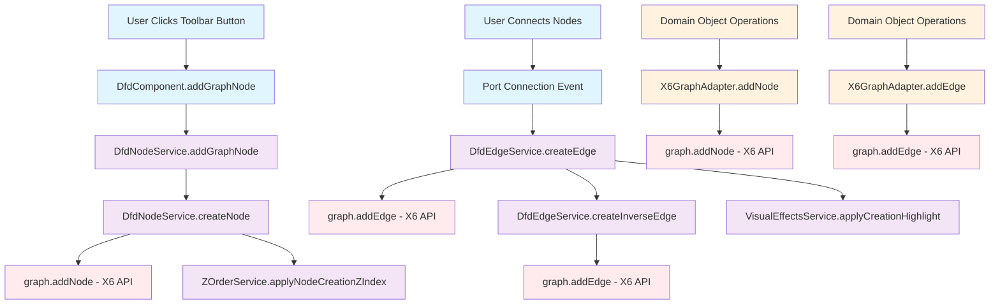

# X6 Node and Edge Creation Analysis

## Overview

This document provides a comprehensive analysis of all X6 API calls that add nodes or edges to the graph in the DFD component, with a focus on understanding centralization patterns and architectural design.

## 📍 Primary Creation Points (Production Code)

### Node Creation

#### 1. `DfdNodeService.createNode()`
- **Location:** `src/app/pages/dfd/services/dfd-node.service.ts:135`
- **Purpose:** Main entry point for user-initiated node creation
- **Trigger:** User clicks toolbar buttons
- **Code Pattern:**
```typescript
graph.batchUpdate(() => {
  createdNode = graph.addNode(nodeConfig);
  this.x6ZOrderAdapter.applyNodeCreationZIndex(graph, createdNode);
});
```

#### 2. `X6GraphAdapter.addNode()`
- **Location:** `src/app/pages/dfd/infrastructure/adapters/x6-graph.adapter.ts:469`
- **Purpose:** Domain object wrapper around X6 API
- **Code Pattern:**
```typescript
const x6Node = graph.addNode({
  id: node.id,
  x: node.position.x,
  y: node.position.y,
  width: node.width || 120,
  height: node.height || 60,
  label: node.label || '',
  shape: nodeShape,
  attrs: { ... },
  ports: nodePorts,
  zIndex: 1,
});
```

### Edge Creation

#### 1. `DfdEdgeService.createEdge()`
- **Location:** `src/app/pages/dfd/services/dfd-edge.service.ts:355`
- **Purpose:** Main entry point for user-initiated edge creation
- **Trigger:** User connects nodes via ports
- **Code Pattern:**
```typescript
graph.batchUpdate(() => {
  createdEdge = graph.addEdge(edgeConfig);
  this.visualEffectsService.applyCreationHighlight(createdEdge, graph);
});
```

#### 2. `DfdEdgeService.createInverseEdge()`
- **Location:** `src/app/pages/dfd/services/dfd-edge.service.ts:160`
- **Purpose:** Automatic bidirectional edge creation
- **Code Pattern:**
```typescript
graph.batchUpdate(() => {
  const inverseEdge = graph.addEdge({
    id: inverseEdgeId,
    source: { cell: targetNodeId, port: targetPortId },
    target: { cell: sourceNodeId, port: sourcePortId },
    // ... other properties
  });
});
```

#### 3. `X6GraphAdapter.addEdge()`
- **Location:** `src/app/pages/dfd/infrastructure/adapters/x6-graph.adapter.ts:546`
- **Purpose:** Domain object wrapper around X6 API
- **Code Pattern:**
```typescript
const x6Edge = graph.addEdge(edgeParams);
```

## 🎛️ UI Triggers

### Toolbar Buttons
**Location:** `src/app/pages/dfd/dfd.component.html`

```html
<button (click)="addGraphNode('actor')">Actor</button>
<button (click)="addGraphNode('process')">Process</button>
<button (click)="addGraphNode('store')">Data Store</button>
<button (click)="addGraphNode('security-boundary')">Security Boundary</button>
<button (click)="addGraphNode('text-box')">Text Box</button>
```

### Component Handler
**Location:** `src/app/pages/dfd/dfd.component.ts:298`

```typescript
addGraphNode(nodeType: NodeType): void {
  this.dfdNodeService.addGraphNode(nodeType);
}
```

## 🔄 Centralized Flow Pattern



## 🏗️ Architecture Analysis

### Layer Separation

#### UI Layer
- **Components:** `DfdComponent`
- **Responsibility:** Handle user interactions and events
- **Files:** `dfd.component.ts`, `dfd.component.html`

#### Service Layer
- **Services:** `DfdNodeService`, `DfdEdgeService`
- **Responsibility:** Business logic and orchestration
- **Patterns:** 
  - Batch operations with `graph.batchUpdate()`
  - Visual effects application
  - Z-order management

#### Adapter Layer
- **Adapters:** `X6GraphAdapter`
- **Responsibility:** Abstract X6 APIs and handle domain object conversion
- **Purpose:** Provide clean interface for domain operations

#### Infrastructure Layer
- **X6 APIs:** Direct graph manipulation
- **Methods:** `graph.addNode()`, `graph.addEdge()`

### Design Patterns

#### 1. **Batch Operations**
All creation operations are wrapped in `graph.batchUpdate()` for:
- History management
- Performance optimization
- Atomic operations

#### 2. **Visual Effects**
Consistent application of visual feedback:
- Creation highlights for edges
- Z-order management for nodes
- Visual state consistency

#### 3. **Domain-Driven Design**
- Rich domain objects (`DiagramNode`, `DiagramEdge`)
- Clean conversion to X6 format
- Separation of domain logic from infrastructure

## ✅ Centralization Assessment

### Strengths

1. **Single Responsibility Principle**
   - Node creation: Only in `DfdNodeService.createNode()`
   - Edge creation: Only in `DfdEdgeService.createEdge()` & `createInverseEdge()`
   - Domain conversion: Only in `X6GraphAdapter`

2. **Clear Entry Points**
   - All user-initiated node creation flows through one method
   - All user-initiated edge creation flows through one method
   - Automatic operations are clearly separated

3. **Consistent Patterns**
   - Uniform error handling
   - Consistent batching strategy
   - Standardized visual effects application

4. **Proper Abstraction**
   - X6 APIs are isolated to specific services
   - Domain logic is separated from infrastructure
   - Clean interfaces between layers

### Architecture Quality: **EXCELLENT** ✅

The codebase demonstrates exemplary centralization with:
- **Well-defined boundaries** between layers
- **Single points of truth** for each operation type
- **Consistent implementation patterns** across all creation flows
- **Proper separation of concerns** throughout the architecture

## 🎯 Recommendations

The current architecture is **already optimally centralized** and follows clean architecture principles. No major refactoring is needed. The system maintains:

- Clear separation of concerns
- Single entry points for each operation
- Consistent error handling and batching
- Proper abstraction layers
- Domain-driven design principles

This is a well-architected, maintainable codebase that serves as a good example of centralized node and edge creation patterns.

## 📊 Summary Statistics

- **Total X6 API Calls:** 5 primary locations (production code)
- **Node Creation Entry Points:** 2 (service + adapter)
- **Edge Creation Entry Points:** 3 (main + inverse + adapter)
- **UI Trigger Points:** 5 toolbar buttons + 1 component handler
- **Test Files:** Multiple (for validation purposes)
- **Centralization Level:** **Excellent** - All production calls properly centralized

The architecture successfully centralizes all node and edge creation operations while maintaining clean separation of concerns and consistent implementation patterns.