# Architectural Issues and Improvement Recommendations

This document identifies key architectural issues in the DFD change propagation system and provides specific recommendations for improvement.

## Executive Summary

The DFD change propagation system has evolved into a complex architecture with multiple overlapping responsibilities, duplicate code paths, and unclear orchestration. While functional, it presents maintenance challenges and potential reliability issues that should be addressed through systematic refactoring.

## Key Architectural Issues

### 1. Multiple Code Paths for Similar Operations

**Problem**: The same conceptual operation (e.g., "add a node") can follow different code paths depending on context.

#### Current State
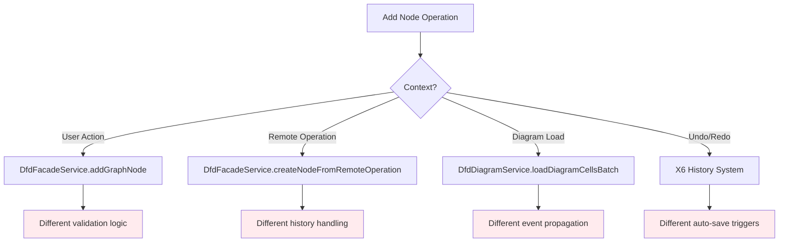

**Specific Examples**:
- Node creation: `addGraphNode()` vs `createNodeFromRemoteOperation()` vs diagram loading
- Node deletion: User delete vs remote delete vs batch delete
- Edge creation: Interactive creation vs programmatic vs remote

**Impact**: 
- Inconsistent behavior between different trigger sources
- Difficult to ensure all paths handle validation, styling, and state updates correctly
- High maintenance burden when changing node/edge behavior

### 2. Scattered Orchestration Logic

**Problem**: The DfdComponent acts as a central coordinator but orchestration logic is scattered across multiple services without clear responsibility boundaries.

#### Current Orchestration Issues
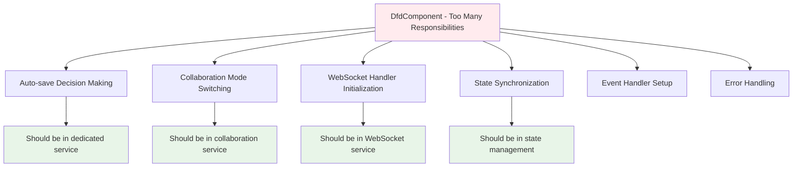

**Specific Problems**:
- DfdComponent has 500+ lines handling coordination
- No single place to understand the complete operation flow
- Error handling scattered across multiple layers
- Difficult to test orchestration logic in isolation

### 3. Inconsistent State Management

**Problem**: Multiple state stores with overlapping responsibilities and unclear ownership.

#### State Store Confusion
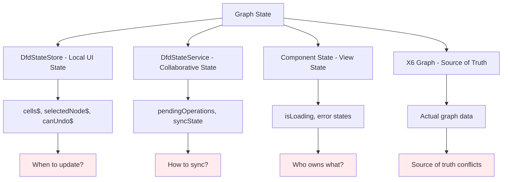

**Specific Issues**:
- DfdStateStore and DfdStateService have overlapping concerns
- No clear data flow hierarchy
- Synchronization logic scattered across components
- Potential for state inconsistencies

### 4. Complex Permission Logic with Race Conditions

**Problem**: Permission checking involves multiple fallback paths and async operations that can create race conditions.

#### Permission Checking Complexity
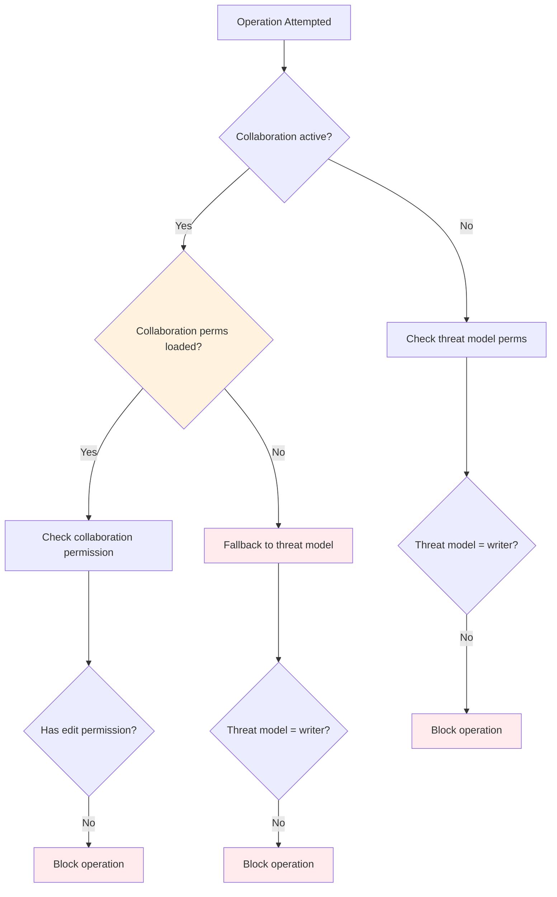

**Race Condition Example**:
1. User starts operation while collaboration permissions are loading
2. System falls back to threat model permission (writer)
3. Collaboration permissions finish loading (reader)
4. Next operation is blocked, creating inconsistent UX

### 5. Visual Effects and History Filtering Complexity

**Problem**: The system for excluding visual changes from history is complex and error-prone.

#### Current Filtering Approach
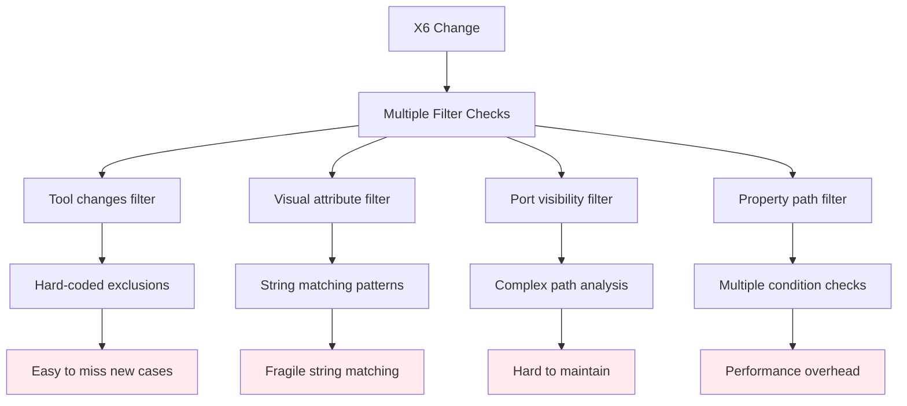

**Issues**:
- Filtering logic scattered across multiple methods
- String-based attribute matching is fragile
- Easy to introduce bugs when adding new visual effects
- No centralized policy for what constitutes a "visual-only" change

### 6. Auto-save Logic Redundancy

**Problem**: Auto-save triggering logic is duplicated and inconsistent across different event sources.

#### Auto-save Trigger Redundancy
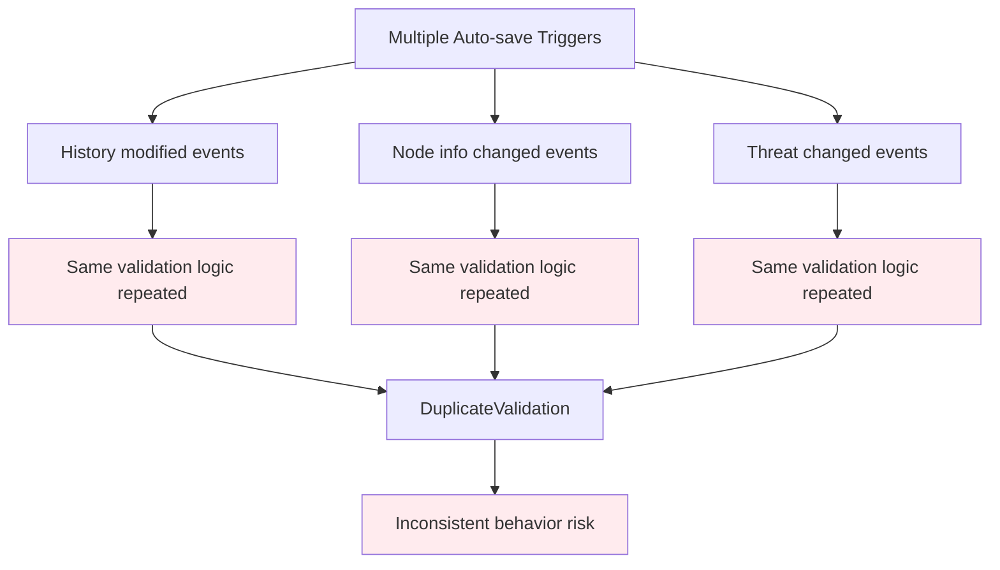

## Improvement Recommendations

### 1. Consolidate Operation Pathways

**Goal**: Create a unified operation system that handles all node/edge operations consistently.

#### Proposed Architecture
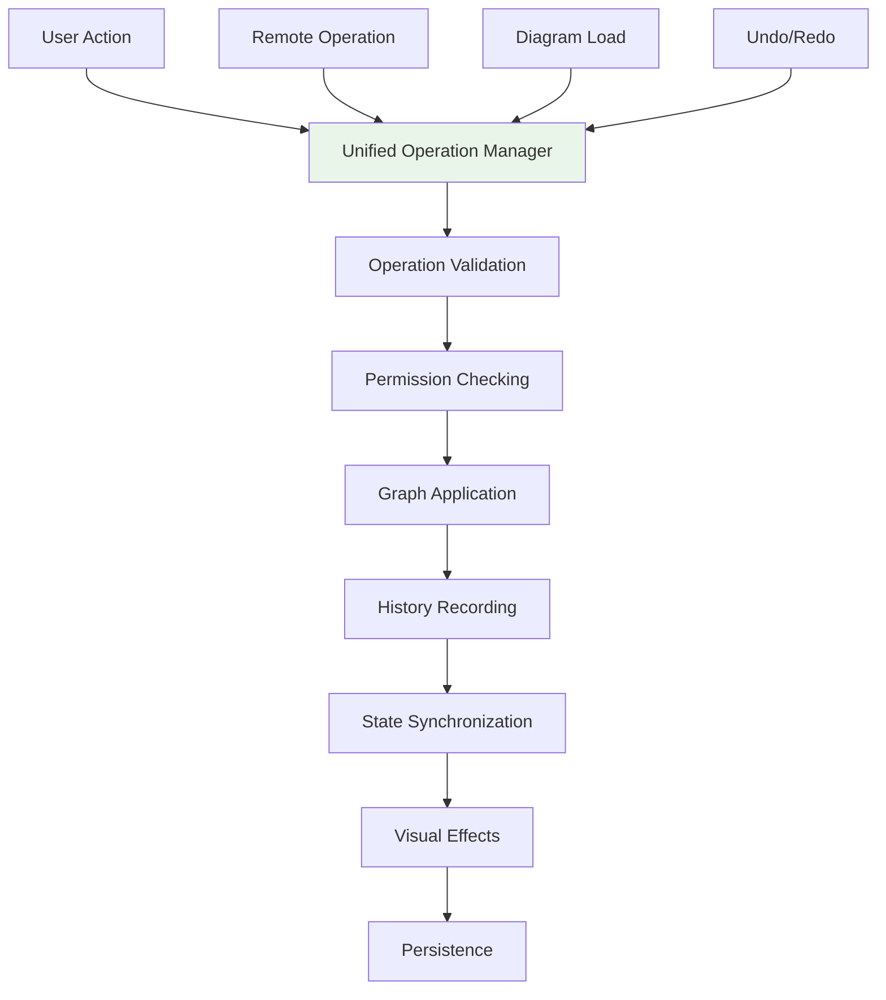

**Implementation Steps**:
1. Create `GraphOperationManager` service
2. Define common `GraphOperation` interface
3. Implement operation visitors for different contexts
4. Migrate existing pathways to use the manager

**Benefits**:
- Single place to handle all graph operations
- Consistent validation and state management
- Easier testing and debugging
- Reduced code duplication

### 2. Implement Clear Orchestration Layer

**Goal**: Extract orchestration logic from DfdComponent into dedicated services.

#### Proposed Service Separation
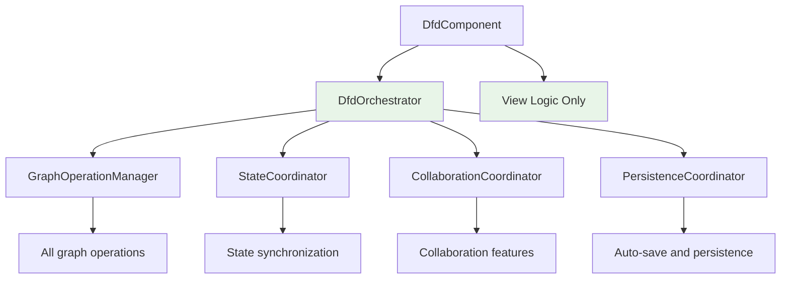

**Implementation Steps**:
1. Create `DfdOrchestrator` service to coordinate high-level operations
2. Create `StateCoordinator` to manage state synchronization
3. Create `CollaborationCoordinator` for collaboration-specific logic
4. Create `PersistenceCoordinator` for auto-save management
5. Refactor DfdComponent to use orchestrator

### 3. Unify State Management

**Goal**: Create a clear hierarchy and ownership model for state.

#### Proposed State Architecture
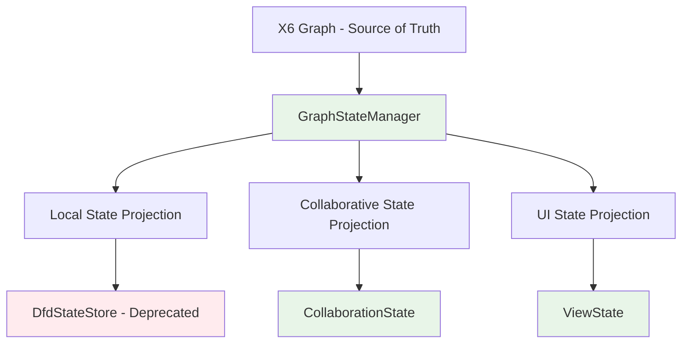

**Implementation Steps**:
1. Create `GraphStateManager` as single state coordinator
2. Define clear state projections for different concerns
3. Implement state update pipeline with clear ownership
4. Deprecate DfdStateStore and migrate to new architecture
5. Add state validation and consistency checks

### 4. Simplify Permission System

**Goal**: Create a unified permission service with clear fallback behavior.

#### Proposed Permission Architecture
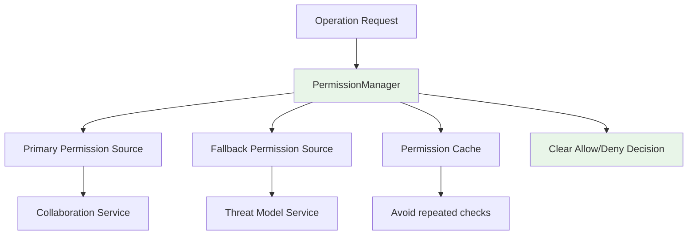

**Implementation Steps**:
1. Create `PermissionManager` service
2. Implement clear permission hierarchy and fallback rules
3. Add permission caching to prevent race conditions
4. Provide reactive permission state for UI binding
5. Centralize all permission checking logic

### 5. Streamline Visual Effects System

**Goal**: Create a declarative visual effects system with better separation from semantic changes.

#### Proposed Visual Effects Architecture
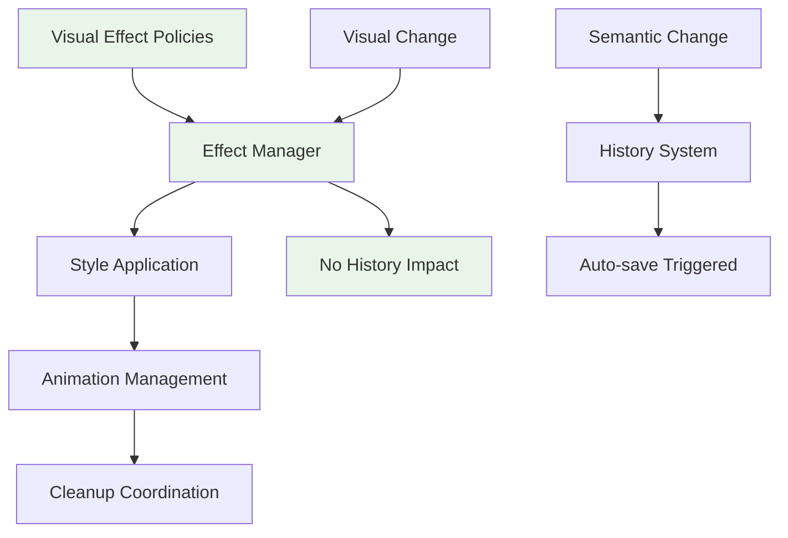

**Implementation Steps**:
1. Define visual effect policies declaratively
2. Create `VisualEffectManager` to coordinate all visual changes
3. Implement effect composition and conflict resolution
4. Separate visual attribute handling from semantic attribute handling
5. Add visual effect testing framework

### 6. Consolidate Auto-save Logic

**Goal**: Create a single auto-save service with unified triggering logic.

#### Proposed Auto-save Architecture
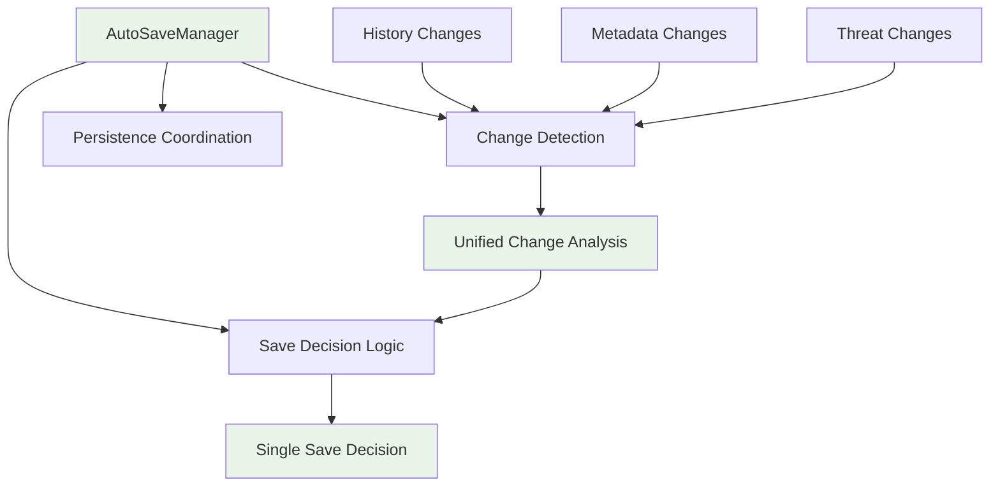

**Implementation Steps**:
1. Create `AutoSaveManager` service
2. Consolidate all auto-save triggering logic
3. Implement unified change detection and filtering
4. Add configurable auto-save policies
5. Provide auto-save status observables for UI

## Migration Strategy

### Phase 1: Foundation (2-3 weeks)
1. Create new service interfaces without changing existing behavior
2. Add comprehensive test coverage for current behavior
3. Implement `GraphOperationManager` alongside existing pathways

### Phase 2: Orchestration (2-3 weeks)
1. Implement `DfdOrchestrator` and related coordination services
2. Begin migrating DfdComponent logic to orchestrator
3. Add new state management architecture alongside existing stores

### Phase 3: Consolidation (3-4 weeks)
1. Migrate all operation pathways to use `GraphOperationManager`
2. Replace scattered auto-save logic with `AutoSaveManager`
3. Implement unified permission system

### Phase 4: Cleanup (1-2 weeks)
1. Remove deprecated services and code paths
2. Update documentation and architectural guides
3. Performance optimization and final testing

## Success Metrics

### Code Quality Metrics
- **Cyclomatic Complexity**: Reduce DfdComponent complexity from ~20 to <10
- **Code Duplication**: Eliminate duplicate operation handling logic
- **Test Coverage**: Achieve >90% coverage for new orchestration services

### Reliability Metrics
- **State Consistency**: Eliminate state synchronization bugs
- **Permission Errors**: Reduce permission-related user errors by 80%
- **Auto-save Failures**: Improve auto-save reliability to >99%

### Maintainability Metrics
- **Bug Fix Time**: Reduce average bug fix time by 50%
- **Feature Development**: Reduce time to add new graph operations by 60%
- **Onboarding**: New developers can understand the system in <2 days

## Risk Mitigation

### Technical Risks
- **Regression Bugs**: Comprehensive test coverage and parallel implementation
- **Performance Impact**: Careful benchmarking and optimization
- **Complex Migration**: Phased approach with rollback capabilities

### Process Risks
- **Team Coordination**: Clear communication and code review processes
- **User Impact**: Feature flags and gradual rollout
- **Timeline Pressure**: Conservative estimates with buffer time

This refactoring will significantly improve the maintainability, reliability, and extensibility of the DFD change propagation system while preserving all existing functionality.