# Auto-save Decision Tree and History Management

This document details the complex decision logic that determines when auto-save is triggered and how the history system manages what gets included in undo/redo operations.

<!-- Note: This document describes architectural patterns and flows. Some class names
may evolve as the codebase is refactored. The patterns described remain valid. -->

## Auto-save Decision Tree

The auto-save system implements sophisticated logic to determine when diagram changes should be persisted to the database.

### Primary Auto-save Decision Flow

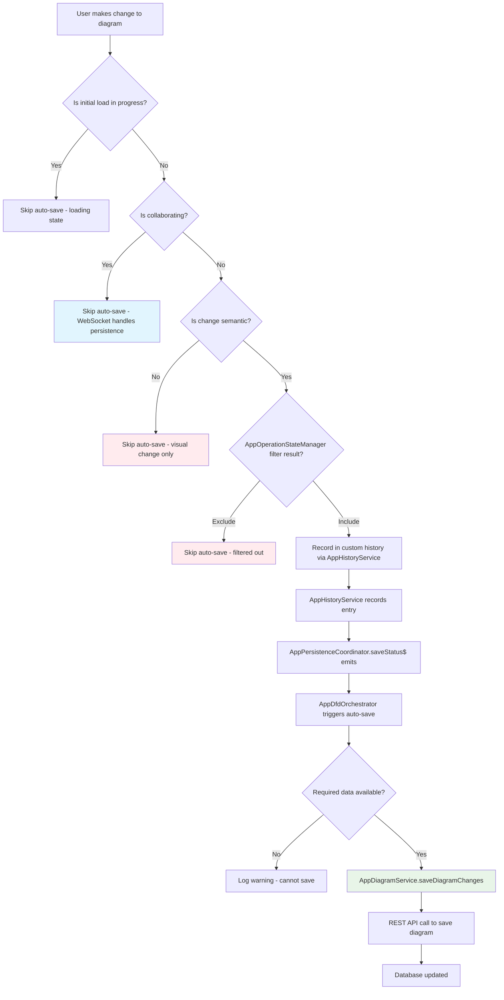

### Auto-save Trigger Sources

The system has multiple sources that can trigger auto-save:

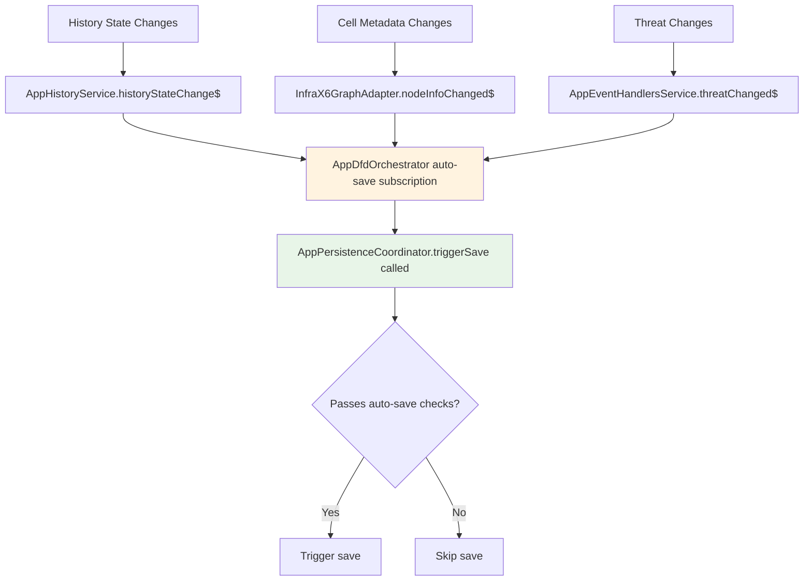

### Auto-save Validation Checks

Before triggering a save, the system performs several validation checks:

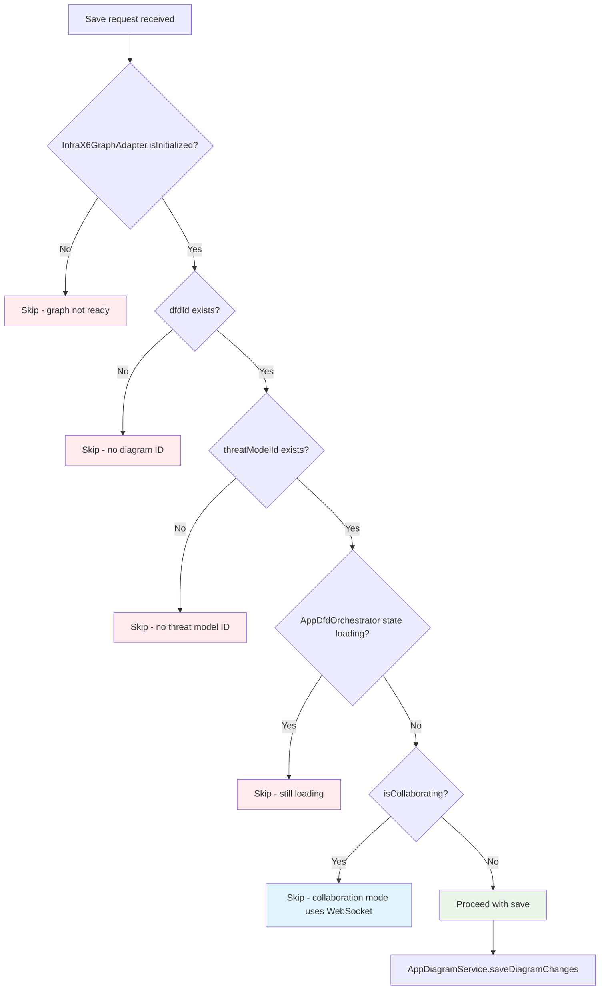

## History Management System

The history system controls what operations can be undone/redone and filters out visual-only changes. TMI uses a custom history implementation (`AppHistoryService`) rather than the X6 built-in history plugin.

### History Inclusion Decision Tree

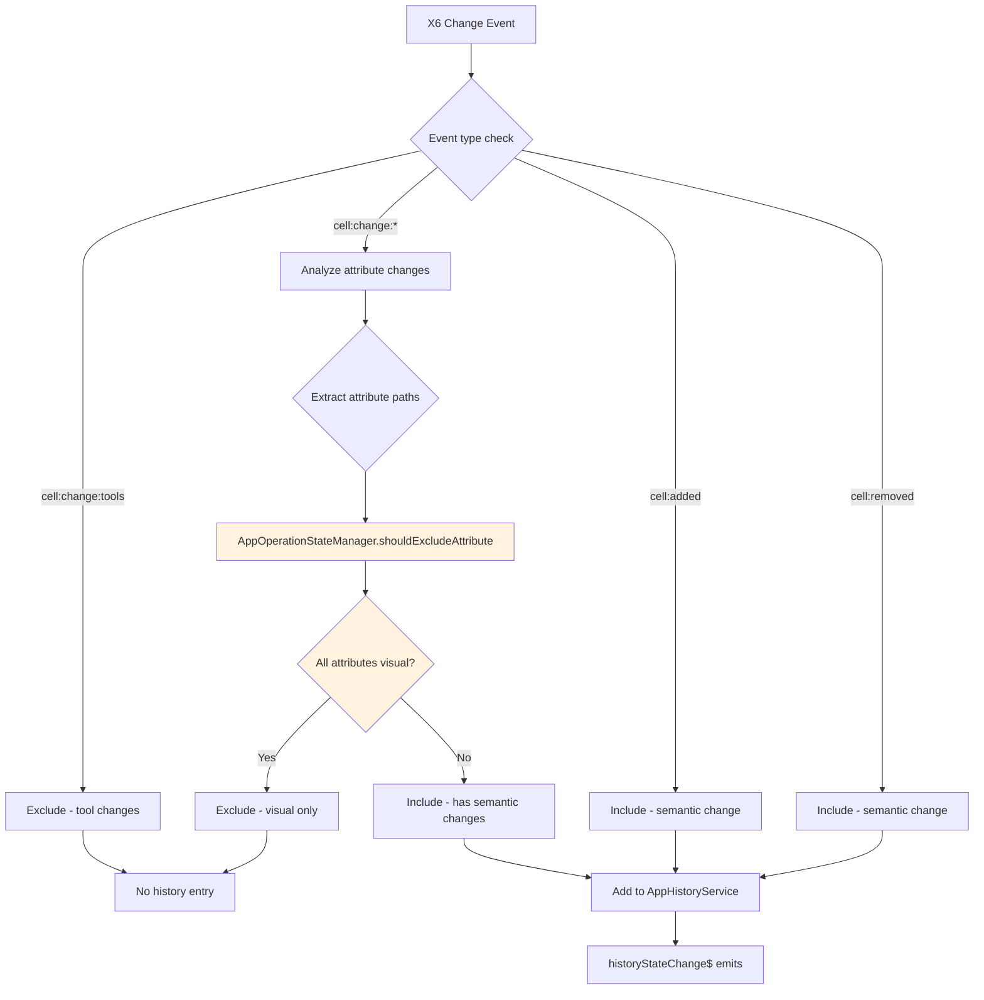

### Visual Attribute Detection

The system maintains a comprehensive list of visual-only attributes:

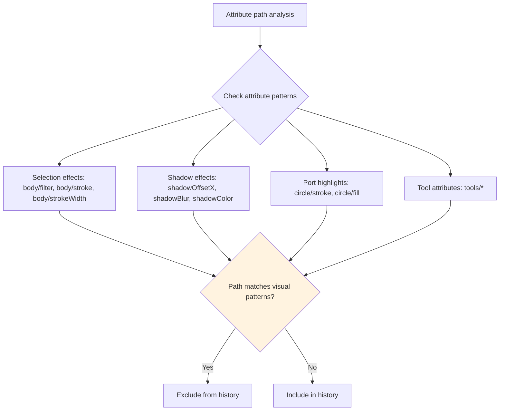

### Port Visibility Handling

Port visibility changes are specifically excluded from history:

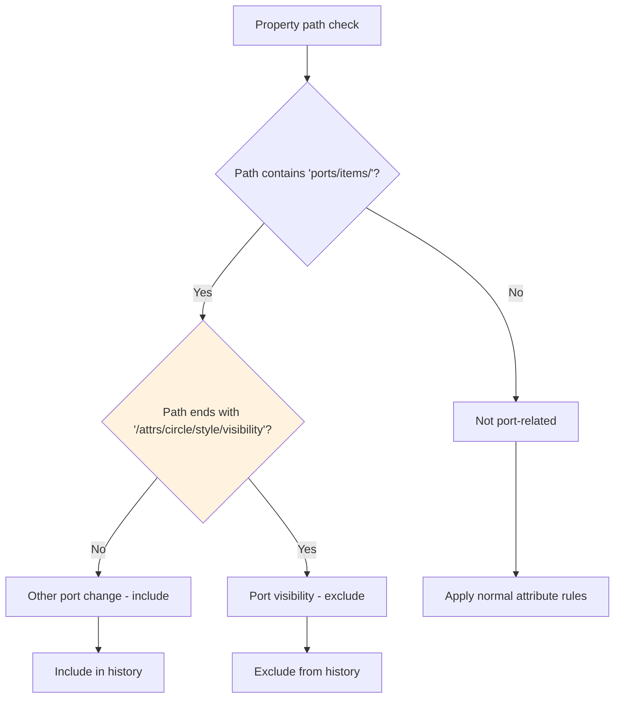

## History Operation Types

The system categorizes different types of operations for history tracking:

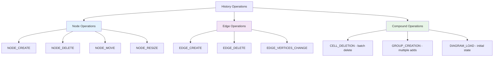

## Atomic Operations and Batching

### Atomic Operation Handling

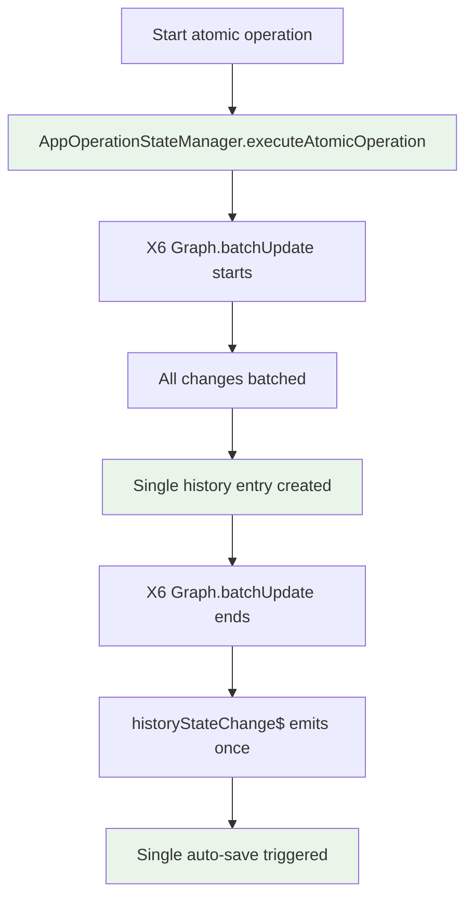

### Remote Operation History Suppression

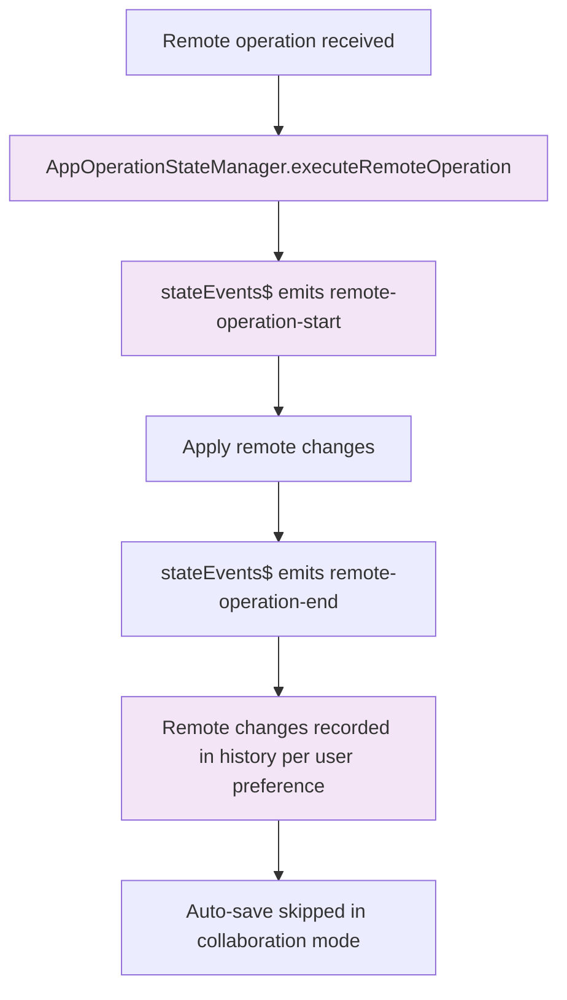

## Collaborative Mode History Handling

### History Management in Collaboration

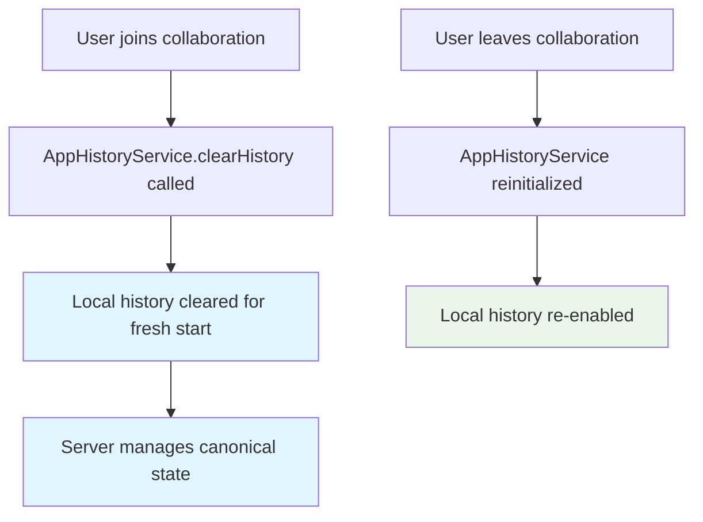

### Server-side History Operations

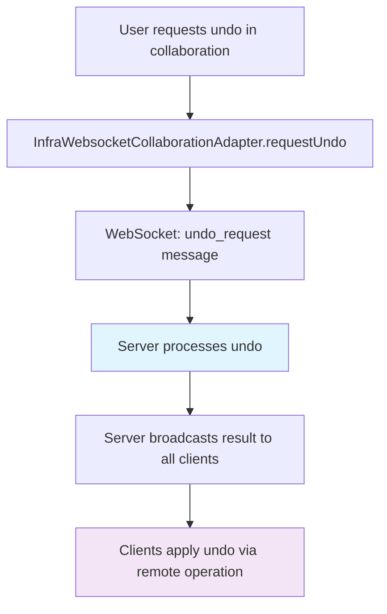

## Performance Considerations

### Debouncing and Throttling

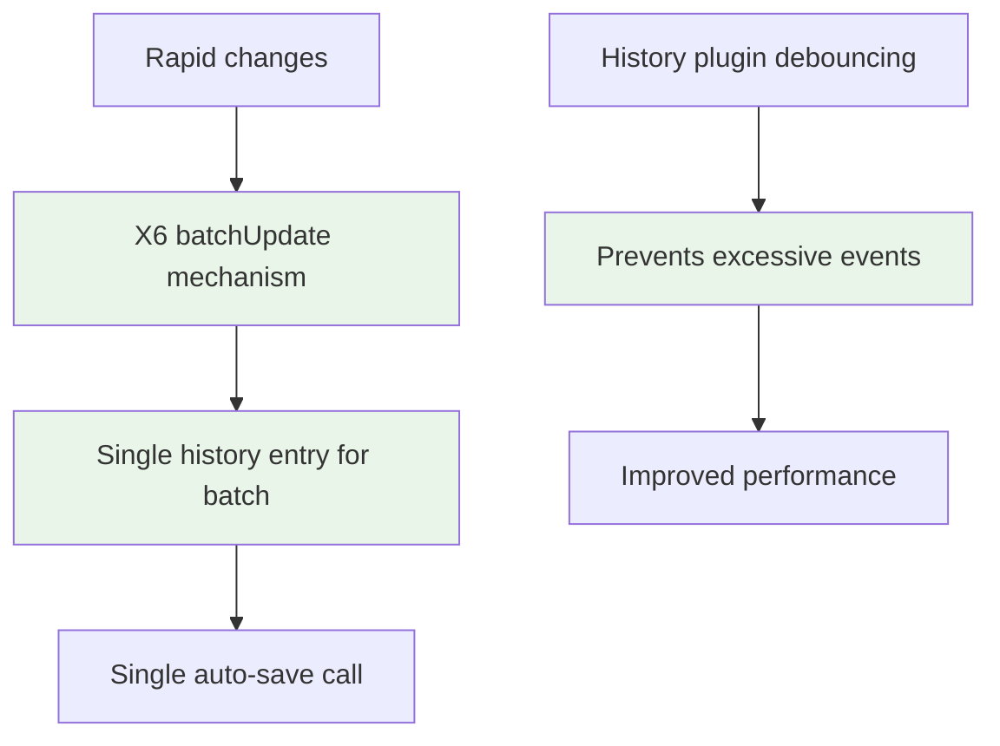

### Memory Management

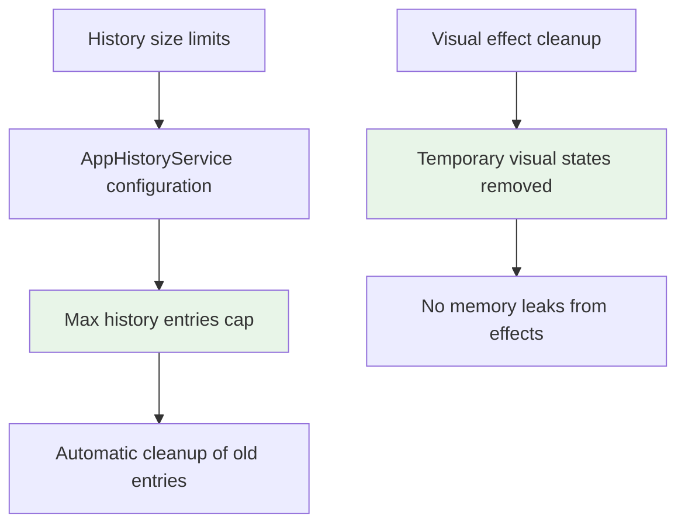

## Error Scenarios and Handling

### Save Failure Handling

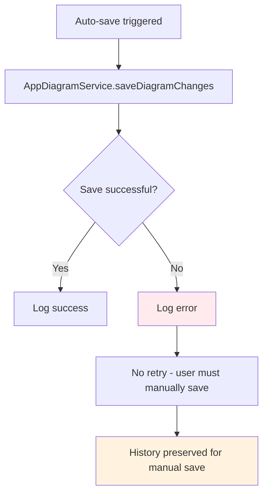

### History Corruption Recovery

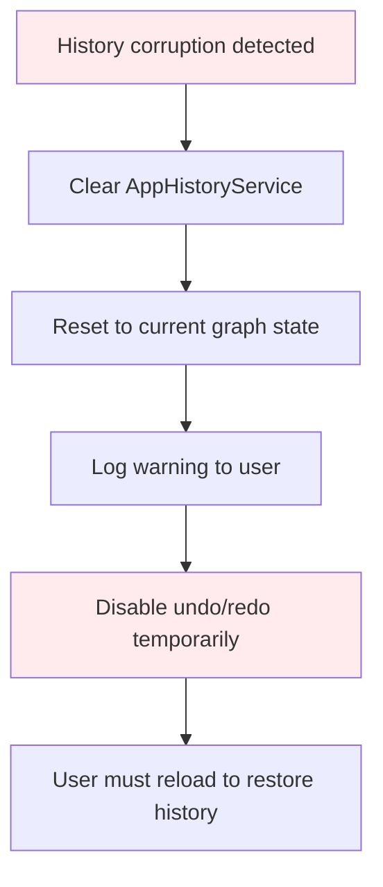

This comprehensive auto-save and history management system ensures data integrity while providing a smooth user experience and maintaining performance even with complex collaborative editing scenarios.

<!--
VERIFICATION SUMMARY
Verified on: 2026-01-25
Agent: verify-migrate-doc

Verified items:
- AppOperationStateManager: Confirmed exists at src/app/pages/dfd/application/services/app-operation-state-manager.service.ts
- AppOperationStateManager.shouldExcludeAttribute: Method confirmed in source code
- AppOperationStateManager.executeAtomicOperation: Method confirmed in source code
- AppOperationStateManager.executeRemoteOperation: Method confirmed in source code
- AppDiagramService: Confirmed exists at src/app/pages/dfd/application/services/app-diagram.service.ts
- AppDiagramService.saveDiagramChanges: Method confirmed in source code
- AppEventHandlersService: Confirmed exists at src/app/pages/dfd/application/services/app-event-handlers.service.ts
- AppEventHandlersService.threatChanged$: Observable confirmed in source code
- AppEventHandlersService.nodeInfoChanged$: Observable confirmed in source code
- InfraX6GraphAdapter: Confirmed exists at src/app/pages/dfd/infrastructure/adapters/infra-x6-graph.adapter.ts
- InfraWebsocketCollaborationAdapter: Confirmed exists at src/app/pages/dfd/infrastructure/adapters/infra-websocket-collaboration.adapter.ts
- Visual attribute detection pattern: Verified shouldExcludeAttribute implementation matches documented patterns

Items corrected:
- GraphHistoryCoordinator renamed to AppOperationStateManager
- X6GraphAdapter renamed to InfraX6GraphAdapter
- DfdDiagramService renamed to AppDiagramService
- DfdEventHandlersService renamed to AppEventHandlersService
- CollaborativeOperationService renamed to InfraWebsocketCollaborationAdapter
- historyModified$ replaced with historyStateChange$ from AppHistoryService
- setHistoryEnabled replaced with clearHistory pattern in AppHistoryService
- Updated references to X6 history plugin to AppHistoryService (custom implementation)
-->
