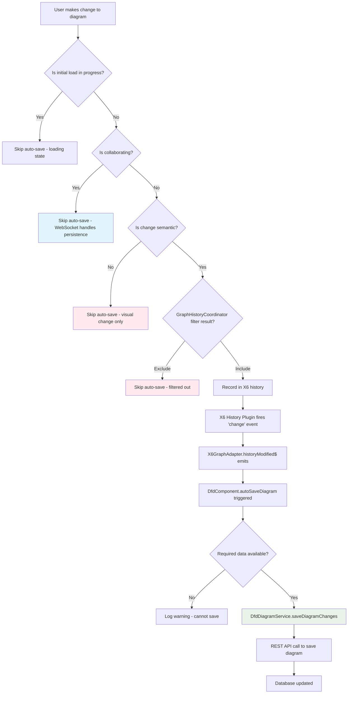
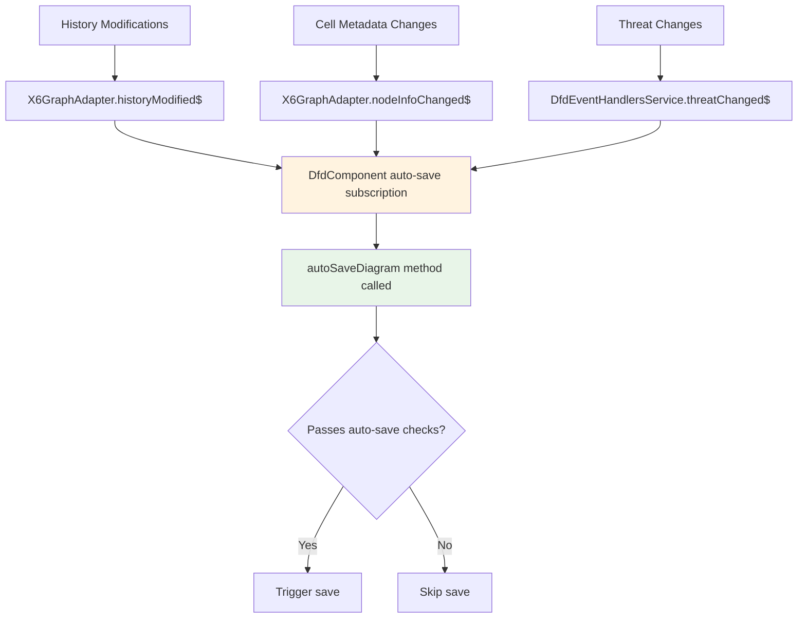
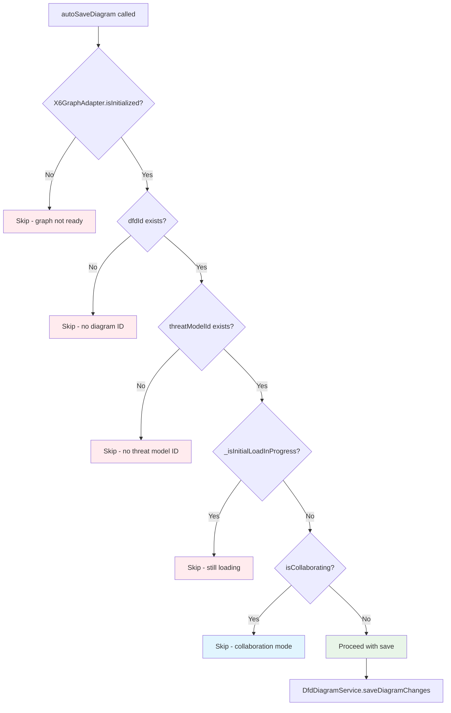
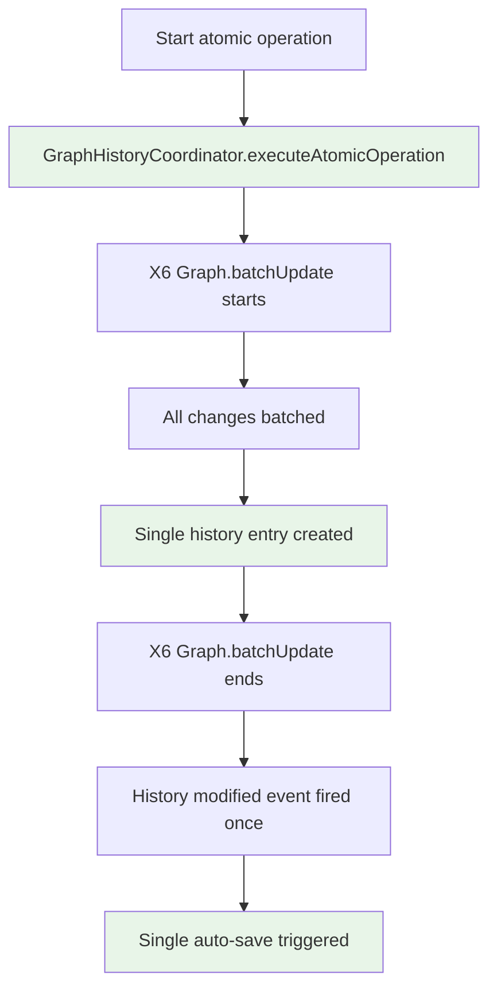
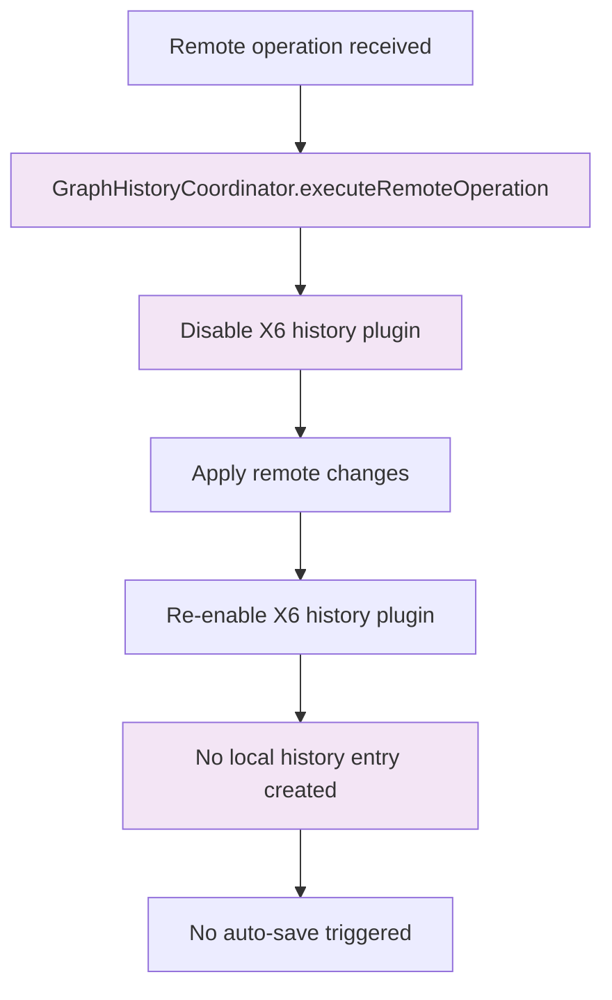
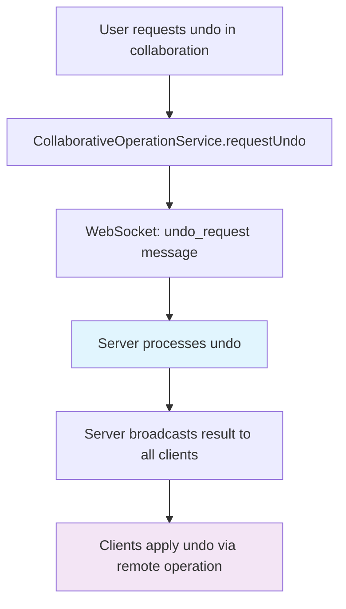
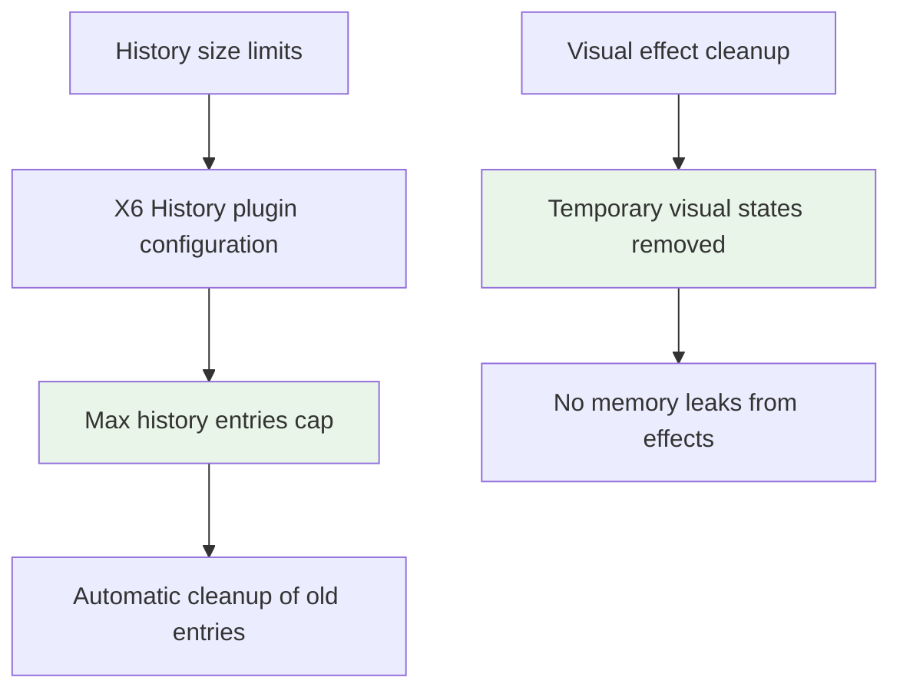
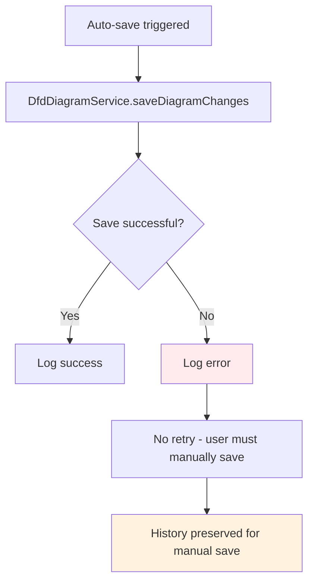
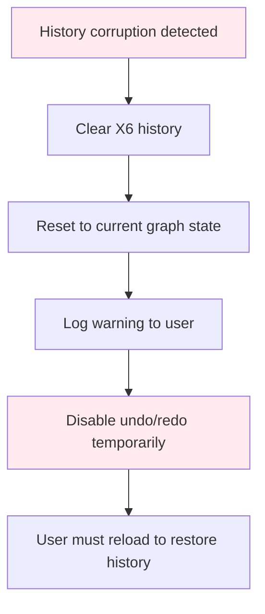

# Auto-save Decision Tree and History Management

This document details the complex decision logic that determines when auto-save is triggered and how the history system manages what gets included in undo/redo operations.

## Auto-save Decision Tree

The auto-save system implements sophisticated logic to determine when diagram changes should be persisted to the database.

### Primary Auto-save Decision Flow



### Auto-save Trigger Sources

The system has multiple sources that can trigger auto-save:



### Auto-save Validation Checks

Before triggering a save, the system performs several validation checks:



## History Management System

The history system controls what operations can be undone/redone and filters out visual-only changes.

### History Inclusion Decision Tree


### Visual Attribute Detection

The system maintains a comprehensive list of visual-only attributes:


### Port Visibility Handling

Port visibility changes are specifically excluded from history:


## History Operation Types

The system categorizes different types of operations for history tracking:


## Atomic Operations and Batching

### Atomic Operation Handling



### Remote Operation History Suppression



## Collaborative Mode History Handling

### History Suppression in Collaboration

```mermaid
flowchart TD
    A[User joins collaboration] --> B[X6GraphAdapter.setHistoryEnabled(false)]
    B --> C[Local history disabled]
    C --> D[Server manages canonical history]

    E[User leaves collaboration] --> F[X6GraphAdapter.setHistoryEnabled(true)]
    F --> G[Local history re-enabled]

    style C fill:#e1f5fe
    style D fill:#e1f5fe
    style G fill:#e8f5e8
```

### Server-side History Operations



## Performance Considerations

### Debouncing and Throttling


### Memory Management



## Error Scenarios and Handling

### Save Failure Handling



### History Corruption Recovery



This comprehensive auto-save and history management system ensures data integrity while providing a smooth user experience and maintaining performance even with complex collaborative editing scenarios.
