# Collaborative Operations Flow

This document details how WebSocket-based collaborative operations work in the DFD system, including message handling, conflict resolution, and state synchronization.

## Overview

The collaborative editing system enables real-time synchronization of diagram changes across multiple users. It implements a client-server architecture with WebSocket communication, conflict detection, and graceful fallback mechanisms.

## WebSocket Message Flow

### Outgoing Operations (Local to Remote)

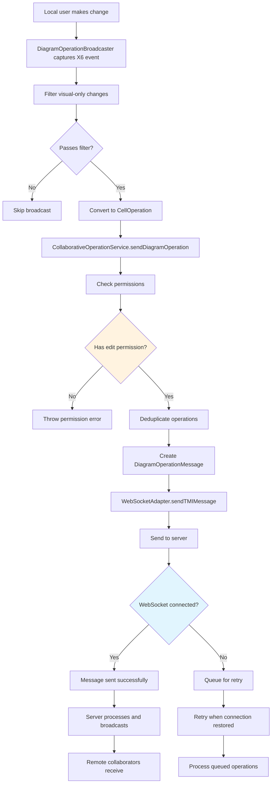

### Incoming Operations (Remote to Local)

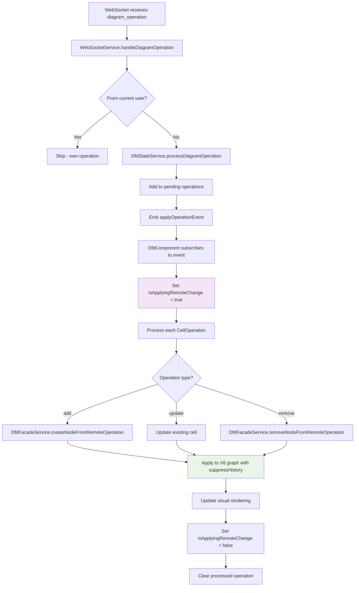

## Conflict Resolution and State Correction

### State Correction Flow

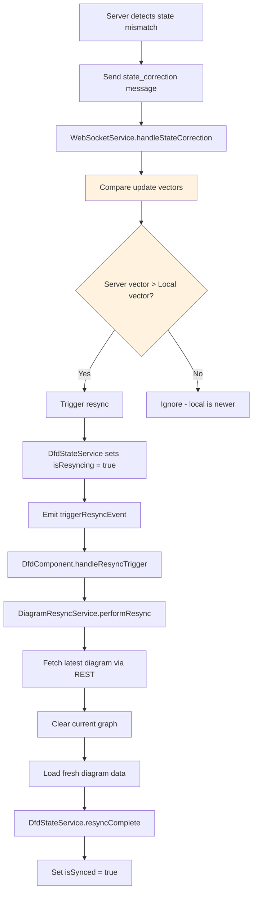

### Authorization Handling

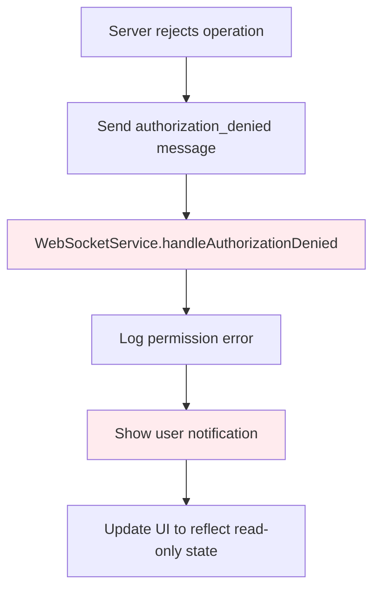

## Permission System Integration

### Permission Checking Flow

```mermaid
flowchart TD
    A[User attempts operation] --> B{DfdCollaborationService.isCollaborating?}
    B -->|No| C[Check threat model permission]
    B -->|Yes| D[Check collaboration permission]

    C --> E{Permission = 'writer'?}
    E -->|Yes| F[Allow operation]
    E -->|No| G[Block operation]

    D --> H{hasPermission('edit')?}
    H -->|Yes| I[Allow operation]
    H -->|No| J{isLoadingUsers?}

    J -->|Yes| K[Fallback to threat model permission]
    J -->|No| L[Block operation]

    K --> E

    F --> M[Proceed with operation]
    I --> M
    G --> N[Show permission error]
    L --> N

    style B fill:#e1f5fe
    style E fill:#fff3e0
    style H fill:#fff3e0
    style J fill:#fff3e0
```

## State Synchronization Architecture

### Multiple State Stores

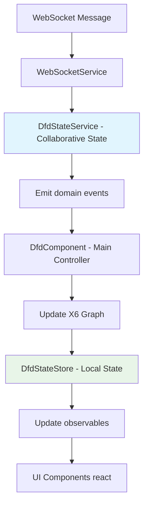

### State Synchronization Points

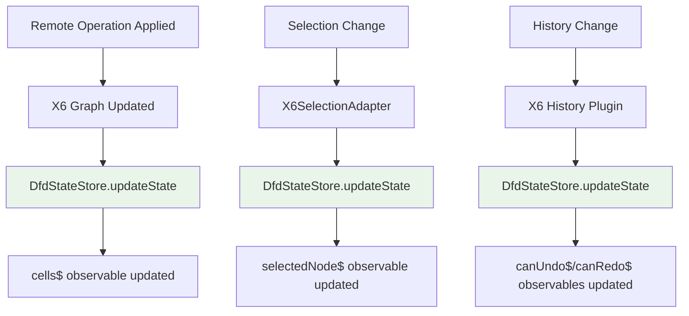

## Error Handling and Fallback

### WebSocket Failure Handling

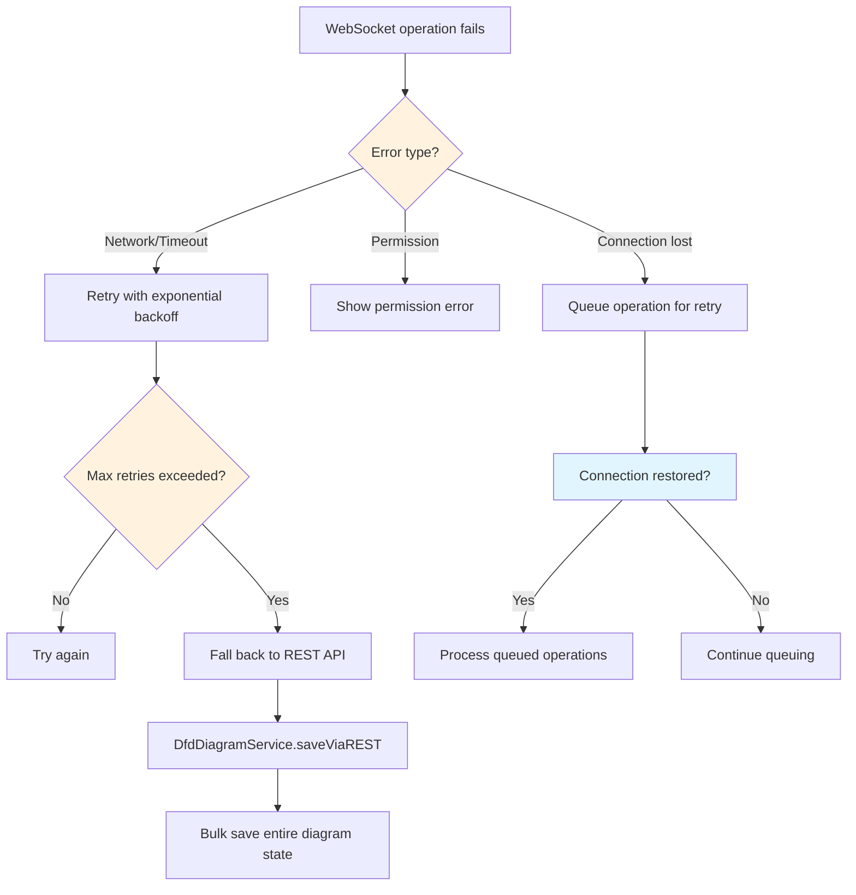

### Operation Deduplication

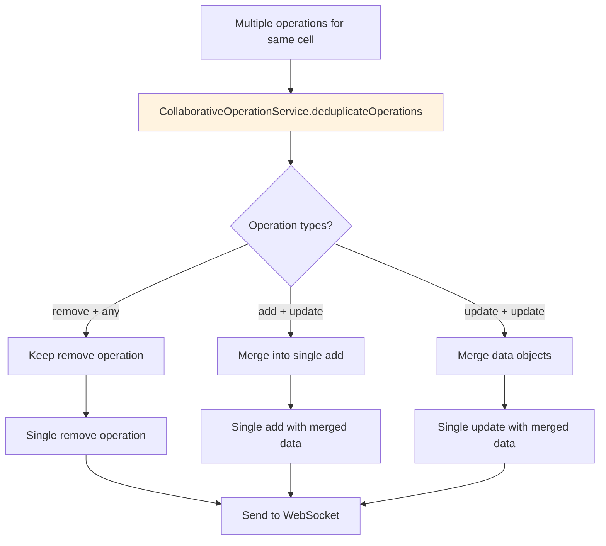

## Presenter Mode Features

### Presenter Cursor Tracking

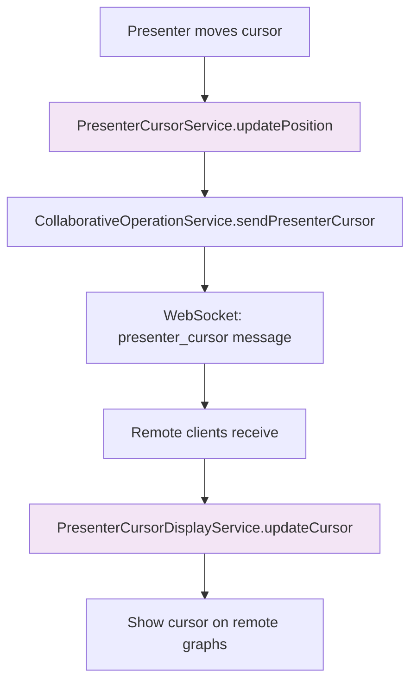

### Presenter Selection Sync

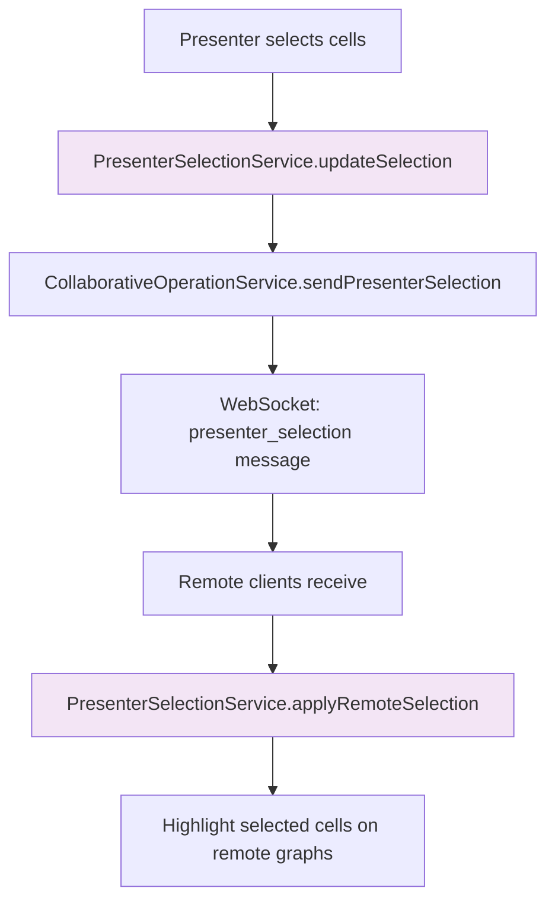

## Performance Optimizations

### Message Batching

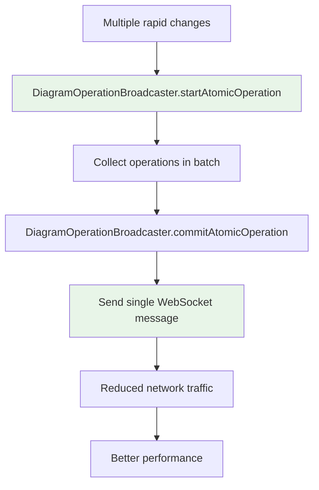

### History Suppression for Remote Operations

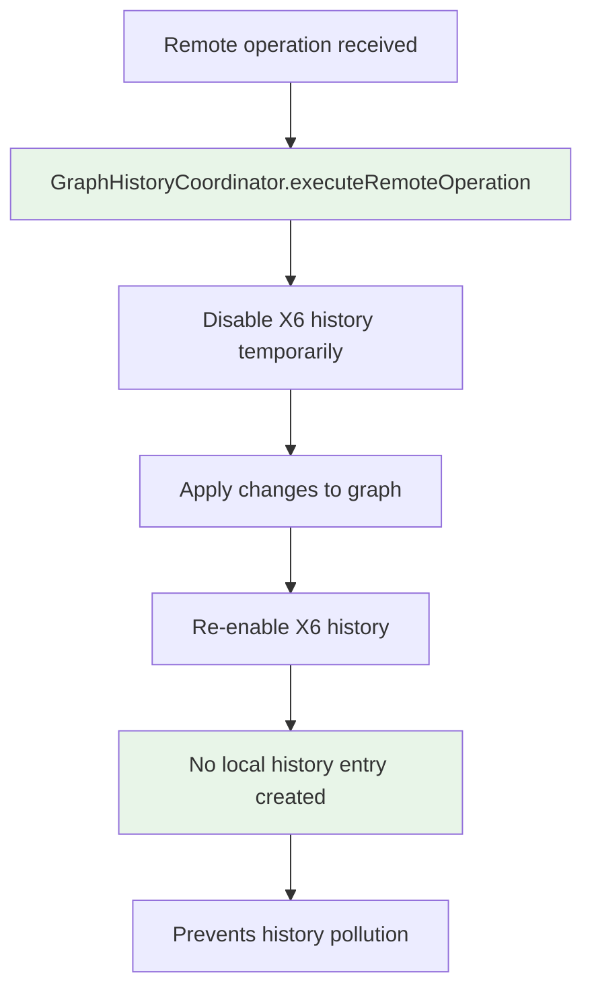

## Key Message Types

### Diagram Operations

- `diagram_operation`: Cell add/update/remove operations
- `undo_request`: Request server-side undo
- `redo_request`: Request server-side redo
- `resync_request`: Request full diagram refresh

### State Management

- `state_correction`: Server indicates client is out of sync
- `authorization_denied`: Operation rejected due to permissions
- `history_operation`: Server-side history changes

### Presenter Features

- `presenter_cursor`: Presenter cursor position updates
- `presenter_selection`: Presenter selection changes
- `presenter_request`: Request to become presenter
- `presenter_denied`: Presenter request denied

### Collaboration Management

- `participant_joined`: New user joined session
- `participant_left`: User left session
- `participants_update`: Full participant list update

This collaborative architecture enables real-time editing while maintaining data consistency and handling various failure scenarios gracefully.
