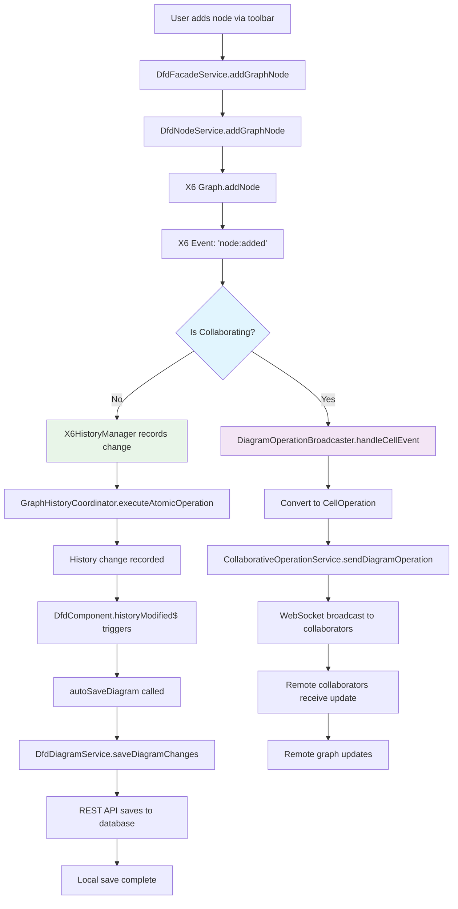
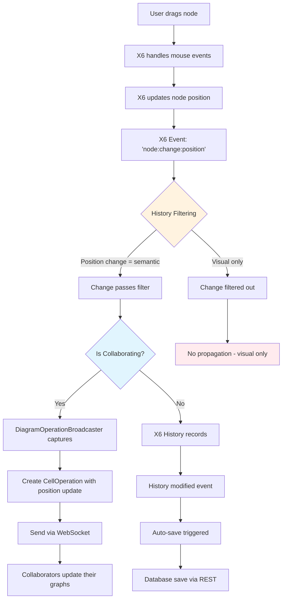
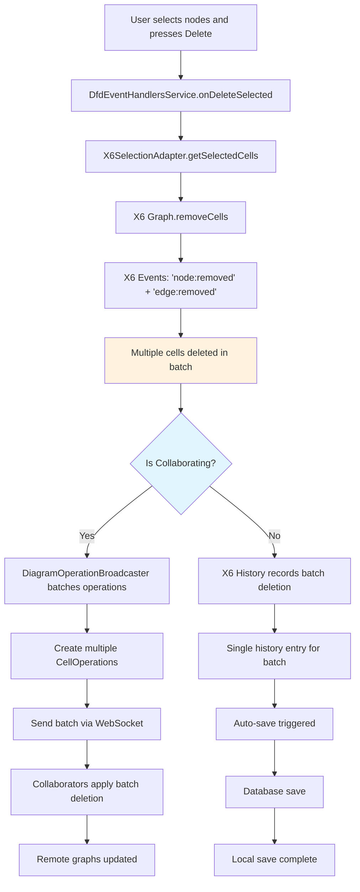
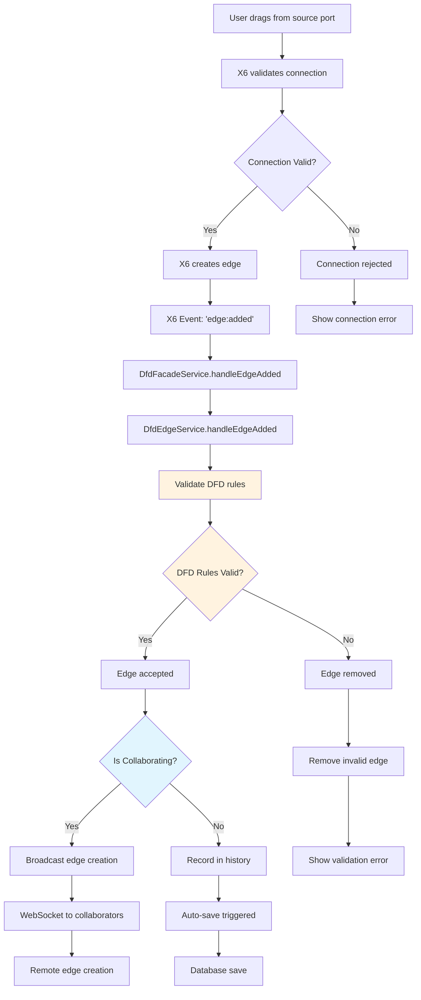
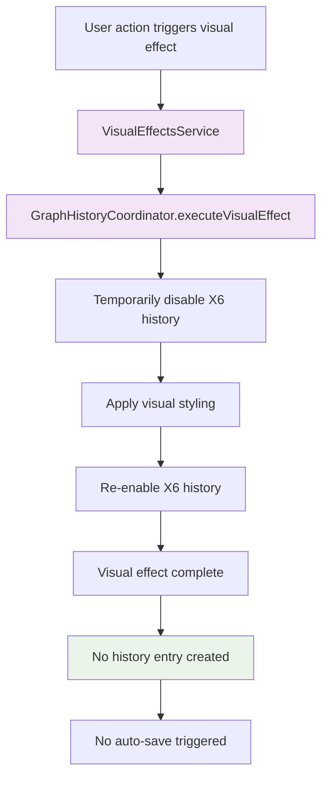
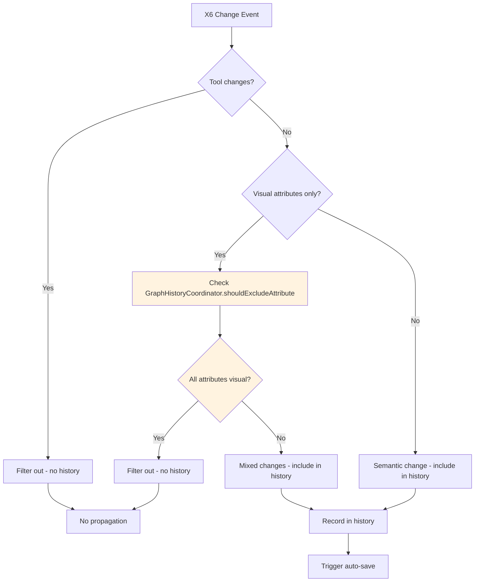
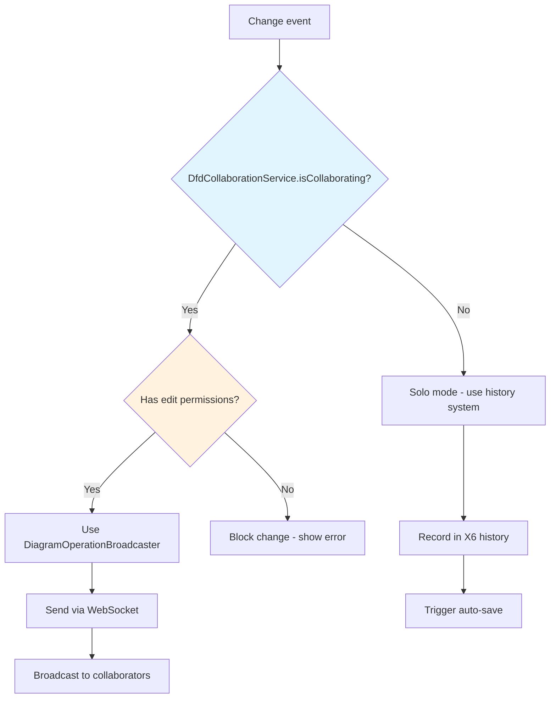

# User Actions Flow

This document details how user interactions with the DFD graph propagate through the system, showing the complete flow from user action to final state updates.

## Overview

User actions in the DFD component follow different propagation paths depending on whether the user is in collaborative mode or solo editing mode. The system implements sophisticated filtering to ensure only semantic changes trigger saves and broadcasts.

## User Action Categories

### 1. Node Creation

When a user adds a new node to the diagram:

### 2. Node Drag/Move Operations

When a user drags a node to a new position:

### 3. Node Deletion

When a user deletes one or more nodes:

### 4. Edge Creation

When a user connects two nodes:

## Visual Effects Flow

Visual effects are applied separately from semantic changes to avoid cluttering the history:

## Decision Points and Filters

### History Filtering Logic

The system applies sophisticated filtering to determine what should be recorded in history:

### Collaborative vs Solo Mode Decision

## Key Services and Their Roles

> **Note**: This section has been updated to reflect the current service names as of 2026-01-25. The Mermaid diagrams above use older service names for historical context.

### Primary Orchestrators

- **AppDfdFacade**: Single entry point for most operations (formerly DfdFacadeService)
- **AppEventHandlersService**: Handles keyboard and user interactions (formerly DfdEventHandlersService)
- **InfraWebsocketCollaborationAdapter**: Captures and broadcasts changes in collaborative mode (formerly DiagramOperationBroadcaster)

### Change Processing

- **AppOperationStateManager**: Controls operation state flags and coordinates with history (formerly GraphHistoryCoordinator)
- **AppHistoryService**: Manages undo/redo stacks and history entries (replaces X6HistoryManager)
- **AppDiagramService**: Handles saving and loading diagram data (formerly DfdDiagramService)

### State Management

- **DfdStateStore**: Local component state (dfd.state.ts)
- **AppStateService**: Collaborative state and conflict resolution (formerly DfdStateService)

## Performance Considerations

1. **Batching**: Multiple related changes are batched into single operations
2. **Filtering**: Visual-only changes are filtered out to reduce noise
3. **Debouncing**: Auto-save is debounced to prevent excessive API calls
4. **History Limits**: X6 history is capped to prevent memory issues

## Error Handling

The system implements several layers of error handling:

- Connection validation before edge creation
- DFD rule validation after X6 operations
- Permission checks in collaborative mode
- Graceful fallback when WebSocket operations fail
