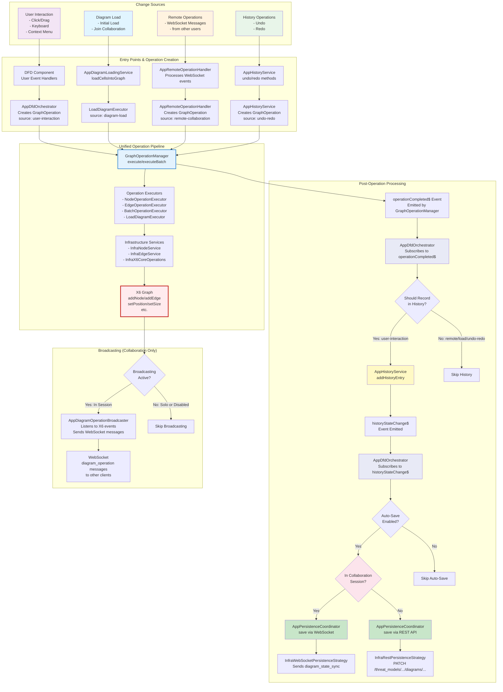

# Graph Component Change Flows

**Status**: Current as of 2025-10-28
**Related**: [Unified Operation Flow](./unified-operation-flow.md)

This document illustrates the complete flow of graph changes from different sources through the unified operation pipeline.

## High-Level Architecture



## Key Architectural Components

### 1. AppDfdOrchestrator

**Role**: Primary coordinator for DFD operations

**Responsibilities**:

- Creates `GraphOperation` objects from UI events
- Provides public API for all graph operations
- Subscribes to `operationCompleted$` from `GraphOperationManager`
- Determines if operations should be recorded in history
- Subscribes to `historyStateChange$` from `AppHistoryService`
- Triggers auto-save via `AppPersistenceCoordinator`

**Does NOT**: Directly modify graph or record history

### 2. GraphOperationManager

**Role**: Routes operations and manages lifecycle

**Responsibilities**:

- Routes operations to appropriate executors
- Provides consistent `OperationContext`
- Emits `operationCompleted$` events
- Handles errors and retries

**Does NOT**: Know about history or persistence

### 3. AppHistoryService

**Role**: Custom undo/redo management

**Responsibilities**:

- Maintains undo and redo stacks
- Adds history entries (via orchestrator)
- Executes undo/redo by creating operations
- Emits `historyStateChange$` events

**Does NOT**: Trigger persistence (orchestrator handles this)

### 4. AppPersistenceCoordinator

**Role**: Persistence strategy coordinator

**Responsibilities**:

- Chooses between REST and WebSocket strategies
- Delegates to appropriate strategy
- Handles save throttling/debouncing
- Provides local storage fallback

**Called by**: AppDfdOrchestrator (in response to history changes)

### 5. AppRemoteOperationHandler

**Role**: Process remote operations from WebSocket

**Responsibilities**:

- Subscribes to `applyOperationEvents$` from `AppStateService`
- Converts `CellOperation` (WebSocket) → `GraphOperation`
- Routes through `GraphOperationManager` with source='remote-collaboration'

**Does NOT**: Broadcast back (prevents infinite loops)

### 6. AppDiagramOperationBroadcaster

**Role**: Broadcast operations to other users

**Responsibilities**:

- Listens to X6 graph events (legacy compatibility)
- Converts X6 events to `CellOperation` format
- Sends operations via WebSocket
- **Only active during collaboration sessions**

**Note**: Runs independently from the operation pipeline for now

## Operation Sources and Processing

| Source                 | Record History? | Trigger Auto-Save?  | Broadcast?                |
| ---------------------- | --------------- | ------------------- | ------------------------- |
| `user-interaction`     | ✅ Yes          | ✅ Yes (if enabled) | ✅ Yes (if in session)    |
| `remote-collaboration` | ❌ No           | ❌ No               | ❌ No (already broadcast) |
| `diagram-load`         | ❌ No           | ❌ No               | ❌ No                     |
| `undo-redo`            | ❌ No           | ✅ Yes (if enabled) | ✅ Yes (if in session)    |

## Critical Decision Points

### Should Record in History?

```typescript
// In AppDfdOrchestrator._handleOperationCompleted()
private _shouldRecordInHistory(operation: GraphOperation): boolean {
  // Only record user-interaction operations
  if (operation.source !== 'user-interaction') {
    return false;
  }

  // Don't record non-modifying operations
  if (operation.type === 'select' || operation.type === 'query') {
    return false;
  }

  return true;
}
```

### Auto-Save Trigger Logic

```typescript
// In AppDfdOrchestrator._triggerAutoSave()
private _triggerAutoSave(historyIndex: number): void {
  if (!this._autoSaveEnabled) {
    return; // Auto-save disabled
  }

  if (historyIndex <= this._lastSavedHistoryIndex) {
    return; // Already saved this history index
  }

  // Determine save strategy
  const isCollaborating = this.collaborationService.isCollaborating();
  const useWebSocket = isCollaborating;

  // Save via coordinator
  this.appPersistenceCoordinator.save(saveOperation, useWebSocket).subscribe({
    next: (result) => {
      if (result.success) {
        this._lastSavedHistoryIndex = historyIndex;
        this._updateState({ hasUnsavedChanges: false });
      }
    }
  });
}
```

## Event Flow Sequence

### User Creates a Node

1. **User clicks "Add Process" button**
2. DFD Component calls `appDfdOrchestrator.addNode('process')`
3. Orchestrator creates `CreateNodeOperation` with `source: 'user-interaction'`
4. Orchestrator calls `graphOperationManager.execute(operation)`
5. GraphOperationManager routes to `NodeOperationExecutor`
6. Executor calls `infraNodeService.createNode()` → X6 graph updated
7. GraphOperationManager emits `operationCompleted$` event
8. **Orchestrator receives event** and checks if should record
9. Since source is 'user-interaction', orchestrator calls `appHistoryService.addHistoryEntry()`
10. **History service emits `historyStateChange$`** event
11. **Orchestrator receives event** and triggers `_triggerAutoSave()`
12. Orchestrator determines collaboration state and calls `appPersistenceCoordinator.save()`
13. Coordinator routes to REST or WebSocket strategy
14. If in collaboration: WebSocket strategy sends `diagram_state_sync` message
15. If solo: REST strategy sends PATCH to `/threat_models/{id}/diagrams/{id}`

### Remote User Creates a Node

1. **WebSocket message received** (`diagram_operation` type)
2. InfraDfdWebsocketAdapter processes and emits domain event
3. AppStateService emits on `applyOperationEvents$`
4. AppRemoteOperationHandler subscribes and converts `CellOperation` → `GraphOperation`
5. Handler creates operation with `source: 'remote-collaboration'`
6. Handler calls `graphOperationManager.execute(operation)`
7. Operation flows through executors → X6 graph updated
8. GraphOperationManager emits `operationCompleted$`
9. Orchestrator receives event but **skips history** (source is remote)
10. **No auto-save triggered** (already persisted by remote user)
11. **No broadcast** (would create infinite loop)

### User Performs Undo

1. **User clicks undo button**
2. DFD Component calls `appDfdOrchestrator.undo()`
3. Orchestrator calls `appHistoryService.undo()`
4. History service pops from undo stack, creates operations with `source: 'undo-redo'`
5. History service calls `graphOperationManager.execute()` for each operation
6. Operations flow through executors → X6 graph updated
7. GraphOperationManager emits `operationCompleted$`
8. Orchestrator receives event but **skips history** (source is undo-redo)
9. **History service emits `historyStateChange$`** (stack changed)
10. **Orchestrator triggers auto-save** (undo/redo operations should be persisted)
11. Save flows through coordinator to REST/WebSocket as appropriate

## State Flags

Managed by `AppOperationStateManager` to control behavior:

| Flag                     | Set By                    | Effect                       |
| ------------------------ | ------------------------- | ---------------------------- |
| `isApplyingRemoteChange` | AppRemoteOperationHandler | Suppress history recording   |
| `isDiagramLoading`       | AppDiagramLoadingService  | Suppress history recording   |
| `isUndoRedoOperation`    | AppHistoryService         | Suppress history, allow save |

## Related Documentation

- [Unified Operation Flow](./unified-operation-flow.md) - Detailed operation pipeline
- [Service Provisioning](./service-provisioning.md) - Service patterns and lifecycle
- [DFD Change Propagation](./dfd-change-propagation/) - Legacy documentation (pre-unified flow)
