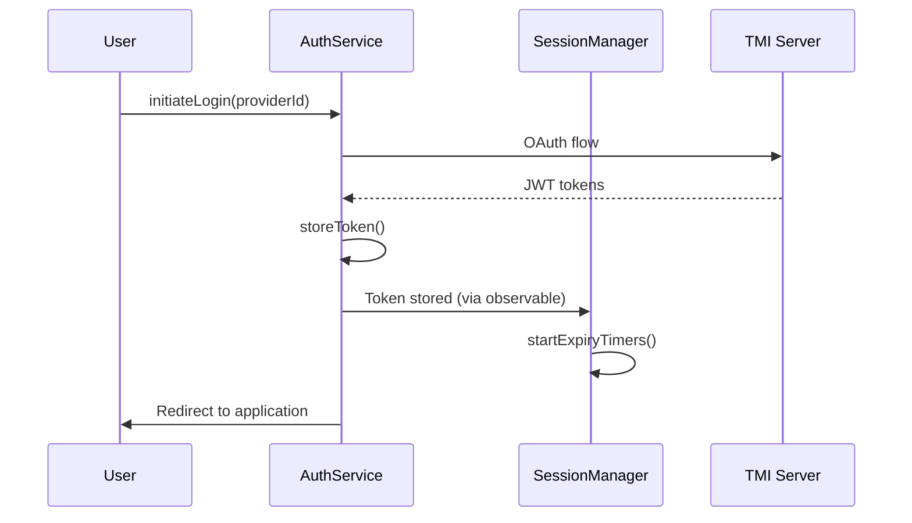
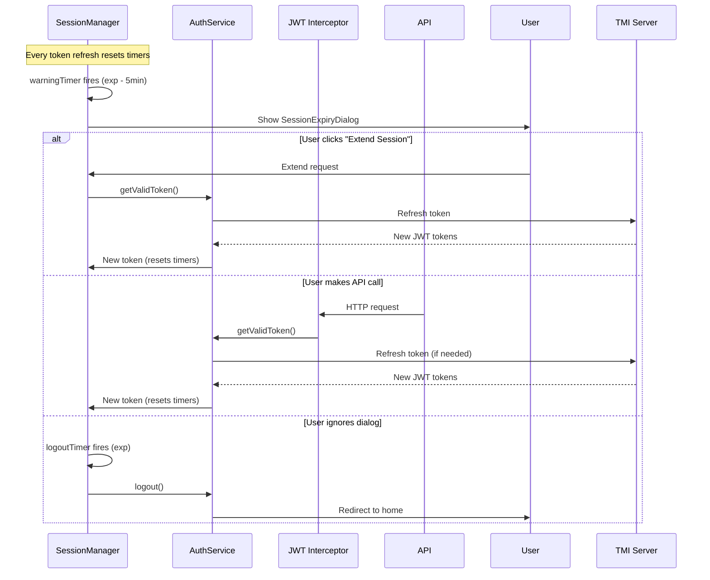
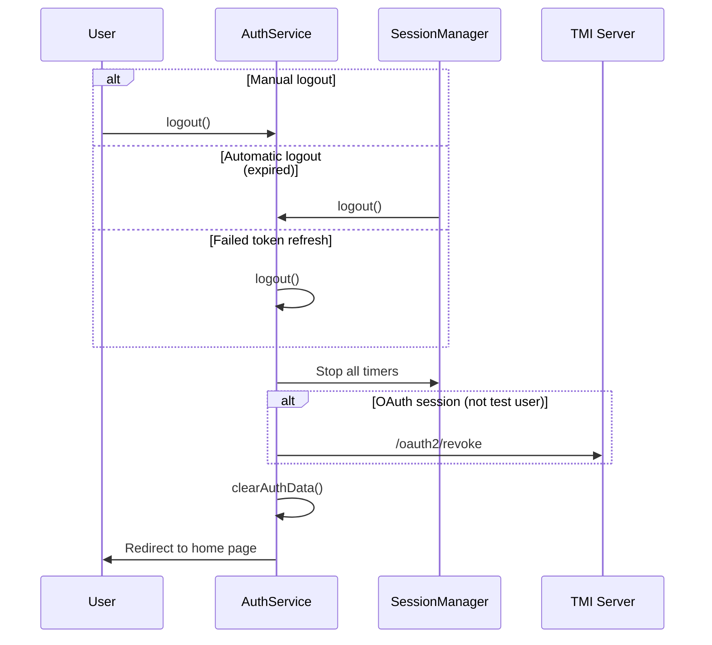

# Session Management Architecture

## Overview

The TMI-UX application implements a comprehensive session management system that ensures users are automatically logged out when their authentication tokens expire, with advance warning and the option to extend their session. This document describes the complete lifecycle of session management from login to logout.

## Core Components

### 1. AuthService (`src/app/auth/services/auth.service.ts`)

- **Primary responsibility**: Token storage, validation, and refresh
- **Key methods**:
  - `getValidToken()`: Returns valid token, refreshing if necessary
  - `refreshToken()`: Exchanges refresh token for new access token
  - `isTokenValid()`: Checks if token is not expired
  - `shouldRefreshToken()`: Checks if token expires within 15 minutes
  - `logout()`: Clears all authentication data and redirects to home

### 2. SessionManagerService (`src/app/auth/services/session-manager.service.ts`)

- **Primary responsibility**: Timer-based session lifecycle management
- **Key functionality**:
  - Monitors token expiry times and sets appropriate timers
  - Shows warning dialog 5 minutes before token expiry
  - Forces logout when tokens expire
  - Coordinates with AuthService for token refresh

### 3. JWT Interceptor (`src/app/auth/interceptors/jwt.interceptor.ts`)

- **Primary responsibility**: Automatic token attachment and reactive refresh
- **Key functionality**:
  - Adds Bearer tokens to API requests
  - Handles 401 responses with automatic token refresh and retry
  - Notifies SessionManager of successful token refreshes

### 4. SessionExpiryDialogComponent (`src/app/core/components/session-expiry-dialog/`)

- **Primary responsibility**: User notification and session extension UI
- **Key functionality**:
  - Shows countdown timer 5 minutes before session expiry
  - Provides "Extend Session" and "Logout" buttons
  - Automatically dismisses when user takes action or time expires

## Session Types

### OAuth Sessions (Google, GitHub, etc.)

- **Token structure**: JWT access token + refresh token
- **Expiry**: Typically 1 hour for access token, longer for refresh token
- **Refresh mechanism**: Uses TMI server's `/oauth2/refresh` endpoint
- **Logout**: Calls TMI server's `/oauth2/revoke` endpoint

### Local Development Sessions

- **Token structure**: Fake JWT token (for consistency)
- **Expiry**: Configurable via `environment.authTokenExpiryMinutes`
- **Refresh mechanism**: Not applicable (local tokens are self-contained)
- **Logout**: Client-side only (no server call)

### Test User Sessions

- **Token structure**: Mock JWT token
- **Expiry**: Same as local development
- **Special handling**: Silent session extension for automated testing
- **Refresh mechanism**: Creates new mock token with extended expiry

## Session Lifecycle

### 1. Login Process

### 2. Active Session Management

### 3. Timer Management

#### Warning Timer (5 minutes before expiry)

- **Trigger**: `token.expiresAt - 5 minutes`
- **Action**: Display SessionExpiryDialogComponent with countdown
- **Behavior**: Shows time remaining until automatic logout

#### Logout Timer (at expiry)

- **Trigger**: `token.expiresAt`
- **Action**: Force logout regardless of user activity
- **Behavior**: Clears all auth data, redirects to home page

#### Timer Reset Conditions

- New token received (login, refresh)
- Successful token refresh from any source
- User clicks "Extend Session" in warning dialog

### 4. Token Refresh Scenarios

#### Proactive Refresh (Warning Dialog)

1. User sees warning dialog 5 minutes before expiry
2. User clicks "Extend Session"
3. AuthService attempts token refresh
4. On success: New timers set, dialog dismissed
5. On failure: Immediate logout

#### Reactive Refresh (API Calls)

1. JWT Interceptor detects token needs refresh
2. Calls `AuthService.getValidToken()`
3. Token refreshed before API request
4. SessionManager receives new token, resets timers

#### Failed Refresh Handling

1. Refresh token expired or invalid
2. Network error during refresh
3. Server rejects refresh request
4. **Result**: Immediate logout and redirect to home

### 5. Logout Process

## Error Handling

### Network Connectivity Issues

- **Token refresh failures**: Immediate logout
- **API request failures**: Let individual services handle
- **Server unavailable**: Local logout only (for local/test users)

### Token Validation Failures

- **Malformed tokens**: Clear auth data, redirect to login
- **Expired refresh tokens**: Cannot refresh, force logout
- **Invalid signatures**: Clear auth data, redirect to login

### Timer Edge Cases

- **Browser tab inactive**: Timers continue running
- **System sleep/resume**: Timers may fire immediately on resume
- **Clock changes**: Minimal impact (timers are relative)

## Configuration

### Environment Variables

- `authTokenExpiryMinutes`: Local/test token expiry (default: varies by env)
- `apiUrl`: TMI server URL for OAuth operations
- `defaultAuthProvider`: Default OAuth provider

### Timer Settings (SessionManagerService)

- `warningTime`: 5 minutes (300,000ms) before expiry to show warning for inactive users
- `proactiveRefreshTime`: 15 minutes (900,000ms) before expiry for proactive refresh of active users
- `activityCheckInterval`: 1 minute (60,000ms) for checking user activity and proactive refresh

## Security Considerations

### Token Storage

- **Encryption**: Tokens encrypted in localStorage using browser fingerprint
- **Secure handling**: Tokens never logged in production
- **Automatic cleanup**: All tokens cleared on logout

### Session Fixation Prevention

- **State parameters**: OAuth flows include CSRF protection
- **Token rotation**: Refresh tokens are rotated on each refresh
- **Automatic expiry**: No indefinite sessions

### Cross-tab Behavior

- **Shared storage**: All tabs share the same token storage
- **Logout propagation**: Logout in one tab affects all tabs
- **Timer coordination**: Only one SessionManager runs per browser

## Testing Strategy

### Unit Tests

- Timer calculation logic
- Token validation methods
- Warning dialog behavior
- Logout cleanup

### Integration Tests

- End-to-end login/logout flows
- Token refresh scenarios
- Warning dialog interactions
- Cross-service coordination

### Manual Testing Scenarios

1. **Normal usage**: Login, use app, automatic token refresh
2. **Idle expiry**: Login, leave idle, see warning, automatic logout
3. **Manual extension**: See warning dialog, click extend, continue session
4. **Manual logout**: Click logout in warning dialog, immediate logout
5. **Network issues**: Disconnect during refresh, verify logout
6. **Multiple tabs**: Open multiple tabs, logout in one, verify all tabs affected

## Migration from Previous System

### Removed Components

- **Duplicate token expiry checking**: Removed from ThreatModelAuthorizationService
- **Manual session extension dialogs**: Replaced with automated warning system
- **Inconsistent timer logic**: Unified in SessionManagerService

### Backward Compatibility

- **Existing tokens**: Continue to work until natural expiry
- **API contracts**: No changes to authentication APIs
- **User experience**: Improved (no unexpected failures)

## Future Enhancements

### Potential Improvements

- **Sliding session windows**: Extend session on any user activity
- **Progressive warnings**: Multiple warning intervals
- **Session sharing**: Coordinate sessions across devices
- **Offline handling**: Cache tokens for offline usage

### Monitoring and Analytics

- **Session duration tracking**: How long users stay logged in
- **Extension patterns**: How often users extend sessions
- **Logout reasons**: Automatic vs manual vs failed refresh
