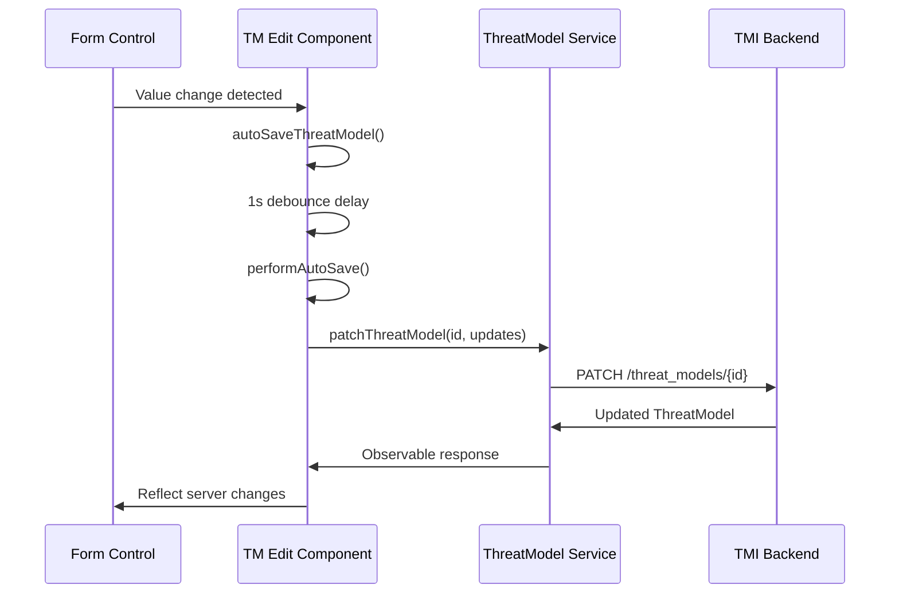
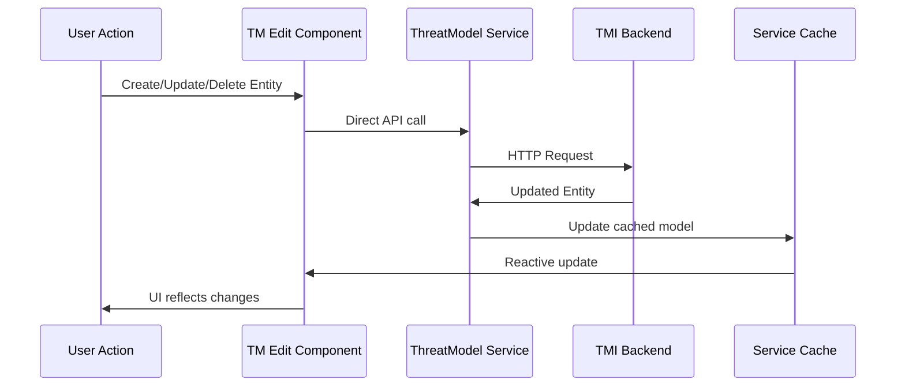

# Autosave, Data Modeling, and Update Handling Architecture

This document provides a comprehensive overview of how autosave functionality works, how data is modeled and temporarily stored/cached in memory, and how the TMI-UX application handles updates involving both in-memory changes and server synchronization for threat models and their child objects.

## Table of Contents

1. [Autosave Mechanism](#1-autosave-mechanism)
2. [Data Modeling and Memory Caching](#2-data-modeling-and-memory-caching)
3. [Update Handling: In-Memory + Server Synchronization](#3-update-handling-in-memory--server-synchronization)
4. [Architecture Diagrams](#4-architecture-diagrams)
5. [Key Implementation Files](#5-key-implementation-files)

## 1. Autosave Mechanism

### Implementation Location
- **Main Component**: `src/app/pages/tm/tm-edit/tm-edit.component.ts` (lines 202-212, 1767-1835)
- **Service**: `src/app/pages/tm/services/threat-model.service.ts`
- **Debounced Auto-save**: Uses RxJS `Subject` with `debounceTime(1000)` to prevent excessive API calls

### How It Works

The autosave mechanism is implemented using a sophisticated debouncing strategy:

1. **Form Change Detection**: Monitors form controls for `name`, `description`, `threat_model_framework`, and `issue_url` changes
2. **Debouncing**: Changes trigger `autoSaveThreatModel()` which emits to `_autoSaveSubject`
3. **1-Second Delay**: After 1 second of inactivity, `performAutoSave()` is called
4. **Selective Updates**: Uses PATCH operations to update only changed basic fields, preserving child entities
5. **Loading State Protection**: Auto-save is disabled during initial data loading (`_isLoadingInitialData` flag)

### Code Flow

```typescript
// Form change detected
nameControl.valueChanges.subscribe(newName => {
  if (!this._isLoadingInitialData && newName && this.threatModel && newName !== this.threatModel.name) {
    this.autoSaveThreatModel(); // Triggers debounced save
  }
});

// Debounced auto-save setup
this._autoSaveSubject
  .pipe(debounceTime(1000))
  .subscribe(() => {
    this.performAutoSave(); // Actual save operation
  });
```

### Key Features

- **Granular Field Tracking**: Each form control has individual change subscriptions
- **Framework Change Handling**: Special logic for framework changes to maintain threat consistency
- **Server-First Approach**: All auto-saves are immediately persisted to the TMI backend server
- **Error Handling**: Auto-save failures are logged but don't block user interaction
- **Optimistic Updates**: UI updates immediately while server sync happens in background

## 2. Data Modeling and Memory Caching

### Core Data Models

The application uses a rich domain model defined in `src/app/pages/tm/models/threat-model.model.ts`:

#### ThreatModel (Root Aggregate)
```typescript
interface ThreatModel {
  id: string;
  name: string;
  description?: string;
  created_at: string;
  modified_at: string;
  owner: string;
  created_by: string;
  threat_model_framework: string;
  issue_url?: string;
  authorization: Authorization[];
  metadata?: Metadata[];
  documents?: Document[];
  sourceCode?: Source[];
  diagrams?: Diagram[];
  threats?: Threat[];
}
```

#### Child Entities
- **Threat**: Individual security threats with severity, status, metadata
- **Document**: Attached documentation with URLs and descriptions  
- **Source**: Source code repository references with Git/SVN parameters
- **Metadata**: Key-value pairs for extensible properties
- **Authorization**: Role-based access control (owner/writer/reader)

### Multi-Level Caching Strategy

#### Service-Level Caching (ThreatModelService)

The `ThreatModelService` implements a sophisticated two-tier caching strategy:

```typescript
class ThreatModelService {
  private _cachedThreatModels = new Map<string, ThreatModel>(); // Full models for editing
  private _threatModelList: TMListItem[] = [];                  // Lightweight list items
  private _threatModelListSubject = new BehaviorSubject<TMListItem[]>([]);
}
```

#### Cache Management Patterns

1. **Two-Tier Caching**: 
   - **Lightweight `TMListItem[]`**: For dashboard/list views with essential fields only
   - **Full `ThreatModel` objects**: Cached only when needed for editing sessions

2. **Cache Invalidation**: 
   - `expireAllCachedModelsExcept()` keeps only the currently edited model
   - Prevents memory bloat in long-running sessions
   - Ensures cache consistency across user sessions

3. **Reactive Updates**: 
   - `BehaviorSubject` provides real-time cache updates to components
   - All subscribers automatically receive cache changes
   - Enables real-time collaboration features

### Memory Storage Hierarchy

The application uses a layered approach to data storage:

1. **Component State**: Temporary form data and UI state (session-scoped)
2. **Service Cache**: In-memory objects for active editing sessions (app-scoped)
3. **Local Storage**: User preferences and mock data toggle state only (persistent)
4. **No Local Backup**: Application relies on server persistence, no localStorage backup of threat models

### Performance Optimizations

- **Lazy Loading**: Child entities (documents, source code, diagrams) loaded separately on demand
- **Smart Caching**: `forceRefresh` parameter bypasses cache when explicit refresh needed
- **Memory Management**: Only one full threat model cached at a time to prevent memory leaks

## 3. Update Handling: In-Memory + Server Synchronization

### Dual-Mode Architecture

The application supports both development and production data sources:

#### Mock Data Mode (Development)
- Uses `MockDataService` with localStorage persistence for development
- Changes applied to in-memory objects immediately
- Simulates server behavior for testing and offline development

#### API Mode (Production)
- **Server-First Strategy**: All changes immediately sent to TMI backend
- **Optimistic Updates**: UI updates immediately, server sync in background
- **PATCH Operations**: Uses JSON Patch RFC 6902 for efficient partial updates

### Update Flow Patterns

#### Basic Field Updates (Auto-save)



1. Form change detected → `autoSaveThreatModel()` called
2. 1-second debounce → `performAutoSave()` executed  
3. PATCH request with only changed fields → `threatModelService.patchThreatModel()`
4. Server response updates cached model
5. UI reflects server-confirmed changes

#### Child Entity Updates (Threats, Documents, Source Code)



1. User action (create/update/delete) → Direct API call
2. Server processes request → Returns updated entity
3. Local cache updated with server response
4. Component re-renders with new data
5. Parent threat model `modified_at` timestamp updated

#### Complex Operations (Framework Changes)

Framework changes require special handling due to data consistency requirements:

- **Validation**: Framework changes blocked if threats exist (maintains data consistency)
- **Cascade Logic**: Framework changes can trigger threat type updates
- **Immediate Persistence**: Framework changes auto-saved immediately
- **State Management**: Framework control disabled when threats exist

### Conflict Resolution and Error Handling

#### Cache Consistency

- **Single Source of Truth**: Server is authoritative for all data
- **Aggressive Cache Invalidation**: Only one full threat model cached at a time
- **Reactive Synchronization**: All subscribers notified of cache changes via RxJS
- **Optimistic Updates**: UI changes immediately, rolled back on server errors

#### Error Recovery

```typescript
// Auto-save error handling
.subscribe({
  next: result => {
    // Update successful - sync local state with server
    this.threatModel.modified_at = result.modified_at;
  },
  error: error => {
    // Log error but don't block user interaction
    this.logger.error('Auto-save failed for threat model', error);
  }
});
```

- **Auto-save Failures**: Logged but don't block user interaction
- **Network Issues**: HTTP interceptor handles retry logic (1 retry for GET requests)
- **Authentication Failures**: Automatic redirect to login via JWT interceptor
- **Validation Errors**: User-friendly dialog display with detailed error messages

### API Integration Patterns

#### RESTful Operations

The service uses consistent RESTful patterns:

```typescript
// Basic CRUD operations
GET    /threat_models           // List threat models
GET    /threat_models/{id}      // Get specific threat model
POST   /threat_models           // Create new threat model
PUT    /threat_models/{id}      // Update entire threat model
PATCH  /threat_models/{id}      // Partial update (auto-save)
DELETE /threat_models/{id}      // Delete threat model

// Child entity operations
GET    /threat_models/{id}/threats
POST   /threat_models/{id}/threats
PUT    /threat_models/{id}/threats/{threat_id}
DELETE /threat_models/{id}/threats/{threat_id}
```

#### JSON Patch Operations

For efficient partial updates, the application uses JSON Patch:

```typescript
const operations = [
  {
    op: 'replace',
    path: '/name',
    value: 'Updated Threat Model Name'
  },
  {
    op: 'replace', 
    path: '/modified_at',
    value: new Date().toISOString()
  }
];
```

## 4. Architecture Diagrams

### Data Flow Architecture

```
┌─────────────────┐    ┌─────────────────┐    ┌─────────────────┐
│   UI Components │    │  Service Layer  │    │  TMI Backend    │
│                 │    │                 │    │                 │
│ • Form Controls │◄──►│ • Service Cache │◄──►│ • PostgreSQL    │
│ • User Actions  │    │ • Auto-save     │    │ • REST API      │
│ • Data Display  │    │ • State Mgmt    │    │ • Validation    │
└─────────────────┘    └─────────────────┘    └─────────────────┘
        │                        │                        │
        ▼                        ▼                        ▼
┌─────────────────┐    ┌─────────────────┐    ┌─────────────────┐
│ Browser Storage │    │  Memory Cache   │    │   Persistence   │
│                 │    │                 │    │                 │
│ • User Prefs    │    │ • Active Models │    │ • Threat Models │
│ • Mock Toggle   │    │ • List Cache    │    │ • Child Entities│
│ • Session Data  │    │ • Reactive Obs  │    │ • Metadata      │
└─────────────────┘    └─────────────────┘    └─────────────────┘
```

### Auto-save Flow Diagram

```
User Types in Form
        │
        ▼
Form Value Changes
        │
        ▼
autoSaveThreatModel()
        │
        ▼
_autoSaveSubject.next()
        │
        ▼ 
debounceTime(1000ms)
        │
        ▼
performAutoSave()
        │
        ▼
patchThreatModel()
        │
        ▼
HTTP PATCH Request
        │
        ▼
Server Response
        │
        ▼
Update Cache & UI
```

## 5. Key Implementation Files

### Core Service Files
- `src/app/pages/tm/services/threat-model.service.ts` - Main threat model operations and caching
- `src/app/core/services/api.service.ts` - HTTP client wrapper with error handling
- `src/app/mocks/mock-data.service.ts` - Development mock data management

### Component Files  
- `src/app/pages/tm/tm-edit/tm-edit.component.ts` - Threat model editing with auto-save
- `src/app/pages/tm/tm.component.ts` - Threat model dashboard and list management

### Model Files
- `src/app/pages/tm/models/threat-model.model.ts` - Core data model definitions
- `src/app/pages/tm/models/tm-list-item.model.ts` - Lightweight list view model

### Configuration Files
- `src/environments/environment*.ts` - API endpoint configuration
- `src/app/core/interceptors/jwt.interceptor.ts` - Authentication and logging

## Performance Characteristics

### Optimal Performance Features

1. **Debounced Auto-save**: Prevents API spam during rapid typing
2. **Two-tier Caching**: Minimizes memory usage while maintaining performance
3. **Lazy Loading**: Child entities loaded on demand
4. **PATCH Operations**: Only changed fields sent to server
5. **Reactive Updates**: Efficient change propagation via RxJS
6. **Smart Cache Invalidation**: Prevents memory leaks in long sessions

### Scalability Considerations

- **Single Active Model**: Only one full threat model cached to manage memory
- **Lightweight Lists**: Dashboard uses minimal data for browsing
- **Server-Side Validation**: Client-side validation backed by server enforcement
- **Efficient Updates**: JSON Patch reduces bandwidth usage
- **Error Boundaries**: Failed operations don't cascade to other functionality

This architecture provides a robust, scalable solution for threat model management with real-time auto-save, efficient caching, and reliable server synchronization while maintaining excellent user experience through optimistic updates and comprehensive error handling.