# Change Propagation Matrix and Decision Points Analysis

This document provides a comprehensive mapping of how different operations propagate through the DFD system and analyzes the critical decision points that determine the flow of changes.

## Change Propagation Matrix

The following matrix shows which systems are affected by different types of operations in the DFD component:

| Operation Type         | X6 Graph     | History       | Auto-save    | WebSocket       | Visual Effects | State Store    | Collaboration     |
| ---------------------- | ------------ | ------------- | ------------ | --------------- | -------------- | -------------- | ----------------- |
| **User Node Creation** | ✅ Direct    | ✅ Semantic   | ✅ Triggered | ✅ If collab    | ✅ Highlight   | ✅ Update      | ✅ Broadcast      |
| **User Node Drag**     | ✅ Direct    | ✅ Position   | ✅ Triggered | ✅ If collab    | ❌ None        | ✅ Update      | ✅ Broadcast      |
| **User Node Delete**   | ✅ Direct    | ✅ Semantic   | ✅ Triggered | ✅ If collab    | ❌ None        | ✅ Update      | ✅ Broadcast      |
| **User Edge Creation** | ✅ Direct    | ✅ Semantic   | ✅ Triggered | ✅ If collab    | ✅ Highlight   | ✅ Update      | ✅ Broadcast      |
| **User Selection**     | ✅ Selection | ❌ Excluded   | ❌ No save   | ❌ No broadcast | ✅ Selection   | ✅ Update      | ✅ If presenter   |
| **User Hover**         | ✅ Visual    | ❌ Excluded   | ❌ No save   | ❌ No broadcast | ✅ Hover       | ❌ No update   | ❌ No broadcast   |
| **Remote Node Add**    | ✅ Applied   | ❌ Suppressed | ❌ No save   | ✅ Received     | ✅ Highlight   | ✅ Update      | ✅ Source         |
| **Remote Node Update** | ✅ Applied   | ❌ Suppressed | ❌ No save   | ✅ Received     | ❌ None        | ✅ Update      | ✅ Source         |
| **Remote Node Delete** | ✅ Applied   | ❌ Suppressed | ❌ No save   | ✅ Received     | ❌ None        | ✅ Update      | ✅ Source         |
| **Diagram Load**       | ✅ Batch     | ❌ Suppressed | ❌ No save   | ❌ No broadcast | ❌ None        | ✅ Full update | ❌ No broadcast   |
| **Undo/Redo (Solo)**   | ✅ History   | ✅ Applied    | ✅ Triggered | ❌ No broadcast | ❌ None        | ✅ Update      | ❌ Not collab     |
| **Undo/Redo (Collab)** | ✅ Applied   | ❌ Suppressed | ❌ No save   | ✅ Server-side  | ❌ None        | ✅ Update      | ✅ Server managed |
| **Port Visibility**    | ✅ Visual    | ❌ Excluded   | ❌ No save   | ❌ No broadcast | ✅ Ports       | ❌ No update   | ❌ No broadcast   |
| **Cell Properties**    | ✅ Direct    | ✅ Metadata   | ✅ Triggered | ✅ If collab    | ❌ None        | ✅ Update      | ✅ Broadcast      |
| **Threat Changes**     | ❌ No change | ❌ No history | ✅ Triggered | ❌ No broadcast | ❌ None        | ❌ No update   | ❌ No broadcast   |

### Legend

- ✅ **Affected**: The system is involved in processing this operation
- ❌ **Not Affected**: The system does not process this operation
- **If collab**: Only affected when in collaborative mode
- **If presenter**: Only affected for presenter in collaborative mode

## Critical Decision Points Analysis

The system contains numerous decision points that determine how changes propagate. Understanding these is crucial for debugging and architectural improvements.

### 1. Collaborative Mode Detection

**Location**: Multiple services check `DfdCollaborationService.isCollaborating()`

**Impact**: This is the most critical decision point that affects almost every operation flow.

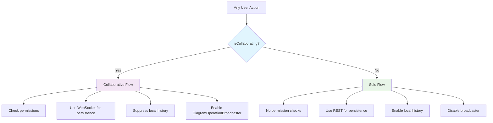

**Services that depend on this decision:**

- DfdComponent (auto-save logic)
- DiagramOperationBroadcaster (event capture)
- CollaborativeOperationService (permission checks)
- X6GraphAdapter (history enable/disable)
- DfdDiagramService (save routing)

### 2. History Filtering Decision

**Location**: `GraphHistoryCoordinator.shouldExcludeAttribute()`

**Impact**: Determines what operations create history entries and trigger auto-save.

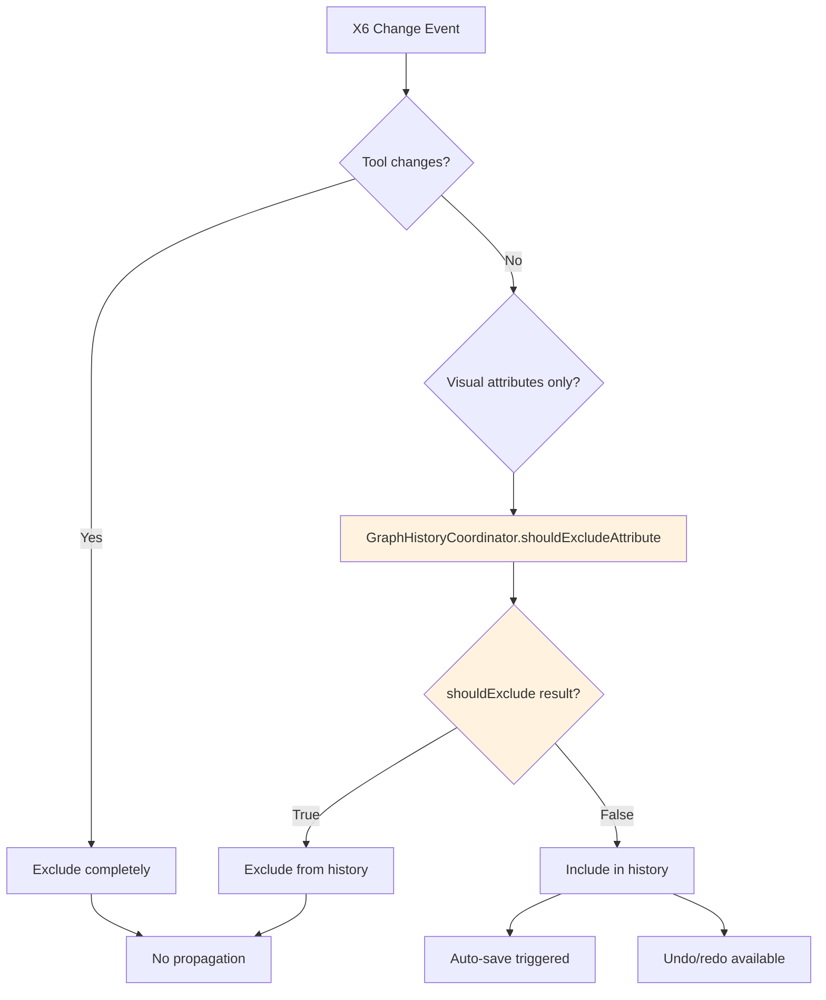

**Affected systems:**

- X6 History system
- Auto-save triggering
- DiagramOperationBroadcaster (collaborative mode)

### 3. Permission Validation Decision

**Location**: `CollaborativeOperationService.sendDiagramOperation()`

**Impact**: Blocks unauthorized operations in collaborative mode.

```mermaid
flowchart TD
    A[Collaborative Operation] --> B{Collaboration permissions loaded?}
    B -->|Yes| C[Check collaboration permission]
    B -->|No| D[Check threat model permission]

    C --> E{hasPermission('edit')?}
    E -->|Yes| F[Allow operation]
    E -->|No| G[Block operation]

    D --> H{threatModelPermission === 'writer'?}
    H -->|Yes| I[Allow operation (fallback)]
    H -->|No| J[Block operation]

    F --> K[Send to WebSocket]
    I --> K
    G --> L[Show permission error]
    J --> L

    style B fill:#fff3e0
    style E fill:#fff3e0
    style H fill:#fff3e0
```

### 4. Auto-save Validation Decision

**Location**: `DfdComponent.autoSaveDiagram()`

**Impact**: Determines when diagram changes are persisted to the database.

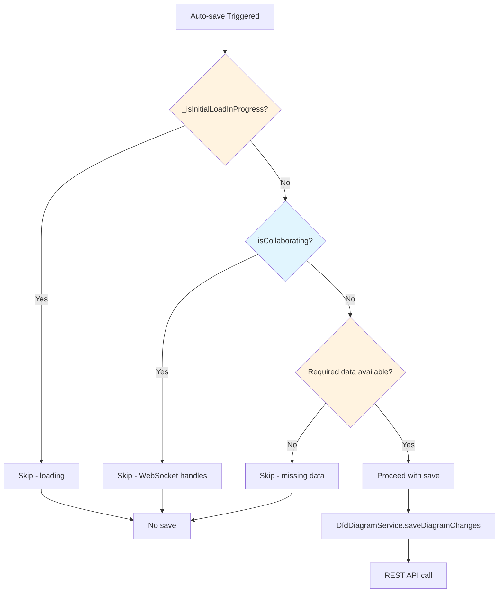

### 5. Visual Effect Application Decision

**Location**: `VisualEffectsService.applyCreationHighlight()`

**Impact**: Prevents visual conflicts and ensures smooth user experience.

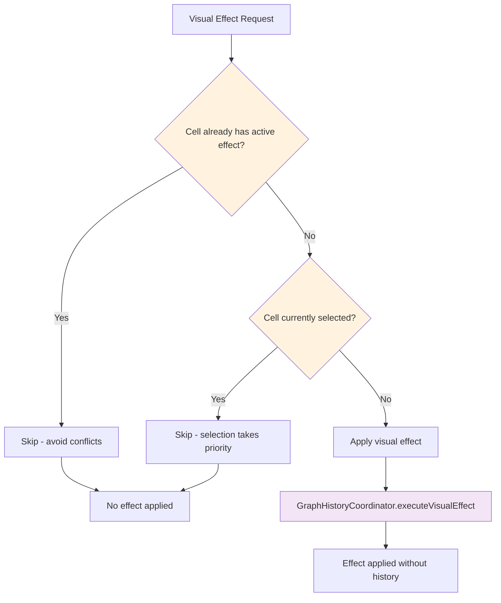

## State Synchronization Decision Points

### 1. State Store Update Routing

**Location**: Multiple locations where state changes occur

**Impact**: Ensures different state stores stay synchronized.

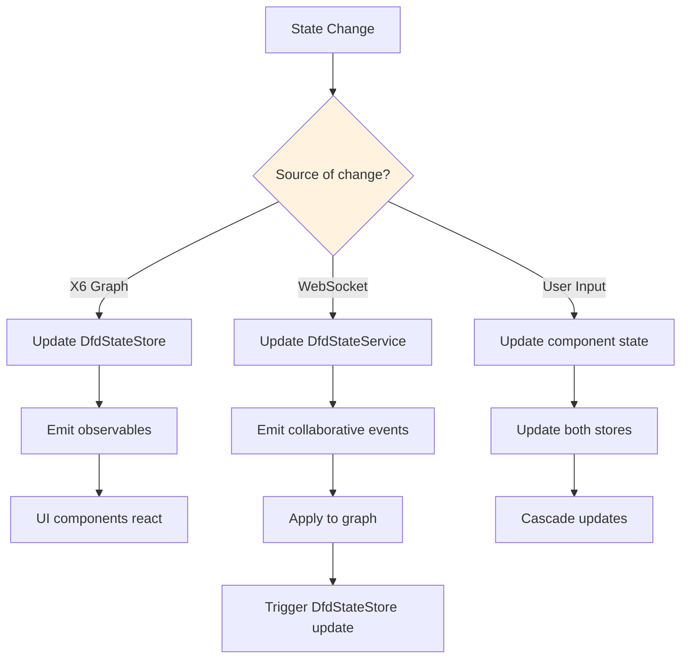

### 2. Remote Operation Processing Decision

**Location**: `DfdStateService.processDiagramOperation()`

**Impact**: Handles incoming collaborative operations correctly.

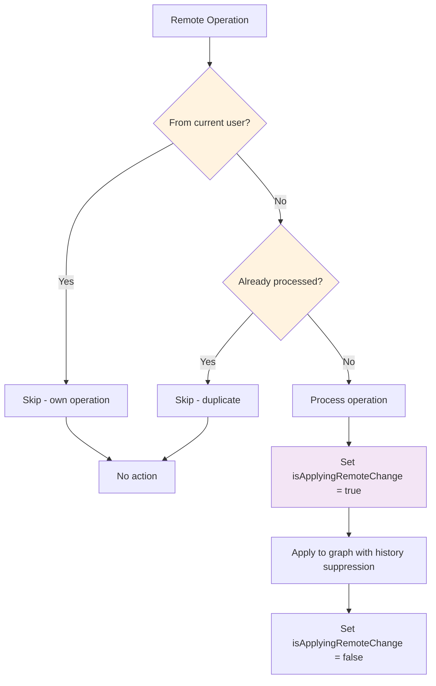

## Operation Deduplication Logic

### Cell Operation Merging

**Location**: `CollaborativeOperationService._deduplicateOperations()`

**Impact**: Prevents duplicate operations and optimizes WebSocket traffic.

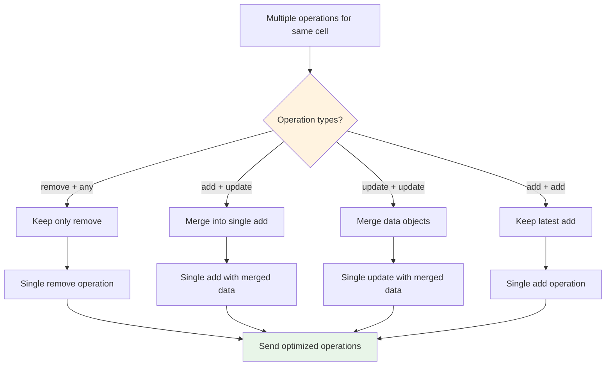

## Error Handling Decision Points

### 1. WebSocket Failure Recovery

**Location**: `CollaborativeOperationService._sendOperationWithRetry()`

**Impact**: Determines fallback behavior when WebSocket operations fail.

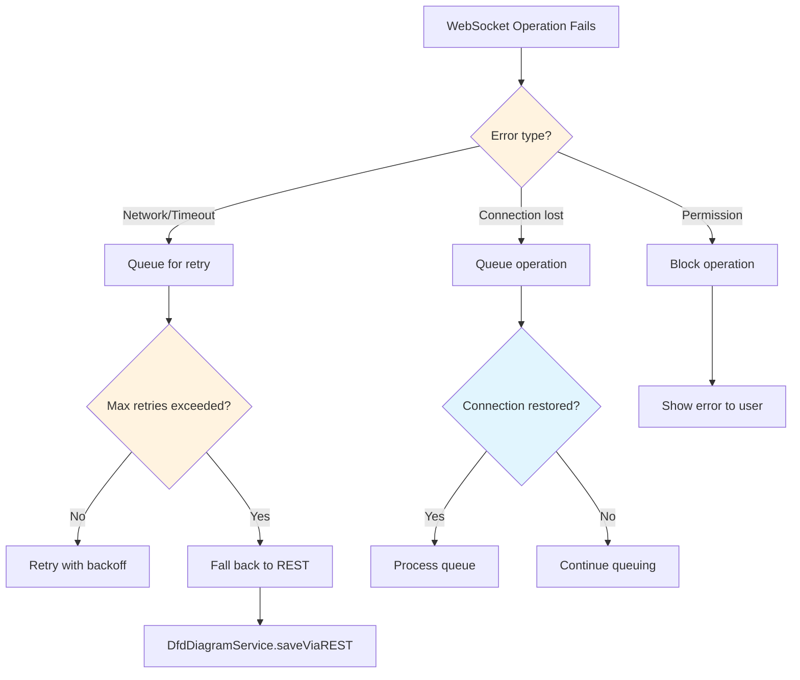

### 2. State Correction Handling

**Location**: `WebSocketService._handleStateCorrection()`

**Impact**: Resolves conflicts between local and server state.

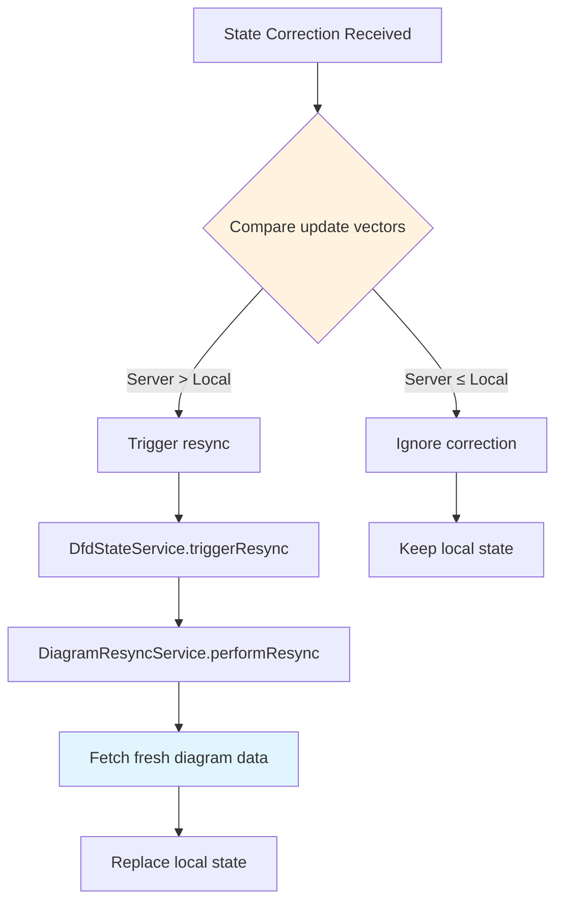

## Performance Decision Points

### 1. Batching Strategy

**Location**: `GraphHistoryCoordinator.executeAtomicOperation()`

**Impact**: Reduces overhead by batching related operations.

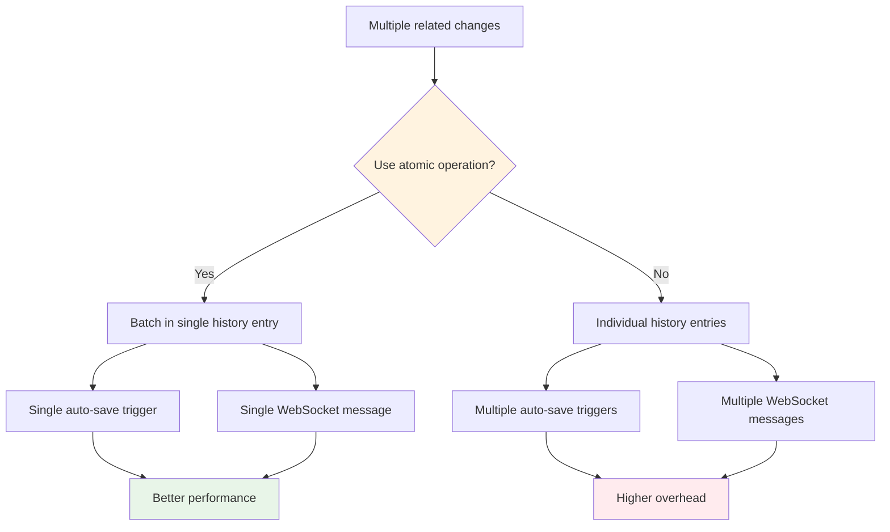

### 2. Visual Effect Throttling

**Location**: `VisualEffectsService` animation management

**Impact**: Prevents performance degradation from excessive visual updates.

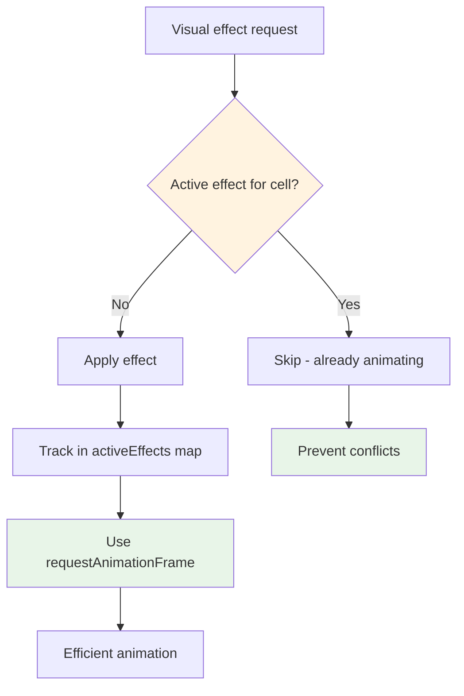

## Architectural Bottlenecks

### 1. DfdComponent as Central Coordinator

**Issue**: The main DfdComponent handles too many coordination responsibilities.

**Affected Flows**:

- Auto-save decision making
- Collaboration mode switching
- WebSocket handler initialization
- State synchronization

**Impact**: Creates a single point of failure and makes the component difficult to test and maintain.

### 2. Multiple State Stores Without Clear Ownership

**Issue**: DfdStateStore and DfdStateService overlap in responsibilities.

**Confusion Points**:

- Which store owns which data
- How to keep them synchronized
- When to update which store

### 3. Complex Permission Checking Logic

**Issue**: Permission validation is scattered across multiple services with fallback logic.

**Problems**:

- Difficult to understand the complete permission flow
- Race conditions with asynchronous permission loading
- Inconsistent error handling

This analysis reveals the complexity of the current architecture and highlights areas where consolidation and simplification could improve maintainability and reliability.
