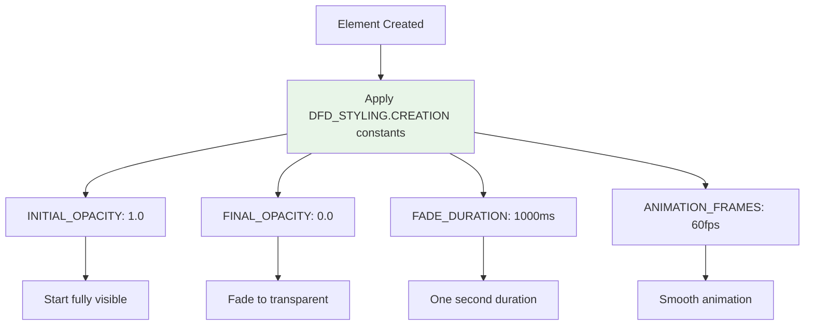
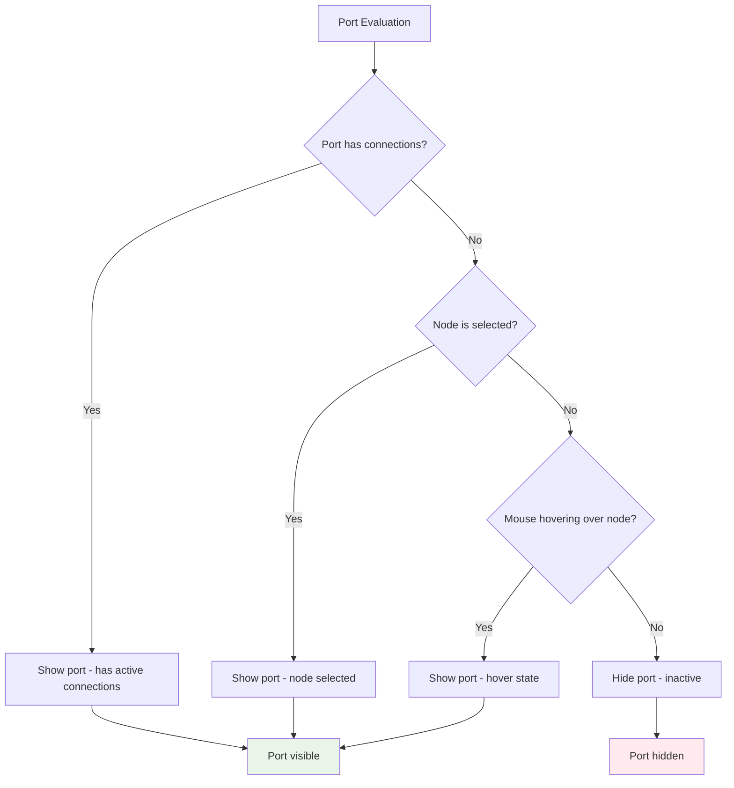

# Visual Effects Pipeline and State Synchronization

This document details how visual effects are applied to the DFD graph and how state synchronization works across the multiple state stores in the system.

## Visual Effects Pipeline

The visual effects system provides immediate visual feedback for user interactions while carefully avoiding interference with the semantic change propagation and history systems.

### Visual Effects Architecture


### Selection Effects Flow


### Creation Highlight System


### Hover Effects Management

```mermaid
flowchart TD
    A[Mouse enters cell] --> B[X6 cell:mouseenter event]
    B --> C[Apply hover styling]
    C --> D[body/filter: brightness(1.1)]
    D --> E[Visual feedback applied]
    
    F[Mouse leaves cell] --> G[X6 cell:mouseleave event]
    G --> H[Remove hover styling]
    H --> I[Restore original styling]
    
    E --> J[No history impact]
    I --> J
    
    style C fill:#f3e5f5
    style H fill:#f3e5f5
    style J fill:#e8f5e8
```

## State Synchronization Architecture

The system manages multiple state stores that must remain synchronized while serving different purposes.

### State Store Hierarchy


### State Update Propagation


### Collaborative State Synchronization


### Cross-Store Synchronization Points


## Visual Effect Types and Styling

### Selection Styling Constants


### Hover Styling System

```mermaid
flowchart TD
    A[Mouse Hover] --> B[Apply DFD_STYLING.HOVER constants]
    
    B --> C[BRIGHTNESS: filter(brightness(1.1))]
    B --> D[TRANSITION: smooth animation]
    B --> E[Z_INDEX: elevated layer]
    
    C --> F[Subtle brightening effect]
    D --> G[Smooth user experience]
    E --> H[Above other elements]
    
    style B fill:#f3e5f5
```

### Creation Highlight Configuration



## Port Visibility Management

### Port State Synchronization


### Port Visibility Rules



## Performance Optimization

### Visual Effect Batching


### Memory Management for Effects


### State Update Debouncing


## Error Handling in Visual Effects

### Visual Effect Failure Recovery


### State Synchronization Error Handling


This visual effects and state synchronization system ensures that users receive immediate visual feedback while maintaining the integrity of the underlying data model and history system.