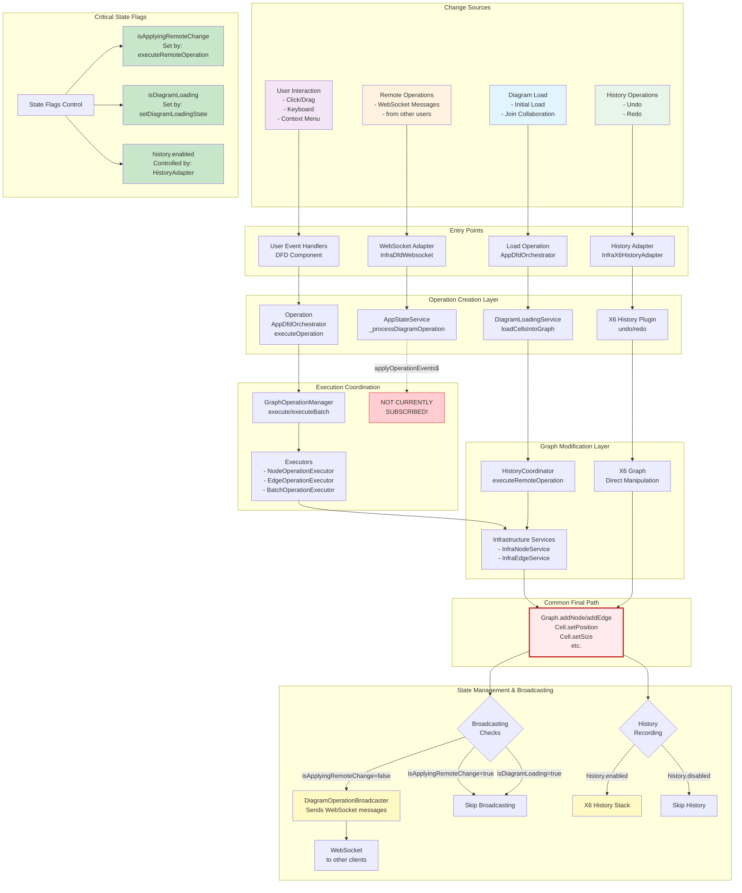

```mermaid
graph TB
subgraph "Change Sources"
US[User Interaction<br/>- Click/Drag<br/>- Keyboard<br/>- Context Menu]
DL[Diagram Load<br/>- Initial Load<br/>- Join Collaboration]
RO[Remote Operations<br/>- WebSocket Messages<br/>- from other users]
HI[History Operations<br/>- Undo<br/>- Redo]
end

    subgraph "Entry Points"
        US --> UE[User Event Handlers<br/>DFD Component]
        DL --> LOE[Load Operation<br/>AppDfdOrchestrator]
        RO --> WSA[WebSocket Adapter<br/>InfraDfdWebsocket]
        HI --> HA[History Adapter<br/>InfraX6HistoryAdapter]
    end

    subgraph "Operation Creation Layer"
        UE --> ORC[Operation<br/>AppDfdOrchestrator<br/>executeOperation]
        LOE --> DLS[DiagramLoadingService<br/>loadCellsIntoGraph]
        WSA --> ASS[AppStateService<br/>_processDiagramOperation]
        HA --> X6H[X6 History Plugin<br/>undo/redo]
    end

    subgraph "Execution Coordination"
        ORC --> GOM[GraphOperationManager<br/>execute/executeBatch]
        ASS -.applyOperationEvents$.-> NC[NOT CURRENTLY<br/>SUBSCRIBED!]
        GOM --> EXE[Executors<br/>- NodeOperationExecutor<br/>- EdgeOperationExecutor<br/>- BatchOperationExecutor]
    end

    subgraph "Graph Modification Layer"
        DLS --> HCE[HistoryCoordinator<br/>executeRemoteOperation]
        X6H --> X6G[X6 Graph<br/>Direct Manipulation]
        EXE --> ISV[Infrastructure Services<br/>- InfraNodeService<br/>- InfraEdgeService]
        HCE --> ISV
    end

    subgraph "Common Final Path"
        ISV --> FIN[Final Application]
        X6G --> FIN
        FIN[Graph.addNode/addEdge<br/>Cell.setPosition<br/>Cell.setSize<br/>etc.]
    end

    subgraph "State Management & Broadcasting"
        FIN --> BC{Broadcasting<br/>Checks}
        BC -->|isApplyingRemoteChange=false| DOB[DiagramOperationBroadcaster<br/>Sends WebSocket messages]
        BC -->|isApplyingRemoteChange=true| SKIP[Skip Broadcasting]
        BC -->|isDiagramLoading=true| SKIP
        DOB --> WS[WebSocket<br/>to other clients]

        FIN --> HC{History<br/>Recording}
        HC -->|history.enabled| HR[X6 History Stack]
        HC -->|history.disabled| SH[Skip History]
    end

    subgraph "Critical State Flags"
        SF[State Flags Control]
        SF --> ARCF[isApplyingRemoteChange<br/>Set by: executeRemoteOperation]
        SF --> DLF[isDiagramLoading<br/>Set by: setDiagramLoadingState]
        SF --> HEF[history.enabled<br/>Controlled by: HistoryAdapter]
    end

    style DL fill:#e1f5ff
    style RO fill:#fff3e0
    style US fill:#f3e5f5
    style HI fill:#e8f5e9
    style FIN fill:#ffebee,stroke:#c62828,stroke-width:3px
    style DOB fill:#fff9c4
    style HR fill:#fff9c4
    style NC fill:#ffcdd2,stroke:#d32f2f
    style ARCF fill:#c8e6c9
    style DLF fill:#c8e6c9
    style HEF fill:#c8e6c9
```
