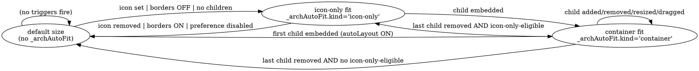

# Architecture Icon Auto-Fit + Auto-Layout — Design Spec

**Issue:** [#638](https://github.com/ericfitz/tmi-ux/issues/638)
**Related:** [#641](https://github.com/ericfitz/tmi-ux/issues/641) (per-shape layout lock — deferred), [#96](https://github.com/ericfitz/tmi-ux/issues/96) (architecture icon support)
**Date:** 2026-04-26
**Branch:** `feature/638-arch-icon-auto-layout` (created off `dev/1.4.0`)

## Overview

When a DFD shape has an architecture icon and the user is in icon-only mode (`showShapeBordersWithIcons = false`), the original shape bounding box is usually much larger than the visible icon + label. Connection ports anchored to that invisible box appear to "float" away from the icon, and edges magnetize to those distant ports. This degrades readability.

This spec extends the architecture-icon work in #96 with a global auto-layout system:

1. **Icon-only fit** — leaf iconned shapes shrink to fit the icon + label.
2. **Container fit** — shapes with embedded children (whether iconned or a security boundary) auto-size to fit the icon/label + a grid of children + padding.
3. **Cascading** — re-layout walks up the parent chain.
4. **User control** — a global `autoLayoutEnabled` preference and an `autoLayoutOrientation` preference (`automatic` / `horizontal` / `vertical`).

## Goals

- Eliminate "floating ports" on icon-only shapes by sizing the bounding box to the icon (+ label).
- Auto-size container shapes to fit children sensibly, in either horizontal or vertical orientation.
- Keep the system reactive to all relevant edits (icon set/removed, child embed/unembed, child resize, child drag, preference changes, diagram load).
- Make every auto-layout cycle a single atomic history operation.

## Non-Goals

- **No animation** on size or position changes.
- **No per-shape layout lock** in v1 (tracked separately in [#641](https://github.com/ericfitz/tmi-ux/issues/641)).
- **No automatic edge re-routing beyond clearing vertices** of edges connected to a moved child.
- **No auto-layout for `text-box` shapes** — they are never resized, never repositioned by parent layout (they are still treated as children for grid sizing if embedded).
- **No layout for non-iconned `actor` / `process` / `store` shapes that have no children** — those keep whatever size the user gave them.
- **No global "lay out everything" command** — auto-layout fires only on triggers, not as a manual action in v1.

## Decisions

| Decision | Choice | Rationale |
|---|---|---|
| State storage | `cell.data._archAutoFit = { kind, width, height }` | Persists across save/reload; lets us tell our own resizes from a manual user resize |
| Eligible shapes | actor, process, store, security-boundary | text-box never resized |
| Icon-only fit | actor/process/store only (security-boundary has no icon) | Per #96 |
| Container fit | actor, process, store, security-boundary | Whenever the cell has children |
| Layout direction | Per-graph; explicit user preference overrides heuristic | Explicit > heuristic > horizontal default |
| Sort order (initial) | By connection-port usage (top → top of grid, etc.) | Reflects existing edge intent |
| Sort order (after drag) | By drag-end position (left-to-right, top-to-bottom in cell-major order for orientation) | Drag is a re-sort cue, not an exit-from-layout signal |
| User-resize detection | Compare current size to recorded `_archAutoFit.width/height` | If size changed, treat as user-customized — don't revert |
| Cascade | Walk `getParent()` chain on every layout change | Keeps ancestors consistent |
| History batching | One `Composite` operation per cycle | Single undo step per trigger |
| Preference defaults | `autoLayoutEnabled: true` (new users), `false` (migrated existing users); orientation: `automatic` | Conservative for existing diagrams |

## Data Model

### Cell-level

```ts
// On any cell that has been auto-fit/auto-laid-out:
cell.data._archAutoFit = {
  kind: 'icon-only' | 'container',
  width: number,   // the size we set
  height: number,  // the size we set
};
```

A revert (preference toggle ON, icon removed, last child removed from a container) only fires if the cell's current size still equals the recorded `width` × `height`. If the user manually resized, we leave the size alone and just clear the flag.

### User preferences

Two new fields on the existing `UserPreferencesData` object:

```ts
interface UserPreferencesData {
  // ...existing fields...
  autoLayoutEnabled: boolean;            // default: true (new) / false (migrated)
  autoLayoutOrientation: 'automatic' | 'horizontal' | 'vertical';  // default: 'automatic'
}
```

These persist via the existing `UserPreferencesService` (localStorage cache + `/me/preferences` server sync).

### Default migration

Existing users who load the app for the first time after this lands get `autoLayoutEnabled = false` so their saved diagrams are not reshuffled. Detection:

- When `UserPreferencesService` loads preferences and `autoLayoutEnabled` is missing from the persisted JSON, set it to `false`.
- Brand-new accounts (no persisted preferences yet) get `autoLayoutEnabled = true`.

## State Machine

The eligible cells for these transitions are `actor`, `process`, `store`, and `security-boundary`. Children participation is via `cell.getChildren?.() ?? []`.



### Icon-only fit conditions (all must hold)

- Cell shape ∈ {actor, process, store}
- Cell has `data._arch`
- User pref `showShapeBordersWithIcons === false`
- User pref `autoLayoutEnabled === true`
- `cell.getChildren().length === 0`
- Current size == shape default OR current size == `_archAutoFit.width × _archAutoFit.height`

### Container fit conditions

- Cell shape ∈ {actor, process, store, security-boundary}
- User pref `autoLayoutEnabled === true`
- `cell.getChildren().length > 0`
- Current size == shape default OR current size == `_archAutoFit.width × _archAutoFit.height`

## Geometry

### Icon-only fit

```text
width  = ICON_SIZE                              // 32
height = ICON_SIZE + LABEL_LINE_HEIGHT          // 32 + ceil(12 * 1.3) = 48

icon  attrs: { refX: '50%', refY: 0,    refX2: -ICON_SIZE/2, refY2: 0 }
label attrs: { refX: '50%', refY: '100%', refX2: 0, refY2: -2,
               textAnchor: 'middle', textVerticalAnchor: 'bottom' }
```

The user's chosen 9-grid icon placement is overridden while in icon-only fit (placement is meaningless inside a 32×48 box). On revert, `applyIconToCell(cell, _arch)` restores it to the user's preferred placement.

### Container fit (horizontal orientation)

```text
Layout (text drawing):
  +---------------------------------------------+
  |                                             |
  |  [icon]    child(0,0)   child(0,1)  ...     |
  |  [label]   child(1,0)   child(1,1)  ...     |
  |                                             |
  +---------------------------------------------+

iconCol  width  = max(ICON_SIZE, labelWidth)
iconCol  height = ICON_SIZE + LABEL_GAP + labelLineHeight
                  (or 0 if cell has no _arch — security boundary case)
gridCol  width  = max(child.width)  for each col
gridRow  height = max(child.height) for each row

containerWidth  = OUTER_PAD + iconCol.width + ICON_GAP
                + sum(gridCol.width) + (cols - 1) * GAP + OUTER_PAD
containerHeight = OUTER_PAD + max(iconCol.height,
                                  sum(gridRow.height) + (rows - 1) * GAP)
                + OUTER_PAD
```

For vertical orientation, the icon column becomes an icon **row** at the top, and the children grid is below it (mirror of the above formula with the icon row's height contributing instead of width).

### Padding constants

```ts
const OUTER_PAD = 12;       // outer cell border to content
const ICON_GAP  = 12;       // gap between icon column/row and grid
const GAP       = 12;       // inter-cell gap inside grid
const LABEL_GAP = 4;        // gap between icon and label inside icon col/row
```

## Sort Algorithm

### Initial (port-based) sort

Determine each child's port-usage signature based on edges connected to its ports:

```ts
type PortBias = { top: boolean; right: boolean; bottom: boolean; left: boolean };
```

Compute a sort key per child:

- **Vertical axis bias**: `1` if `top` only, `-1` if `bottom` only, else `0`. (Both → 0; neither → 0.)
- **Horizontal axis bias**: `1` if `left` only, `-1` if `right` only, else `0`.

For **horizontal orientation** (children grid expands rightward; rows grow with column count):

- Primary sort: vertical bias **descending** (top-port-used first → top rows; bottom-port-used last → bottom rows).
- Secondary sort: horizontal bias **descending** (left-port-used → left columns; right-port-used → right columns).
- Tie-breaker: stable sort preserves insertion order.

For **vertical orientation** (grid expands downward), swap primary and secondary axes.

### Drag-end re-sort

After a child is dragged within its parent:

1. Capture the drag-end position of the dragged child in graph coords.
2. Sort all children by their current `(x, y)`:
   - Horizontal orientation: row-major (`y` primary, `x` secondary).
   - Vertical orientation: column-major (`x` primary, `y` secondary).
3. Apply container layout with that sorted order.
4. Persist no extra state — the post-layout positions reflect the new order.

This lets a user reorder by dragging, and the next refresh applies the new order.

## Grid Dimension Algorithm

For a child count `n` and orientation `O`:

```text
horizontal: prefer cols >= rows. When cols == rows and we need more, add a column. When cols > rows, add a row.
vertical:   prefer rows >= cols. When rows == cols and we need more, add a row.    When rows > cols, add a column.
```

Iteratively grow `(rows, cols)` from `(1, 0)` (horizontal) or `(0, 1)` (vertical) until `rows * cols >= n`. Pseudocode:

```ts
function gridDims(n: number, orientation: 'horizontal' | 'vertical'): {rows: number; cols: number} {
  if (n === 0) return { rows: 0, cols: 0 };
  let rows = orientation === 'horizontal' ? 1 : 0;
  let cols = orientation === 'horizontal' ? 0 : 1;
  while (rows * cols < n) {
    if (orientation === 'horizontal') {
      if (cols <= rows) cols++; else rows++;
    } else {
      if (rows <= cols) rows++; else cols++;
    }
  }
  return { rows, cols };
}
```

Worked example for horizontal (matches the issue discussion):

| n | (rows, cols) | filled |
|---|---|---|
| 1 | (1, 1) | 1/1 |
| 2 | (1, 2) | 2/2 |
| 3 | (2, 2) | 3/4 |
| 4 | (2, 2) | 4/4 |
| 5 | (2, 3) | 5/6 |
| 6 | (2, 3) | 6/6 |
| 7 | (3, 3) | 7/9 |
| 9 | (3, 3) | 9/9 |
| 10 | (3, 4) | 10/12 |
| 12 | (3, 4) | 12/12 |
| 13 | (4, 4) | 13/16 |
| 16 | (4, 4) | 16/16 |

## Layout Direction Inference

Computed at every auto-layout call (cheap; ensures freshness):

1. Get all top-level nodes (`graph.getNodes().filter(n => !n.getParent())`).
2. If fewer than 2 → return `'horizontal'`.
3. Compute `xSpan = maxX - minX`, `ySpan = maxY - minY` over those nodes' bounding boxes.
4. Return `'horizontal'` if `xSpan >= ySpan`, else `'vertical'`.

If the user preference is not `'automatic'`, return that preference instead.

## Event Model

| Trigger | Action |
|---|---|
| Icon set on cell (`onIconSelected`) | After applyBorderPreference: `applyAutoLayout(cell)` (icon-only fit if no children, container fit if children) |
| Icon removed (`onIconRemoved`) | After restoreBorder: `revertAutoFit(cell)` |
| Icon placement changed (`onIconPlacementChanged`) | No layout change (size unaffected by placement) |
| Child embedded (`graph.on('node:change:parent')`) | Re-layout new parent; revert old parent if it was an icon-only fit and is now empty |
| Child resized (`graph.on('node:change:size')`) | Re-layout parent (if any) |
| Child moved within parent (`graph.on('node:moved')`) | If parent is auto-layout: clear vertices on connected edges; re-layout parent with drag-end positional sort |
| Border preference toggle (`showShapeBordersWithIcons`) | Re-apply or revert across all `_arch` cells |
| AutoLayout preference toggle (`autoLayoutEnabled`) | If turning ON: scan all eligible cells and apply. If turning OFF: revert all `_archAutoFit` cells back to default; clear flags |
| Orientation preference change (`autoLayoutOrientation`) | Re-layout all cells with `_archAutoFit.kind === 'container'` |
| Diagram load (`applyIconsOnLoad`) | Per cell with `_arch`: applyAutoLayout; per cell with children but no `_arch` (security boundary): applyAutoLayout (container fit) |

### Cascade

After any container fit applies to cell `C`, walk `C.getParent()` upward. For each ancestor with `_archAutoFit` (container fit), re-layout it. Stop when an ancestor has no `_archAutoFit` flag or there is no parent.

### Batching

Every event handler that causes layout changes opens a "layout cycle". Within the cycle:

- All `cell.resize()` and `child.position()` calls are collected into a single composite operation that the executor records as one history entry.
- The cycle ends when the trigger handler returns.

The implementation uses an internal flag `_inLayoutCycle` plus a queue of pending changes; on cycle close, one `UpdateGraph` operation is dispatched.

## User Preferences UX

In the user-preferences dialog (existing component), a new section "Diagram layout":

```
[Section heading] Diagram layout

[ ] Auto-layout shapes
    Automatically resize and position shapes when icons are added,
    children are embedded, or shapes are moved.

  Layout orientation
    ( ) Automatic (infer from current diagram)
    ( ) Horizontal
    ( ) Vertical
```

The orientation radio group is disabled when the auto-layout checkbox is unchecked.

i18n keys (English):

```json
{
  "userPreferences": {
    "sections": {
      "diagramLayout": "Diagram layout"
    },
    "autoLayout": {
      "label": "Auto-layout shapes",
      "description": "Automatically resize and position shapes when icons are added, children are embedded, or shapes are moved.",
      "orientation": {
        "label": "Layout orientation",
        "automatic": "Automatic (infer from current diagram)",
        "horizontal": "Horizontal",
        "vertical": "Vertical"
      }
    }
  }
}
```

## Persistence

- `cell.data._archAutoFit` is part of cell data, automatically round-trips through API save/load.
- User preferences round-trip via the existing `UserPreferencesService`.
- On diagram load, `applyIconsOnLoad` re-applies the layout. If the saved positions/sizes still match the recomputed layout, no operation is dispatched (idempotent). If they differ (e.g., because the user toggled orientation between sessions), the recomputed layout is applied — this is intentional, the saved file should reflect the current preference.

## History / Undo

Each top-level trigger produces one undoable operation that captures:

- Pre-state and post-state of every cell touched (size, position, attrs, data).
- Includes the edge `vertices` cleared by Q5.

Implementation: introduce a small `LayoutCycle` helper used inside dfd.component handlers. It captures `previousCellState` on entry and emits one `UpdateGraph` at exit. Eliminates the need for callers to manually batch.

## Utility Module

New file `src/app/pages/dfd/utils/auto-layout.util.ts`. Pure, x6-free, fully unit-testable.

```ts
export type Orientation = 'horizontal' | 'vertical';

export interface ChildBox {
  id: string;
  width: number;
  height: number;
  ports: { top: boolean; right: boolean; bottom: boolean; left: boolean };
  // Optional: current position for drag-end re-sort
  x?: number;
  y?: number;
}

export interface IconColumn {
  width: number;
  height: number;
  // null if cell has no icon (security boundary)
  hasIcon: boolean;
}

export interface ContainerLayout {
  containerWidth: number;
  containerHeight: number;
  iconAttrs: Record<string, string | number>;
  labelAttrs: Record<string, string | number>;
  childPositions: Array<{ id: string; x: number; y: number }>;
}

export function gridDimensions(n: number, orientation: Orientation): { rows: number; cols: number };

export function inferOrientation(
  topLevelNodes: Array<{ x: number; y: number; width: number; height: number }>,
): Orientation;

export function sortChildrenByPorts(children: ChildBox[], orientation: Orientation): ChildBox[];

export function sortChildrenByPosition(
  children: ChildBox[],
  orientation: Orientation,
): ChildBox[];

export function layoutContainer(
  iconCol: IconColumn,
  children: ChildBox[],
  orientation: Orientation,
  padding: { outer: number; iconGap: number; gap: number },
): ContainerLayout;

export function iconOnlyFitGeometry(labelLineHeight: number): {
  width: number;
  height: number;
  iconAttrs: Record<string, string | number>;
  labelAttrs: Record<string, string | number>;
};
```

A small `text-measurement.util.ts` (canvas-based) is included for measuring `iconCol.width` against label text.

## Phase Plan

### Phase 1 — utilities (no x6 integration)

1. Create `auto-layout.util.ts` with `gridDimensions`, `inferOrientation`, `sortChildrenByPorts`, `sortChildrenByPosition`, `layoutContainer`, `iconOnlyFitGeometry`. Pure functions.
2. Create `text-measurement.util.ts` (canvas-based, falls back to char-count heuristic).
3. Unit tests covering: grid sequence at n = 1..16, sort behavior with various port signatures, layout output for sample child sets in both orientations, orientation inference edge cases.

### Phase 2 — user preferences

4. Add `autoLayoutEnabled` and `autoLayoutOrientation` to `UserPreferencesData` and migration logic.
5. Add UX in `user-preferences-dialog.component.ts/html` (new section). Add i18n keys.
6. Sync new keys to all 16 locale files via the existing localization tooling.

### Phase 3 — dfd.component integration

7. Add `applyAutoLayout(cell)` and `revertAutoFit(cell)` methods.
8. Wire into `onIconSelected`, `onIconRemoved`, `onIconPlacementChanged`, `applyIconsOnLoad`.
9. Add subscriptions for `node:change:parent`, `node:change:size`, `node:moved`.
10. Add reactive subscription for `showShapeBordersWithIcons`, `autoLayoutEnabled`, `autoLayoutOrientation` preferences.
11. Implement cascade walk and batching helper.

### Phase 4 — verification

12. Lint, build, unit tests pass.
13. Manual browser verification: cover the acceptance criteria from #638 plus the container/cascade scenarios. (Login required — assumes manual testing by a human.)
14. E2E updates if any selectors or behaviors changed.

## Test Plan

### Unit tests

- `gridDimensions(n, orientation)`: spot-check the table values from "Worked example" above for both orientations.
- `inferOrientation`: cluster-around-x → horizontal, cluster-around-y → vertical, single node → horizontal, equal spans → horizontal.
- `sortChildrenByPorts`: each port combination produces the documented order.
- `sortChildrenByPosition`: orientation determines primary axis.
- `layoutContainer`: verify container dimensions match the formula for sample inputs in both orientations.
- `iconOnlyFitGeometry`: width/height correct for given label line height.
- `text-measurement.util`: returns positive width for non-empty text; longer strings measure wider; tolerates missing canvas (test environment).

### Integration / e2e

- Toggle borders OFF on a populated diagram → all iconned actor/process/store with no children shrink to 32×48.
- Toggle borders ON → revert.
- Toggle `autoLayoutEnabled` OFF → all `_archAutoFit` cells revert. Toggle ON again → re-applied.
- Embed a leaf into an icon-only-fit shape → container fit applies; cascade up.
- Drag a child within a container → re-sort + edges clear vertices.
- Save and reload a diagram with auto-layout state → idempotent.

## Risks / Open Items

- **Migration for existing diagrams**: A user opens a saved 1.4.0 diagram for the first time after this lands. Their `autoLayoutEnabled` defaults to `false` (migrated existing user), so nothing changes. They can opt in via the preferences dialog. If they enable it, the next open of any diagram will run a layout pass — they may see a one-time visual rearrangement. Acceptable.
- **Performance on large diagrams**: A 100-child container takes O(n) to lay out, plus O(d) for cascade where `d` is depth. Total O(N) per cycle. For typical diagrams this is microseconds. We do not need debouncing for v1; revisit if the dragged-child re-layout feels laggy.
- **Edge bundling**: When many children move at once (e.g., on first auto-layout of a populated container), edges connected to those children clear vertices and re-route. Routing may briefly look chaotic. Acceptable per Q5; revisit if it bothers users.
- **`node:moved` vs. `node:change:position`**: We listen for `node:moved` (drag end) rather than `node:change:position` (every position update during drag) to avoid relayout-during-drag jitter.

## Future Work (out of scope)

- [#641](https://github.com/ericfitz/issues/641) — per-shape layout lock.
- A "Lay out everything now" command for users who want manual control with a one-shot trigger.
- Animation on size/position transitions.
- Per-cell orientation override.
- Smarter heuristics for grid sort (e.g., considering edge target positions, not just port usage).
