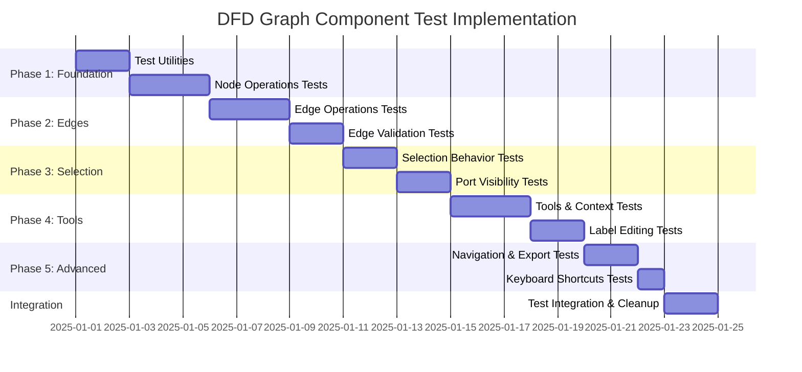

# DFD Graph Component Test Implementation Plan

## Overview

This plan outlines the implementation of comprehensive tests for the DFD graph component, focusing on all implemented features documented in [`DFD_GRAPH_INTERACTION.md`](../../context/DFD_GRAPH_INTERACTION.md). The tests will use X6 cell JSON serialization to verify proper behavior without DOM inspection, organized into multiple focused test files by feature area.

## Test Architecture

```mermaid
graph TD
    A[Test Suite Root] --> B[Node Operations Tests]
    A --> C[Edge Operations Tests]
    A --> D[Selection & Highlighting Tests]
    A --> E[Port Visibility Tests]
    A --> F[Tools & Context Menu Tests]
    A --> G[Label Editing Tests]
    A --> H[Navigation & Export Tests]
    A --> I[Keyboard Shortcuts Tests]
    A --> J[Test Utilities]

    B --> B1[Node Creation]
    B --> B2[Node Movement]
    B --> B3[Node Resizing]
    B --> B4[Node Embedding]

    C --> C1[Edge Creation]
    C --> C2[Edge Styling]
    C --> C3[Edge Vertices]
    C --> C4[Edge Validation]

    D --> D1[Individual Selection]
    D --> D2[Multiple Selection]
    D --> D3[Hover Effects]
    D --> D4[Selection Clearing]

    E --> E1[Port Show/Hide Logic]
    E --> E2[Connected Port Visibility]
    E --> E3[Hover Behavior]

    F --> F1[Node Tools]
    F --> F2[Edge Tools]
    F --> F3[Context Menu Actions]
    F --> F4[Z-order Operations]

    G --> G1[Node Label Editing]
    G --> G2[Edge Label Editing]
    G --> G3[Label Validation]

    H --> H1[Pan & Zoom]
    H --> H2[Export Functions]
    H --> H3[Grid & Snaplines]

    I --> I1[Delete Operations]
    I --> I2[Future Shortcuts]

    J --> J1[Cell Serialization Utils]
    J --> J2[Mock Factories]
    J --> J3[Assertion Helpers]
```



## Test File Structure

### 1. Core Test Files

| File                               | Purpose                         | Key Features Tested                                    |
| ---------------------------------- | ------------------------------- | ------------------------------------------------------ |
| `graph-node-operations.spec.ts`    | Node lifecycle and manipulation | Creation, movement, resizing, embedding, deletion      |
| `graph-edge-operations.spec.ts`    | Edge lifecycle and manipulation | Creation, styling, vertices, validation, deletion      |
| `graph-selection-behavior.spec.ts` | Selection and highlighting      | Individual/multiple selection, hover effects, clearing |
| `graph-port-visibility.spec.ts`    | Port show/hide logic            | Hover behavior, connection states, edge creation       |
| `graph-tools-context.spec.ts`      | Tools and context menu          | Node/edge tools, context menu actions, z-order         |
| `graph-label-editing.spec.ts`      | Label editing functionality     | Node/edge label editing, validation, persistence       |
| `graph-navigation-export.spec.ts`  | Navigation and export           | Pan, zoom, grid, snaplines, export formats             |
| `graph-keyboard-shortcuts.spec.ts` | Keyboard interactions           | Delete operations, future shortcuts                    |

### 2. Utility Files

| File                                    | Purpose                                     |
| --------------------------------------- | ------------------------------------------- |
| `test-utils/cell-serialization.util.ts` | JSON serialization and comparison utilities |
| `test-utils/mock-factories.ts`          | Factory functions for creating test data    |
| `test-utils/assertion-helpers.ts`       | Custom assertion functions for graph state  |

## Detailed Test Implementation Plan

### Phase 1: Foundation & Node Operations

#### 1.1 Test Utilities (`test-utils/`)

**Cell Serialization Utility**

```typescript
interface CellSerializationUtil {
  serializeNode(node: Node): NodeSerializedState;
  serializeEdge(edge: Edge): EdgeSerializedState;
  compareNodeStates(actual: NodeSerializedState, expected: NodeSerializedState): boolean;
  compareEdgeStates(actual: EdgeSerializedState, expected: EdgeSerializedState): boolean;
  extractNodeProperties(serialized: NodeSerializedState): NodeProperties;
  extractEdgeProperties(serialized: EdgeSerializedState): EdgeProperties;
}
```

**Mock Factories**

```typescript
interface MockFactories {
  createMockNode(type: NodeType, position: Point, options?: NodeOptions): MockNode;
  createMockEdge(source: string, target: string, options?: EdgeOptions): MockEdge;
  createMockGraph(): MockGraph;
  createTestScenario(scenario: TestScenarioType): TestScenario;
}
```

#### 1.2 Node Operations Tests (`graph-node-operations.spec.ts`)

**Test Categories:**

- **Node Creation**: All 5 node types (Actor, Process, Store, Security Boundary, Textbox)
- **Node Movement**: Position updates, boundary constraints
- **Node Resizing**: Min/max constraints (40x30 to 400x300)
- **Node Embedding**: Parent-child relationships, depth-based styling
- **Node Deletion**: Cleanup of connected edges

**Key Test Cases:**

```typescript
describe('Node Creation', () => {
  it('should create actor node with correct default properties');
  it('should create process node with ellipse shape');
  it('should create store node with custom shape and borders');
  it('should create security boundary with dashed styling and lower z-index');
  it('should create textbox with transparent styling');
});

describe('Node Embedding', () => {
  it('should embed child node and update fill color based on depth');
  it('should handle multiple levels of nesting');
  it('should prevent invalid embedding relationships');
});
```

**Features Tested from DFD_GRAPH_INTERACTION.md:**

- ✅ Node creation via toolbar buttons (5 types)
- ✅ Node movement by dragging
- ✅ Node resizing with transform plugin (min: 40x30, max: 400x300)
- ✅ Node embedding/nesting with visual feedback
- ✅ Security boundaries with lower z-index
- ✅ Embedded nodes with progressive bluish tints

### Phase 2: Edge Operations & Validation

#### 2.1 Edge Operations Tests (`graph-edge-operations.spec.ts`)

**Test Categories:**

- **Edge Creation**: Port-to-port connections, validation rules
- **Edge Styling**: Dual-path markup, default styling, connectors
- **Edge Vertices**: Adding, moving, removing control points
- **Edge Validation**: Connection rules, self-connection prevention

**Key Test Cases:**

```typescript
describe('Edge Creation', () => {
  it('should create edge with dual-path markup structure');
  it('should apply default styling (black stroke, 2px width, block arrowhead)');
  it('should prevent self-connections');
  it('should allow multiple edges between same nodes');
  it('should validate port-to-port connections');
});

describe('Edge Vertices', () => {
  it('should add vertex at specified position');
  it('should update domain model when vertices change');
  it('should serialize vertex positions correctly');
});
```

**Features Tested from DFD_GRAPH_INTERACTION.md:**

- ✅ Edge creation by dragging from port to port
- ✅ Edge validation (validateMagnet, validateConnection)
- ✅ Self-connection prevention
- ✅ Port-to-port connection requirements
- ✅ Multiple edges between same nodes allowed
- ✅ Dual-path markup (wrap + line paths)
- ✅ Default styling (black stroke, 2px, block arrowhead)
- ✅ Smooth connector with normal router
- ✅ Default "Flow" label at midpoint

### Phase 3: Selection & Interaction

#### 3.1 Selection Behavior Tests (`graph-selection-behavior.spec.ts`)

**Test Categories:**

- **Individual Selection**: Click selection, visual feedback
- **Multiple Selection**: Rubberband selection, Ctrl+click
- **Hover Effects**: Subtle red glow for unselected cells
- **Selection Clearing**: Blank area clicks, programmatic clearing

**Key Test Cases:**

```typescript
describe('Selection Visual Feedback', () => {
  it('should apply hover effects (subtle red glow) to unselected cells');
  it('should apply selection effects (stronger glow, 3px stroke) to selected cells');
  it('should not show selection boxes (showNodeSelectionBox: false)');
});

describe('Multiple Selection', () => {
  it('should support rubberband selection on blank area drag');
  it('should maintain selection state across operations');
});
```

**Features Tested from DFD_GRAPH_INTERACTION.md:**

- ✅ Individual cell selection by clicking
- ✅ Multiple selection with rubberband (drag on blank area)
- ✅ Selection cleared by clicking blank area
- ✅ Keyboard delete/backspace removes selected cells
- ✅ Toolbar buttons enabled/disabled based on selection
- ✅ Hover effects (subtle red glow for unselected)
- ✅ Selection effects (stronger red glow, 3px stroke)
- ✅ No selection boxes displayed
- ✅ Custom highlighting with drop-shadow filters

#### 3.2 Port Visibility Tests (`graph-port-visibility.spec.ts`)

**Test Categories:**

- **Default Visibility**: Ports invisible unless connected
- **Hover Behavior**: Show ports on node hover
- **Connection States**: Connected ports always visible
- **Edge Creation**: Show all ports during edge creation

**Key Test Cases:**

```typescript
describe('Port Visibility Logic', () => {
  it('should hide ports by default');
  it('should show ports on node hover');
  it('should keep connected ports always visible');
  it('should show all ports during edge creation');
  it('should return to normal visibility after edge creation');
});
```

**Features Tested from DFD_GRAPH_INTERACTION.md:**

- ✅ Ports normally invisible unless connected
- ✅ Connected ports remain always visible
- ✅ Hovering over node shows all ports on that node
- ✅ Starting edge creation shows all ports on all nodes
- ✅ Ports return to normal visibility after edge creation
- ✅ Ports displayed as circles (radius 5, black stroke, white fill)
- ✅ All nodes have 4 ports (top, right, bottom, left)
- ✅ Ports have magnet="active" for connection validation
- ✅ Port tooltips show port group information

### Phase 4: Tools & Advanced Features

#### 4.1 Tools & Context Menu Tests (`graph-tools-context.spec.ts`)

**Test Categories:**

- **Node Tools**: Button-remove, boundary tools
- **Edge Tools**: Vertices, target-arrowhead, button-remove
- **Context Menu**: Copy definition, z-order operations
- **Z-order Management**: Move forward/backward/front/back

**Key Test Cases:**

```typescript
describe('Node Tools', () => {
  it('should add button-remove tool on selection');
  it('should add boundary tool with dashed orange border');
  it('should remove tools when selection changes');
});

describe('Context Menu Actions', () => {
  it('should copy complete cell definition to clipboard');
  it('should respect z-order categories (security boundaries vs regular nodes)');
});
```

**Features Tested from DFD_GRAPH_INTERACTION.md:**

- ✅ Button-remove tool (top-right corner) for deletion
- ✅ Boundary tool with dashed orange border around selected nodes
- ✅ Tools automatically added/removed based on selection
- ✅ Vertices tool for edge control points
- ✅ Target-arrowhead tool for reconnecting edge target
- ✅ Button-remove tool (middle of edge) for deletion
- ✅ Vertex changes tracked and synchronized with domain model
- ✅ Right-click opens context menu
- ✅ Copy cell definition to clipboard (complete JSON)
- ✅ Z-order manipulation (Move Forward/Backward/Front/Back)
- ✅ Z-order operations respect cell categories

#### 4.2 Label Editing Tests (`graph-label-editing.spec.ts`)

**Test Categories:**

- **Node Label Editing**: Double-click activation, multiline support
- **Edge Label Editing**: Midpoint positioning, text validation
- **Editor Behavior**: Enter commits, Shift+Enter line breaks, Escape cancels
- **Synchronization**: Visual and domain model updates

**Features Tested from DFD_GRAPH_INTERACTION.md:**

- ✅ Double-click on cells opens custom label editor
- ✅ Custom textarea editor with multiline support
- ✅ Editor positioned at cell center with proper styling
- ✅ Enter commits edit, Shift+Enter adds line breaks, Escape cancels
- ✅ Label changes synchronized between visual and domain models
- ✅ Supports both node and edge label editing

### Phase 5: Navigation & Export

#### 5.1 Navigation & Export Tests (`graph-navigation-export.spec.ts`)

**Test Categories:**

- **Pan & Zoom**: Shift+drag, Shift+wheel, zoom constraints (0.5-1.5)
- **Grid & Snaplines**: 10px spacing, alignment guides
- **Export Functions**: PNG, JPEG, SVG formats with proper options
- **Auto-resize**: Window resize handling

**Features Tested from DFD_GRAPH_INTERACTION.md:**

- ✅ Pan with Shift+drag or Shift+mouse wheel
- ✅ Zoom with Shift+mouse wheel (factor: 1.1, range: 0.5-1.5)
- ✅ Grid display (10px spacing, visible)
- ✅ Snaplines for node alignment during movement
- ✅ Auto-resize on window resize events
- ✅ Export to PNG, JPEG, SVG formats
- ✅ Configurable export options (background, padding, quality)
- ✅ Automatic file download with timestamp

#### 5.2 Keyboard Shortcuts Tests (`graph-keyboard-shortcuts.spec.ts`)

**Test Categories:**

- **Delete Operations**: Delete/Backspace key handling
- **Input Field Filtering**: Prevent conflicts with focused inputs
- **Future Shortcuts**: Framework for undo/redo, copy/paste

**Features Tested from DFD_GRAPH_INTERACTION.md:**

- ✅ Delete/Backspace removes selected cells
- ✅ Keyboard events properly filtered to avoid conflicts with input fields

## Test Data Strategy

### Serialization-Based Verification

Instead of DOM inspection, tests will:

1. **Serialize Cell State**: Use `cell.toJSON()` to capture complete state
2. **Compare Properties**: Verify specific properties in serialized data
3. **Validate Relationships**: Check source/target connections in edge data
4. **Assert Styling**: Verify attrs object contains expected styling
5. **Check Metadata**: Validate custom data and domain model integration

### Example Test Pattern

```typescript
it('should create process node with correct properties', () => {
  // Arrange
  const nodeData = createTestNodeData('process', { x: 100, y: 100 });

  // Act
  const node = adapter.addNode(nodeData);

  // Assert
  const serialized = node.toJSON();
  expect(serialized).toMatchObject({
    shape: 'ellipse',
    position: { x: 100, y: 100 },
    size: { width: 120, height: 80 },
    attrs: {
      body: {
        stroke: '#000',
        strokeWidth: 2,
        fill: expect.any(String),
      },
      label: {
        text: 'Process',
        fontFamily: 'Roboto Condensed',
      },
    },
    ports: {
      items: expect.arrayContaining([
        expect.objectContaining({ group: 'top' }),
        expect.objectContaining({ group: 'right' }),
        expect.objectContaining({ group: 'bottom' }),
        expect.objectContaining({ group: 'left' }),
      ]),
    },
  });
});
```

### Edge Serialization Example

```typescript
it('should create edge with correct dual-path markup and styling', () => {
  // Arrange
  const sourceNode = createTestNode('process', { x: 100, y: 100 });
  const targetNode = createTestNode('store', { x: 300, y: 100 });

  // Act
  const edge = adapter.addEdge(createTestEdge(sourceNode.id, targetNode.id));

  // Assert
  const serialized = edge.toJSON();
  expect(serialized).toMatchObject({
    shape: 'edge',
    source: { cell: sourceNode.id, port: expect.any(String) },
    target: { cell: targetNode.id, port: expect.any(String) },
    attrs: {
      line: {
        stroke: '#000',
        strokeWidth: 2,
        targetMarker: {
          name: 'block',
          width: 12,
          height: 8,
        },
      },
    },
    labels: expect.arrayContaining([
      expect.objectContaining({
        attrs: { text: { text: 'Flow' } },
        position: { distance: 0.5 },
      }),
    ]),
    connector: { name: 'smooth' },
    router: { name: 'normal' },
  });
});
```

## Implementation Timeline



## File Organization

```
src/app/pages/dfd/tests/
├── graph-node-operations.spec.ts
├── graph-edge-operations.spec.ts
├── graph-selection-behavior.spec.ts
├── graph-port-visibility.spec.ts
├── graph-tools-context.spec.ts
├── graph-label-editing.spec.ts
├── graph-navigation-export.spec.ts
├── graph-keyboard-shortcuts.spec.ts
└── test-utils/
    ├── cell-serialization.util.ts
    ├── mock-factories.ts
    └── assertion-helpers.ts
```

## Success Criteria

1. **Complete Feature Coverage**: All ✅ IMPLEMENTED features from DFD_GRAPH_INTERACTION.md have corresponding tests
2. **Serialization-Based Verification**: No DOM inspection, all assertions based on cell JSON serialization
3. **Organized Structure**: Multiple focused test files by feature area
4. **Maintainable Code**: Reusable utilities, clear test patterns, comprehensive documentation
5. **Integration Ready**: Tests work with existing X6GraphAdapter and mock infrastructure
6. **Future-Proof**: Framework supports testing of 🔄 FUTURE features when implemented

## Excluded Features

The following features are explicitly excluded from this test plan as requested:

- **Self-connections**: User plans to change this behavior
- **Loop connections**: User plans to change this behavior

## Next Steps

1. **Review and Approve Plan**: Confirm the test structure and approach
2. **Switch to Code Mode**: Begin implementation of test utilities and core test files
3. **Iterative Development**: Implement tests in phases as outlined in the timeline
4. **Integration Testing**: Ensure tests work with existing codebase and CI/CD pipeline

This plan provides a comprehensive approach to testing the graph component while avoiding DOM inspection and focusing on the serialized state of X6 cells. The modular structure will make tests maintainable and allow for easy extension as new features are added.
