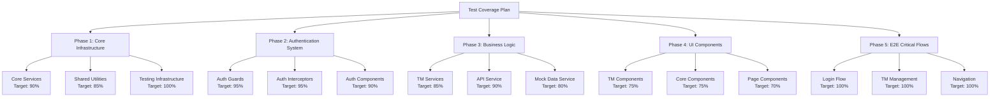

# Test Coverage Improvement Plan for TMI-UX

## Executive Summary

This document outlines a comprehensive plan to improve test coverage for the TMI-UX Angular application. The plan focuses on unit testing with Vitest and end-to-end testing with Cypress, targeting 80% overall coverage while excluding the rapidly-changing DFD components.

## Current State Analysis

### Existing Test Coverage

- **Current Coverage**: Minimal (0% statements, 0% lines based on coverage reports)
- **Existing Tests**: Only 2 test files
  - `src/app/auth/services/auth.service.spec.ts` - Comprehensive auth service tests
  - `src/app/auth/auth-integration.spec.ts` - Auth integration tests
- **Testing Framework**: Vitest for unit tests, Cypress for e2e tests
- **Architecture**: Angular application with modular structure

### Key Findings

- Well-structured existing auth tests demonstrate good testing patterns
- Comprehensive mock setup and testing infrastructure already in place
- Clear separation of concerns in application architecture
- DFD components undergoing rapid development (excluded from coverage requirements)

## Testing Strategy Overview



## Implementation Phases

### Phase 1: Core Infrastructure (Priority: High)

**Timeline**: Week 1-2  
**Target Coverage**: 90% for core services, 85% for utilities

#### 1.1 Core Services Unit Tests

##### `src/app/core/services/api.service.spec.ts`

**Coverage Target**: 90%

```typescript
describe('ApiService', () => {
  // Test scenarios:
  // - HTTP GET requests with/without parameters
  // - HTTP POST requests with body validation
  // - HTTP PUT requests with body validation
  // - HTTP DELETE requests
  // - Error handling for different HTTP status codes
  // - Request timeout handling
  // - Request retry logic
  // - URL construction with parameters
  // - Response transformation
  // - Authentication header injection
});
```

##### `src/app/core/services/logger.service.spec.ts`

**Coverage Target**: 95%

```typescript
describe('LoggerService', () => {
  // Test scenarios:
  // - Log level filtering (DEBUG, INFO, WARN, ERROR)
  // - Message formatting with timestamps
  // - Variable logging with different data types
  // - Log level runtime configuration
  // - Console output verification
  // - Performance impact of disabled log levels
  // - Circular reference handling in objects
  // - Large object truncation
});
```

##### `src/app/core/services/asset-loader.service.spec.ts`

**Coverage Target**: 85%

```typescript
describe('AssetLoaderService', () => {
  // Test scenarios:
  // - Image preloading success/failure
  // - WebP support detection
  // - Optimal image path selection
  // - Cache management
  // - Error handling for missing images
  // - Performance optimization
  // - Browser compatibility checks
});
```

##### `src/app/core/services/operator.service.spec.ts`

**Coverage Target**: 90%

```typescript
describe('OperatorService', () => {
  // Test scenarios:
  // - Operator information retrieval
  // - Environment-based configuration
  // - Contact information formatting
  // - Service initialization
});
```

#### 1.2 Shared Utilities

##### `src/app/core/utils/dynamic-material-loader.spec.ts`

**Coverage Target**: 85%

```typescript
describe('DynamicMaterialLoader', () => {
  // Test scenarios:
  // - Dynamic module loading
  // - Error handling for missing modules
  // - Module caching
  // - Performance optimization
});
```

#### 1.3 Testing Infrastructure Enhancement

##### Enhanced Test Helpers

- **File**: `src/testing/helpers/component-test-helper.ts`
- **Purpose**: Standardized component testing utilities
- **Features**: Mock setup, fixture creation, event simulation

##### Custom Matchers

- **File**: `src/testing/matchers/custom-matchers.ts`
- **Purpose**: Domain-specific test assertions
- **Features**: Auth state matchers, API response matchers

##### Mock Factories Expansion

- **Files**: Expand existing factories in `src/app/mocks/factories/`
- **Purpose**: Comprehensive test data generation
- **Coverage**: All domain models and API responses

### Phase 2: Authentication System (Priority: High)

**Timeline**: Week 2-3  
**Target Coverage**: 95% for auth system

#### 2.1 Auth Guards

##### `src/app/auth/guards/auth.guard.spec.ts`

**Coverage Target**: 95%

```typescript
describe('AuthGuard', () => {
  // Test scenarios:
  // - Authenticated user access granted
  // - Unauthenticated user redirected to login
  // - Token expiration handling
  // - Route protection for different user roles
  // - Navigation state preservation
  // - Error handling during auth check
});
```

##### `src/app/auth/guards/role.guard.spec.ts`

**Coverage Target**: 95%

```typescript
describe('RoleGuard', () => {
  // Test scenarios:
  // - Owner role access to all routes
  // - Writer role access restrictions
  // - Reader role access restrictions
  // - Unauthorized role access denial
  // - Role-based route data handling
  // - Dynamic role checking
});
```

##### `src/app/auth/guards/home.guard.spec.ts`

**Coverage Target**: 90%

```typescript
describe('HomeGuard', () => {
  // Test scenarios:
  // - Authenticated user redirect to dashboard
  // - Unauthenticated user access to home
  // - Route parameter handling
  // - Navigation logic
});
```

#### 2.2 Auth Interceptors

##### `src/app/auth/interceptors/jwt.interceptor.spec.ts`

**Coverage Target**: 95%

```typescript
describe('JwtInterceptor', () => {
  // Test scenarios:
  // - JWT token injection in requests
  // - Token refresh on expiration
  // - Error handling for invalid tokens
  // - Request retry after token refresh
  // - Exclusion of auth endpoints from token injection
  // - Concurrent request handling during token refresh
});
```

#### 2.3 Auth Components

##### `src/app/auth/components/login/login.component.spec.ts`

**Coverage Target**: 85%

```typescript
describe('LoginComponent', () => {
  // Test scenarios:
  // - Google OAuth login initiation
  // - Demo login functionality
  // - Loading state management
  // - Error message display
  // - Redirect after successful login
  // - Form validation
});
```

##### `src/app/auth/components/unauthorized/unauthorized.component.spec.ts`

**Coverage Target**: 80%

```typescript
describe('UnauthorizedComponent', () => {
  // Test scenarios:
  // - Error message display
  // - Retry button functionality
  // - Navigation back to login
  // - Component initialization
});
```

##### `src/app/auth/components/reauth-dialog/reauth-dialog.component.spec.ts`

**Coverage Target**: 85%

```typescript
describe('ReauthDialogComponent', () => {
  // Test scenarios:
  // - Dialog opening and closing
  // - Re-authentication flow
  // - User interaction handling
  // - Session restoration
});
```

### Phase 3: Business Logic Services (Priority: High)

**Timeline**: Week 3-4  
**Target Coverage**: 85% for business services

#### 3.1 TM Services

##### `src/app/pages/tm/services/threat-model.service.spec.ts`

**Coverage Target**: 90%

```typescript
describe('ThreatModelService', () => {
  // Test scenarios:
  // - CRUD operations for threat models
  // - API error handling
  // - Data transformation
  // - Caching mechanisms
  // - Concurrent operation handling
  // - Validation logic
});
```

##### `src/app/pages/tm/services/collaboration.service.spec.ts`

**Coverage Target**: 85%

```typescript
describe('CollaborationService', () => {
  // Test scenarios:
  // - Session creation and management
  // - User presence tracking
  // - Real-time updates
  // - Connection error handling
  // - Session cleanup
});
```

#### 3.2 Mock Data System

##### `src/app/mocks/mock-data.service.spec.ts`

**Coverage Target**: 80%

```typescript
describe('MockDataService', () => {
  // Test scenarios:
  // - Mock data generation
  // - Data consistency
  // - Toggle functionality
  // - Service initialization
  // - Data reset capabilities
});
```

##### Factory Tests

- `src/app/mocks/factories/threat-model.factory.spec.ts`
- `src/app/mocks/factories/diagram.factory.spec.ts`
- `src/app/mocks/factories/threat.factory.spec.ts`
- `src/app/mocks/factories/cell.factory.spec.ts`

#### 3.3 Internationalization

##### `src/app/i18n/language.service.spec.ts`

**Coverage Target**: 85%

```typescript
describe('LanguageService', () => {
  // Test scenarios:
  // - Language switching
  // - Default language loading
  // - Translation key resolution
  // - Browser language detection
  // - Fallback language handling
});
```

##### `src/app/i18n/transloco-loader.spec.ts`

**Coverage Target**: 80%

```typescript
describe('TranslocoLoader', () => {
  // Test scenarios:
  // - Translation file loading
  // - Error handling for missing files
  // - Caching mechanisms
  // - Dynamic language loading
});
```

### Phase 4: UI Components (Priority: Medium)

**Timeline**: Week 4-5  
**Target Coverage**: 75% for UI components

#### 4.1 TM Components

##### `src/app/pages/tm/tm.component.spec.ts`

**Coverage Target**: 80%

```typescript
describe('TmComponent', () => {
  // Test scenarios:
  // - Component initialization
  // - Threat model list display
  // - Search and filter functionality
  // - Create new threat model
  // - Delete threat model
  // - Collaboration session management
  // - Date formatting
  // - Navigation handling
});
```

##### `src/app/pages/tm/components/create-diagram-dialog/create-diagram-dialog.component.spec.ts`

**Coverage Target**: 75%

```typescript
describe('CreateDiagramDialogComponent', () => {
  // Test scenarios:
  // - Dialog initialization
  // - Form validation
  // - Diagram creation
  // - Error handling
  // - Dialog closing
});
```

##### `src/app/pages/tm/components/threat-editor-dialog/threat-editor-dialog.component.spec.ts`

**Coverage Target**: 75%

```typescript
describe('ThreatEditorDialogComponent', () => {
  // Test scenarios:
  // - Threat data loading
  // - Form validation
  // - Threat saving
  // - Error handling
  // - Dialog management
});
```

#### 4.2 Core Components

##### `src/app/core/components/navbar/navbar.component.spec.ts`

**Coverage Target**: 70%

```typescript
describe('NavbarComponent', () => {
  // Test scenarios:
  // - Navigation menu display
  // - User authentication state
  // - Language switching
  // - Mobile menu toggle
  // - Route highlighting
});
```

##### `src/app/core/components/footer/footer.component.spec.ts`

**Coverage Target**: 65%

```typescript
describe('FooterComponent', () => {
  // Test scenarios:
  // - Footer content display
  // - Link functionality
  // - Responsive behavior
});
```

##### `src/app/core/components/mock-data-toggle/mock-data-toggle.component.spec.ts`

**Coverage Target**: 80%

```typescript
describe('MockDataToggleComponent', () => {
  // Test scenarios:
  // - Toggle state management
  // - Service integration
  // - Visual state updates
  // - Event handling
});
```

#### 4.3 Page Components

##### `src/app/app.component.spec.ts`

**Coverage Target**: 75%

```typescript
describe('AppComponent', () => {
  // Test scenarios:
  // - Component initialization
  // - Authentication state handling
  // - User profile management
  // - Subscription management
  // - Component cleanup
});
```

##### `src/app/pages/about/about.component.spec.ts`

**Coverage Target**: 60%

```typescript
describe('AboutComponent', () => {
  // Test scenarios:
  // - Component rendering
  // - Content display
  // - Navigation functionality
});
```

##### `src/app/pages/home/home.component.spec.ts`

**Coverage Target**: 65%

```typescript
describe('HomeComponent', () => {
  // Test scenarios:
  // - Component initialization
  // - Content display
  // - Navigation handling
});
```

### Phase 5: E2E Critical User Flows (Priority: Medium)

**Timeline**: Week 5-6  
**Target Coverage**: 100% for critical user flows

#### 5.1 Authentication Flow

**File**: `cypress/e2e/auth-flow.cy.ts`

```typescript
describe('Authentication Flow', () => {
  // Test scenarios:
  // - Google OAuth login complete flow
  // - Demo login functionality
  // - Logout and session cleanup
  // - Unauthorized access handling
  // - Token expiration and refresh
  // - Remember me functionality
});
```

#### 5.2 Threat Model Management

**File**: `cypress/e2e/threat-model-management.cy.ts`

```typescript
describe('Threat Model Management', () => {
  // Test scenarios:
  // - Create new threat model
  // - Edit existing threat model
  // - Delete threat model with confirmation
  // - Search and filter threat models
  // - Threat model list pagination
  // - Collaboration session creation
});
```

#### 5.3 Navigation and Core Features

**File**: `cypress/e2e/navigation-and-features.cy.ts`

```typescript
describe('Navigation and Core Features', () => {
  // Test scenarios:
  // - Main navigation functionality
  // - Language switching
  // - Mock data toggle
  // - Responsive design behavior
  // - Error page handling
  // - Route protection
});
```

## Implementation Guidelines

### Testing Standards

#### Framework Configuration

- **Unit Tests**: Vitest with Angular testing utilities
- **E2E Tests**: Cypress with custom commands
- **Coverage**: Istanbul/c8 for coverage reporting
- **Mocking**: Comprehensive mock strategy using Vitest mocks

#### Test Structure

```typescript
describe('ComponentName', () => {
  // Arrange
  beforeEach(() => {
    // Setup test environment
  });

  // Act & Assert
  it('should [expected behavior] when [condition]', () => {
    // Test implementation
  });

  afterEach(() => {
    // Cleanup
  });
});
```

#### Naming Conventions

- **Test Files**: `*.spec.ts` for unit tests, `*.cy.ts` for e2e tests
- **Test Names**: Descriptive names following "should [behavior] when [condition]"
- **Mock Names**: Prefix with `mock` or `stub` for clarity

#### Mocking Strategy

- **Services**: Mock all external dependencies
- **HTTP**: Use HttpClientTestingModule for API calls
- **Components**: Shallow rendering with mocked child components
- **Time**: Mock Date and timers for consistent testing

### Coverage Configuration

#### Coverage Targets

- **Overall Target**: 80% (excluding DFD components)
- **Critical Services**: 90% (Auth, API, Logger)
- **Business Logic**: 85% (TM services, Mock data)
- **UI Components**: 75% (Components, Pages)
- **E2E Flows**: 100% (Critical user journeys)

#### Coverage Exclusions

- DFD components and services (due to rapid development)
- Configuration files
- Type definitions
- Test files themselves

#### Reporting

- **Format**: HTML, JSON, and LCOV reports
- **Thresholds**: Fail build if coverage drops below targets
- **Trends**: Track coverage changes over time
- **Integration**: Coverage reports in CI/CD pipeline

### CI/CD Integration

#### Test Execution

```bash
# Unit tests
pnpm run test

# Unit tests with coverage
pnpm run test:coverage

# E2E tests
pnpm run e2e

# All tests
pnpm run test:all
```

#### Quality Gates

- All tests must pass
- Coverage thresholds must be met
- No test files should be skipped or disabled
- Linting rules must pass for test files

## Success Metrics

### Phase Completion Criteria

#### Phase 1: Core Infrastructure

- [ ] 90% coverage for core services
- [ ] 85% coverage for shared utilities
- [ ] Enhanced testing infrastructure in place
- [ ] All core service tests passing

#### Phase 2: Authentication System

- [ ] 95% coverage for auth guards and interceptors
- [ ] 90% coverage for auth components
- [ ] All authentication flows tested
- [ ] Security edge cases covered

#### Phase 3: Business Logic

- [ ] 85% coverage for TM services
- [ ] 80% coverage for mock data system
- [ ] 85% coverage for i18n services
- [ ] All business rules validated

#### Phase 4: UI Components

- [ ] 75% coverage for TM components
- [ ] 70% coverage for core components
- [ ] 65% coverage for page components
- [ ] User interaction scenarios covered

#### Phase 5: E2E Testing

- [ ] 100% coverage for critical user flows
- [ ] Authentication flow completely tested
- [ ] TM management flow completely tested
- [ ] Navigation and core features tested

### Overall Success Metrics

- **Total Coverage**: 80% overall (excluding DFD)
- **Test Reliability**: 99% test pass rate
- **Performance**: Test suite completes in under 5 minutes
- **Maintainability**: Clear, readable, and well-documented tests

## Risk Mitigation

### Identified Risks

1. **DFD Component Changes**: Rapid changes may affect related tests
2. **Test Maintenance**: Large test suite requires ongoing maintenance
3. **Performance Impact**: Comprehensive testing may slow development
4. **Mock Complexity**: Complex mocking may become brittle

### Mitigation Strategies

1. **Isolation**: Keep DFD-related tests separate and minimal
2. **Automation**: Automated test generation where possible
3. **Parallel Execution**: Run tests in parallel to reduce time
4. **Mock Management**: Centralized mock factories and utilities

## Timeline and Resources

### Estimated Timeline

- **Phase 1**: 2 weeks (Core Infrastructure)
- **Phase 2**: 1 week (Authentication System)
- **Phase 3**: 1 week (Business Logic)
- **Phase 4**: 1 week (UI Components)
- **Phase 5**: 1 week (E2E Testing)
- **Total**: 6 weeks

### Resource Requirements

- **Developer Time**: 1 full-time developer
- **Code Review**: Regular review cycles
- **CI/CD Setup**: DevOps support for pipeline integration
- **Documentation**: Technical writing for test documentation

## Maintenance and Evolution

### Ongoing Maintenance

- Regular test review and refactoring
- Coverage monitoring and improvement
- Test performance optimization
- Mock data updates with API changes

### Future Enhancements

- Visual regression testing
- Performance testing integration
- Accessibility testing
- Cross-browser testing expansion

## Conclusion

This comprehensive test coverage improvement plan provides a structured approach to achieving 80% test coverage for the TMI-UX application. By focusing on critical components and following a phased implementation approach, we can ensure robust testing while maintaining development velocity.

The plan prioritizes the most stable and critical parts of the application while respecting the rapid development cycle of the DFD components. With proper implementation, this testing strategy will significantly improve code quality, reduce bugs, and increase confidence in deployments.
